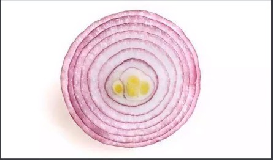
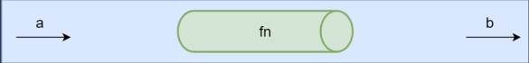
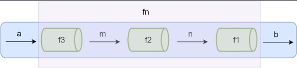

### 函数组合
* 纯函数和柯理化很容易写出洋葱代码 `h(g(f(x)))`
    * 获取数组的最后一个元素再转换为大写字母，`_toUpper(_.first(_.reverse(array)))`
    
* 函数组合可以让我们把细粒度的函数重新组合生成一个新的函数
### 管道
下面这张图表示程序中使用函数处理数据的过程，给fn函数输入参数a，返回结果b，可以想想a数据通过一个管道得到了b数据。


当fn函数比较复杂的时候，我们可以把函数fn拆分成多个小函数，此时多了中间运算过程产生的m和n。

下面这张图中可以想象成把函数fn这个管道拆分成了3个管道f1，f2，f3，数据a通过管道f3得到结果m，m再通过管道f2得到结果n，n通过管道f1得到最终结果b


```javascript
fn = compose(f1, f2, f3)
b = fn(a)
```

### 函数组合
* 函数组合（compose）：如果一个函数要经过多个函数处理才能得到最终结果值，这个时候可以把中间过程的函数合并成一个函数
    * 函数就像是数据的管道，函数组合就是把这些管道连接起来，让数据穿过多个管道形成最终结果
    * 函数组合默认是从右到左执行
