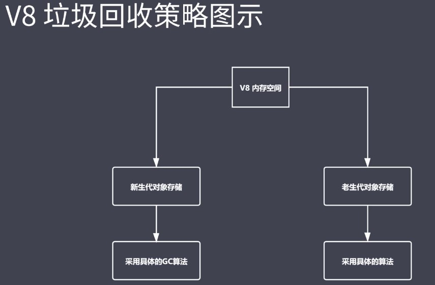
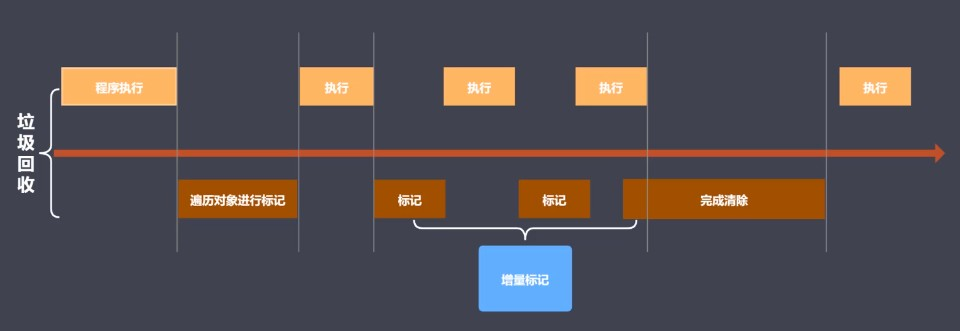

### V8
* V8是一款主流的javascript执行引擎
* V8采用即时编译（速度快）
* V8内存设限（64位系统不超1.5G，32位系统不超800M）

### V8垃圾回收策略
* 采用分代回收的思想
* 内存分为新生代、老生代
* 针对不同对象采用不同算法

### V8中常用GC算法
* 分代回收
* 空间复制
* 标记清除
* 标记整理
* 标记增量

### V8内存分配
* V8内存空间一分为二
* 小空间用于存储新生代对象（64位系统：32M | 32位系统：16M）
* 新生代指的是存活时间较短的对象（局部作用域变量执行完后要回收，全局变量要在程序退出后才被回收）

### 新生代对象回收实现
* 回收过程采用复制算法 + 标记整理
* 新生代内存区分为两个等大小空间（From、To）
* 使用空间为From，空闲空间为To
* 活动对象存储于From空间（代码执行如果需要申请空间，首先会将所有变量对象分配到From空间）
* 标记整理后将活动对象拷贝至To
* From 和 To 交换空间完成释放（From变为To，To变为From）

### 回收细节说明
* 拷贝过程中可能出现晋升（拷贝过程中发现变量的空间在老生代也会出现）
* 晋升就是将新生代对象移动至老生代
* 一轮GC还存活的新生代需要晋升（会把他拷贝到老生代存储区）（触发晋升）
* To空间的使用率超过25%（会将活动对象移动到老生代存储区）25%：因为From 和 To要交换空间，如果过大交换空间后From的空间过小不够用
* 新生代存储区在进行垃圾回收的时候采用标记整理，找到的是所有活动对象，将它们拷贝至老生代而不是所有对象

### V8回收老生代对象
* 老生代对象存放在右侧老生代区域
* 64位操作系统1.4G，32位操作系统700M
* 老生代对象就是指存活时间较长的对象（全局对象下的变量、闭包变量）

#### 老生代对象回收实现
* 主要采用标记清除、标记整理、增量标记算法
* 首先使用标记清除完成垃圾空间的回收（找到老生代变量标记，释放垃圾对象的空间，所以有碎片空间的问题）
* 采用标记整理进行空间优化（把新生代往老生代移动的时候，而且老生空间不足以储存新生代移过来的对象[晋升]，触发标记整理，把之前的碎片空间整理回收）
* 采用增量标记进行效率优化

### 细节对比
* 新生代区域垃圾回收使用空间换时间（采用复制算法，内部每时每刻都有空闲空间存在，新生代空间本来就小，分出来后就更小）
* 老生代区域垃圾回收不适合复制算法（空间较大一份为二比较浪费；对象较多，复制过程中消耗时间多）

### 标记增量如何优化垃圾回收
垃圾回收工作时会阻塞程序执行，当程序执行完后，执行回收操作

标记增量： 将一整段垃圾回收操作拆分多个小部组合垃圾回收，替代一口气做完的垃圾回收操作，可以实现垃圾回收和程序交替执行

程序执行完后，对老生代存储区域遍历对象进行标记，变量存在直接可达和间接可达操作，当找到第一层可达是就可以停下让程序继续执行，然后在进行二次标记，然后执行程序，交替执行；标记完成后执行垃圾回收

### V8总结
* V8是一款主流的javascript执行引擎
* V8内存设置上限
    * 专门为浏览器使用的，内存大小足够使用
    * 内部回收机制
* V8采用基于分代回收思想实现垃圾会收
* V8内存分为新生代和老生代
* V8垃圾回收常见的GC算法
    * 新生代：复制算法和标记算法
    * 老生代：标记清除、标记整理、增量标记
