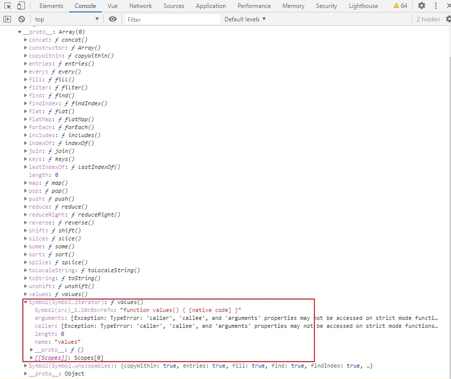

## ECMAScript2015
1. overView
    * 实际上javascript是ECMAScript的扩展语言，ECMAScript只提供最简单的语法只是停留语言层面，并不能用来实际功能开发
    
    * javascript实现了ECMAScript的标准，并扩展，可以在浏览器操作DOM和BOM，node中能够操作文件
    
    * 浏览器中javascript等于ECMAScript + WebApi（DOM、BOM），node中 ECMAScript + node APIS(FS/net/etc.)
    
    * javascript语言本身就是ECMAScript
    
    * 2015年开始，ECMAScript保持每年一个版本迭代，ES2015开始按照年份命名。也有人把ECMAScript2015称为ES6（ECMAScript2015==>ES6）
    
2. let与块级作用域

   作用域-- 某个成员能够起作用的范围
   
   ES2015前，ES只有两种作用域，分别是全局作用域和函数作用域；在ES2015中新增了一个块级作用域
   
   块：代码中用一对花括号包 '{}' 裹起来的代码，如：
   ```javascript
   if (true){
     console.log('if')
   }
   
   for (var i = 0; i < 10; i++){
     console.log('for')
   }
   ```
   以前块没有独立的作用域，所以在块中定义的变量，块的外面也可以访问，如：
   ```javascript
   if (true){
     var foo = 'foo'
   }
   console.log(foo)
   ```
   这对于代码是非常不利的、不安全的，有了块级作用域，可以通过新的关键字let去声明变量，用法跟传统一样，只是let声明的变量只能在声明的代码块中使用，外部无法访问的，如：
   ```javascript
   if (true){
     let foo = 'foo'
   }
   console.log(foo) // foo is not defined
   ```
   传统for循环如果多个for循环嵌套，那么就要声明不同名称的计数器，不然出现问题，如下代码本应输出九次，但是却输出三次，因为内层声明的i会覆盖外层声明的i
   ```javascript
   for (var i = 0; i < 3; i++){
     for (var i = 0; i < 3; i++){
       console.log(i)
     }
     console.log('内存循环结束 i =' + i)
   }
   ```
   而使用let声明的变量不会出现上面的问题，因为内层声明的i变量是内层块作用域的成员
   ```javascript
   for (let i = 0; i < 3; i++){
     for (let i = 0; i < 3; i++){
       console.log(i)
     }
     console.log('内存循环结束 i =' + i)
   }
   ```
   
   ```javascript
   var elements = [{}, {}, {}]
   for(var i = 0; i < elements.length; i++){
     elements[i].onclick = function() {
       console.log(i) // 输出 3，因为i始终指向全局的i，循环执行后i已经累加到了3
     }
   }
   elements[0].onclick()
   ```
   解决上面的问题可以通过闭包，借助函数作用域拜托全局作用域的影响
   ```javascript
   var elements = [{}, {}, {}]
   for(var i = 0; i < elements.length; i++){
     (function(i) {
       elements[i].onclick = function() {
           console.log(i)
         }
     })(i)
   }
   elements[0].onclick()
   ```
   有了块级作用域就不需要如此麻烦；其实内部也是闭包的机制，当onclick执行是寻找早已执行完毕，i 早已销毁，因为闭包的机制我们才能拿到i对应的值
   ```javascript
   var elements = [{}, {}, {}]
   for(let i = 0; i < elements.length; i++){
     elements[i].onclick = function() {
       console.log(i)
     }
   }
   elements[0].onclick()
   ```
   for循环内部有两层作用域，当声明两个一样的 i 时，他们会在不同的作用域中(两层嵌套的作用域)、互不影响，循环体的 i 是内层作用域，外层 i 是for循环本身的作用域
   ```javascript
   for (let i = 0; i< 2; i++){
     let i = 'foo'
     console.log(i)
   }
   
   // 可以拆解为
   let i = 0
   
   if (i < 2) {
     let i = 'foo'
     console.log(i)
   }
   
   i++
   
   let i = 0
   
   if (i < 2) {
     let i = 'foo'
     console.log(i)
   }
   
   i++
   ```
   let声明的变量不会出现变量提升的情况，需要先声明变量再去使用变量，否则报错；传统的var声明的变量会导致变量提升
   ```javascript
   console.log(foo) // undefined，说明变量已经声明，只是还没赋值，这种现象叫做变量声明的提升
   var foo = 'foo'
   console.log(bar) // 报错
   let bar = 'bar'
   ```
   
3. const -- 恒量/常量

   特点：在 let 基础上多了[只读]
   
   [只读]变量声明后不允许修改，如果在声明后再去修改值就会报错
   
   所以在声明时就要给定值
   ```base
   const name = 'Tom'
   name = 'jack'
   ```
   const声明的成员不可以修改，只是说不允许修改重新指向新内存地址，并不是指不给修改属性成员，如：
   ```base
   const obj = {}
   obj.name = 'Tom'
   
   obj = {} // 报错，改变了obj的指向
   ```

4. 数组解构--array-destructuring
   
   传统获取数组中元素只能通过下标获取
   ```javascript
   const arr = [100, 200, 300]
   
   const foo = arr[0]
   const bar = arr[1]
   const baz = arr[2]
   console.log(foo, bar, baz)
   ```
   
   ES2015新增解构方式快速获取元素，用法：把定义变量的地方用方括号包裹，方括号的成员就是我们要提取数据的变量名，
   内部会按照变量名位置分配数组中对应位置的数值，如果想要获取后面的数值，可以把前面的变量命删除但是保留逗号','，确保结构的格式和数据是一致的
   ```javascript
   const arr = [100, 200, 300]
   const [foo, bar, baz] = arr
   const [, , B] = arr
   console.log(foo, bar, baz, B)
   ```
   也可以在结构的变量名之前添加三点'...'表示提取当前位置之后的所有成员，结果会放在一个数组中，这种用法只能在解构中的最后一个成员使用
   ```javascript
   const [foo,...rest] = arr
   console.log(rest) // [200, 300]
   ```
   
   如果解构位置的成员个数小于被解构数组的长度，会按照从前到后的顺序提取，多出的成员不会被提取；如果解构的成员多于被解构的成员，提取到的是undefined；如果要给默认值，只需要在后面添加等号给默认值，如果提取不了值变量就会等于默认值
   ```javascript
   const arr = [100, 200, 300]
   const [foo] = arr
   console.log(foo) // 100
   
   const [foo, bar, baz, more = 'default value'] = arr
   console.log(more) // undefined
   
   ```

5. 对象解构--- object-destructuring

   对象的解构是根据属性名提取而不是根据位置，因为对象的属性是没有固定的次序的，而数组元素是有下标的（也就是有顺序规则）
   
   可以重命名，具体语法就是在解构的成员名后面加上冒号然后跟上一个新的名称
   ```javascript
   const obj = {
     name: 'tom'
   }
   const name = 'jack'
   const {name: objName} = obj
   console.log(objName)
   ```
   设置默认值
   ```javascript
   const obj = {
     name: 'tom'
   }
   const name = 'jack'
   const {name: objName='default name'} = obj
   console.log(objName)
   
   const { log } = console
   log('foo')
   log('bar')
   ```
   解构嵌套的对象，解构嵌套的对象，解构的格式，要和被解构的一样
   ```javascript
   const user = {
     id: 123,
     name: 'tom',
     education: {
       degree: 'Masters'
     }
   }
   const {education: {degree}} = user // 可以理解为，外层的大括号对应user的大括号，education对应usere的ducation，degree对应user的degree
   console.log(degree) // Masters
   ```

6. 模板字符串--template-strings

   模板字符串支持换行，只需要正常回车换行即可
   ```javascript
   const str = `hello es 2015, 
   this is a string`
   ```
   模板字符串支持插值表达式，${}不仅可以插入变量，还可以插入js语句，语句的返回值会被输出
   ```javascript
   const name = 'tom'
   const msg = `hey,${name}---${1 + 2}`
   console.log(msg)
   ```

7. 带标签的模板字符串---tagged-templates
   
   在定义模板字符串前添加一个标签，那么这个标签就是一个特殊的函数，添加这个标签就是调用这个函数
   ```javascript
   const str = console.log`hello world` // ['hello world']
   ```
   
   下面的例子中，函数输出的是模板字符串分隔后的结果，因为在模板字符串中有可能嵌入表达式，所以这里的数组就是按照表达式分隔后的静态内容
   
   这个函数还可以接收所以模板字符串中出现的表达式的返回值
   
   函数内部的返回值是带标签模板字符串所对应的返回值
   ```javascript
   const name = 'tom'
   const gender = true
   
   function myTagFunc(strings,name,gender){
     console.log(strings) // [ 'hey, ', ' is a ', '' ]
     console.log(name, gender) // tom true
     // return '123'
   
     const sex = gender ? 'man' : 'woman'
     return strings[0] + name + strings[1] + sex + strings[2]
   }
   
   const reslt = myTagFunc`hey, ${name} is a ${gender}`
   console.log(reslt)
   ```

8. 字符串的扩展方法--strings-ext-methods

   判断字符串是否以某个开始--startsWith
   ```javascript
   const message = 'Error: foo is not defined.'
   console.log(message.startsWith('Error')) // true
   ```
   判断字符串是否以某个字符结尾-- endsWith
   ```javascript
   const message = 'Error: foo is not defined.'
   console.log(message.endsWith('.')) // true
   ```
   判断字符串中是否有某个字符
   ```javascript
   const message = 'Error: foo is not defined.'
   console.log(message.includes('foo'))
   ```

9. 参数默认--parameter-default
   
   之前给函数定义默认值，在函数体内通过逻辑判断去觉得是否使用默认值，但是存在问题，如下代码，使用短路运算判断默认值，当传入的是false，但是输出了true，这是错误的；应该判断参数是否等于undefined
   ```javascript
   function foo(enable) {
     // enable = enable || true // 当传入的是false，但是输出了true
     enable = enable === undefined ? true : enable
     console.log('foo invoked - enable')
     console.log(enable) // true
   }
   foo(false)
   ```
   而使用ES2015的参数默认就简单多，默认值只有在没传参数或者传的参数是undefined才会被使用，如果有多个参数，带有默认值的形参要出现在参数列表最后，因为参数是按照次序传递的，如果默认值不在后面，默认值无法正常工作
   ```javascript
   function foo(enable = true) {
     console.log('foo invoked - enable')
     console.log(enable)
   }
   foo(false)
   ```

10. 剩余参数--rest-parameter

    之前对于未知的参数都是使用arguments（伪数组）接收
    ```javascript
    function foo() {
      console.log(arguments)
    }
    ```
    ES2015新增了‘...’的操作符，有两个作用：一是剩余操作符，二是展开（如，展开数组）
    
    剩余参数，形参以数组的形式接收从当前参数位置开始往后所有的形参；因为接收的是所有的参数，所有他只能出现在形参的最后一位，而且只能使用一次
    ```javascript
    function foo(...args) {
      console.log(args)
    }
    foo(1,2,3,4)
    ```
    
11. 展开数组--spread-parameter

    ES5
    ```javascript
    const arr = ['foo', 'bar', 'baz']
    
    console.log(arr[0], arr[1], arr[2])
    console.log.apply(console, arr)
    ```
    ES2015使用‘...’操作符展开数组，它会把数组成员按照次序传入
    ```javascript
    const arr = ['foo', 'bar', 'baz']
    console.log(...arr)
    ```

12. 箭头函数--arrow-functions

    ES5定义函数方式
    ```javascript
     function inc(number) {
       return number + 1
    }
    
    console.log(inc(100))
    ```
    
    ES2015定义函数方式
    
    箭头的左边是参数列表，如果有多个参数可以使用圆括号定义，如(m,n)；右边是函数体只有句语句，执行结果将作为结果返回，如果需要执行多条语句，可以使用花括号包裹，如果使用了花括号那么需要使用return关键字返回结果
    ```javascript
    const inc = n => n + 1
    console.log(inc(100))
    
    const foo = (m,n) => {
      return m + n
    }
    foo(1, 2)
    
    const arr = [1, 2, 3, 4, 5, 6, 7]
    // ES5
    arr.filter(function(item) {
      return item % 2
    })
    
    // ES2015
    arr.filter(i => i % 2)
    ```

13. 箭头函数 与 this--arrow-func-this

    箭头函数不会改变this的指向
    
    在普通函数中this的指向，始终指向调用该函数的对象
    
    箭头函数中没有this的机制，所以不会改变this的指向；箭头函数的外面this是什么，那么箭头函数的this就是什么
    ```javascript
    const person = {
      name: 'tom',
      sayHi: function() {
        console.log(`hi, my name is ${this.name}`)
      },
      sayHello: () => {
        console.log(`hi, my name is ${this.name}`)
      },
      sayHiAsync: function() {
        setTimeout(function() { // 该函数会被放在全局对象window上调用，所以拿不到当前作用域的this，拿到的是全局对象，可以在外层用变量保存this（闭包），也可以使用箭头函数
          console.log(this.name) // undefined
        }, 1000)
        setTimeout(() => {
          console.log(this.name)
        }, 1000)
      }
    }
    person.sayHi() // name 为 tom
    person.sayHello() // name 为 undefined
    person.sayHiAsync() // 第一个定时器为 undefined 第二个定时器为 tom
    ```

14. 对象字面量--Object-literal

    ES5中对象属性的值是一个变量，也要书写`属性名:属性值`；如果对象有一个方法需要`方法名:function(){}`
    ```javascript
    const bar = 'bar'
    const obj = {
      foo: 123,
      bar: bar, // 不能像ES6简写为 bar
      method: function() {
        console.log('method')
      }
    }
    ```
    在ES2015中对象属性的值是一个变量,如果属性名和属性值同名，则可以省略冒号和变量名；方法可以省略冒号和function，这其实就是一个普通的function，并不是箭头函数，如果通过对象调用方法，this就指向该对象
    ```javascript
    const bar = 'bar'
    const obj = {
      foo: 123,
      bar,
      method(){
        console.log('method', this)
      }
    } 
    console.log(obj.method())
    ```
    对象字面量还可以使用表达式，表达式的执行结果将作为属性名，通过方括号去使用动态的值（计算属性名）
    ```javascript
    const obj = {
      [Math.random()]: 123
    }
    ```

15. Object.assign

    将多个源对象中的属性复制到一个目标对象中，如果有相同的属性，那么源对象的属性将覆盖目标对象的属性
    
    Object.assign(target, source) 第一个参数是目标对象，第二个参数是源对象；源对象中的所有属性将会被复制到目标对象中(就是后面的覆盖前面的)，该方法的返回值就是目标对象
    
    ```javascript
    const source1 = {
      a: 123,
      b: 123
    }
    
    const source2 = {
      b: 789,
      d: 789
    }
    
    const target = {
      a: 45,
      c: 456
    }
    
    const result = Object.assign(target, source1, source2)
    console.log(result)
    console.log(result === target) // true
    ```

16. Object.is

    判断两个值是否相等
    ```javascript
    console.log(0 == false, 0 === false, +0 === -0, NaN === NaN)
    // true false true false
    ```
    ES2015提出同值比较的算法
    ```javascript
    console.log(Object.is(+0, -0), Object.is(NaN, NaN))
    // false true
    ```

17. Proxy

    ES5中想要监视一个对象的属性读写使用`Object.defineProperty`方法来为对象添加属性，可以捕获对象的读写过程
    
    ES2015中设计了一个Proxy类，为对象设计访问代理器，可以监听对象的读写过程，工能更强大、使用简单
    
    * `new Proxy(target,{handled})`，第一个参数是需要代理的目标对象，第二个参数是对象，代理的处理对象，通过get方法监视属性的访问，通过set方法监视属性设置
    
    * get 方法接收两个参数，第一个参数是代理目标对象，第二个是外部访问的属性名；返回值将是外部访问的结果
    
    * set 方法接收三个参数，第一个参数是代理目标对象，第二个是要写入的属性名称，第三个是要写入的属性值
    
    ```javascript
    const person = {
      name: 'tom',
      age: 20
    }
    const PersonProxy = new Proxy(person, {
      get(target, key) {
        return key in target ? target[key] : 'default'
        // console.log(target, key)
        // return 100
      },
      set(target, key, value) {
        if (key === 'age') {
          if (!Number.isInteger(value)) {
            throw new Error(`${value} is not an int`)
          }
        }
        target[key] = value
        // console.log(target,key,value)
      }
    })
    
    PersonProxy.age = 17
    PersonProxy.gender = true
    
    console.log(PersonProxy.name)
    console.log(PersonProxy.xxx)
    ```
    
18. Proxy 对比 Object.defineProperty

    Object.defineProperty
    * `Object.defineProperty`只能监视属性的读写
    
    * 监视数组称操作，常见的方式是重写数组的操作方法，通过自定义的方法覆盖数组原型链上的方法，来劫持操作
    
    Proxy
    * Proxy能够监视到更多对象操作，如：delete 或 对象方法的调用
    
      [Proxy跟多操作方法](https://es6.ruanyifeng.com/#docs/proxy#Proxy-%E5%AE%9E%E4%BE%8B%E7%9A%84%E6%96%B9%E6%B3%95)
    ```base
    const person = {
      name: 'Tom',
      age: 18
    }
    const personProxy = new Proxy(person, {
      deleteProperty (target, property) {
        console.log('delete', property)
        delete target(property)
      }
    })
    
    delete personProxy.age
    console.log(person)
    ```
    
    * Proxy更好的支持数组对象的监视，重写数组的操作方法，自定义的方法覆盖原型对象的方法，以此劫持方法操作过程（Vue.js源码）
    
    * Proxy 对象监视数组
    ```base
    const list = []
    
    const listProxy = new Proxy(list, {
      set (target, property, value) {
        console.log('set', property, value) // Proxy 会自动推算push数值所处的下标
        target[property] = value
        return true // 表示设置成功
      }
    })
    
    listProxy.push(100)
    
    ```
    
    * Proxy是以非侵入的方式监管对象的读写（已经定义好的对象，不需要对对象本身做任何操作就可以监视对象成员的读写）
    
    deleteProperty：删除对象属性，接收两个参数，第一个是目标对象，第二个是删除的属性名称
    
    ```javascript
    const person = {
      name: 'tom',
      age: 20
    }
    
    const PersonProxy = new Proxy(person, {
      deleteProperty(target, key) {
        console.log('delete', key)
        delete target[key]
      }
    })
    
    delete PersonProxy.age
    ```
    
    Proxy 操作数组，Proxy会自动根据操作推算下标
    ```javascript
    const list = []
    const listProxy = new Proxy(list, {
      set(target, property, value) {
        console.log('set', property, value) // property 数组下标
        target[property] = value
        return true // 表示设置成功
      }
    })
    
    listProxy.push(100)
    console.log(list)
    ```

19. Reflect

    Reflect属于静态类，不能通过new去实例化一个对象，只能调用这个静态类的方法（Reflect.get()）
    
    [静态方法](https://developer.mozilla.org/zh-CN/docs/Web/JavaScript/Reference/Global_Objects/Reflect)
    
    Reflect内部封装了一系列对对象的底层操作
    
    Reflect成员方法就是Proxy处理对象的默认实现（Reflect 的静态方法名和 Proxy 处理对象的方法名是一致的）
    ```javascript
    const obj = {
      foo: 'foo',
      bar: 'bar'
    }
    const proxy = new Proxy(obj, {
      get(target, key) {
        return Reflect.get(target,key)
      }
    })
    console.log(proxy.foo)
    ```
    
    统一提供一套用于操作对象的API
    ```javascript
    const obj = {
      foo: 'foo',
      bar: 'bar'
    }
    
    // console.log('name' in obj)
    // console.log(delete obj['age'])
    // console.log(Object.keys(obj))
    
    console.log(Reflect.has(obj, 'name'))
    console.log(Reflect.deleteProperty(obj, 'age'))
    console.log(Reflect.ownKeys(obj))
    ```
    
20. Class

    ES5 通过定义函数和函数原型对象实现类，通过this访问实例对象
    ```javascript
    function Person(name) {
      this.name = name
    }
    
    // 实例之间共享方法，可通过函数对象的原型实现
    Person.prototype.say = function() {
      console.log(`hi my name is ${this.name}`)
    }
    const p1 = new Person()
    console.log(p1)
    ```
    
    ES2015中类由关键词class声明一个类型
    ```javascript
    class Person {
      constructor(name) { // 构造函数，通过this访问实例对象
        this.name = name
      }
    
      // 定义实例方法，实例方法将挂载到原型对象上(prototype)
      say() {
        console.log(`hi my name is ${this.name}`)
      }
    }
    
    const p = new Person('Tom') // 通过 new 创建类型的实例
    console.log(p)
    p.say()
    ```

21. class 静态方法

    class中方法分为实例方法和静态方法，实例方法提供实例对象访问；静态方法通过类本身调用
    
    ES5 中静态方法在构造函数对象挂载方法实现
    ```javascript
    function Person1(name,age) {
        this.name = 'name'
        this.age = 'age'
    }
    Person1.say = function () {
        console.log(this.name)
    }
    const p1 = new Person1()
    Person1.say()
    // p1.say() // 报错，只能构造函数本身调用
    console.log(p1) // 可以看到实例对象的原型constructor存在say方法
    ```
    
    ES2015 通过static实现静态方法
    
    因为静态方法是挂载到类上的，所以静态方法内部this不会指向实例对象，而是指向当前的类
    ```javascript
    class Person {
      constructor(name) {
        this.name = name
        this.age = 18
      }
      say() {
        console.log(`hi my name is ${this.name}`)
      }
    
      static create(name) { // 静态方法将挂载到原型的constructor
        // 静态方法可以调用静态方法，静态方法可以和非静态方法重名
        // this指向的是Person类，而不是Person的实例
        console.log('this', this)
        return new Person(name)
      }
    }
    // 类静态方法调用
    const tom = Person.create('Tom') // new Person('Tom')
    tom.say()
    ```

22. extends 继承

    继承可以抽象出类之间相似的地方
    
    ES5 大多使用原型实现继承
    
    ES6 使用extends实现继承
    
    super始终指向父类，调用super就是调用父类的构造函数
    ```javascript
    class Person {
        constructor(name) {
            this.name = name
        }
        say() {
            console.log(`hi my name is ${this.name}`)
        }
    }
    
    class Student extends Person {
        constructor(name, number) {
            super(name) // super始终指向父类，调用super就是调用父类的构造函数
            this.number = number
        }
        hello() {
            super.say() // 调用父类的方法
            console.log(`my school number is ${this.number}`)
        }
    }
    
    const s = new Student('jack', 100)
    s.hello()
    ```

23. Set

    Set成员不允许重复
    
    add方法可以向集合对象添加成员，add方法返回集合对象本身，所以可以链式调用，添加已存在的值会被忽略
    ```javascript
    const s = new Set()
    s.add(1).add(2).add(3).add(2)
    console.log(s)
    ```
    
    遍历
    ```javascript
    const s = new Set()
    s.forEach((key, value) => { console.log(key, value) }) // 遍历集合
    for (let i of s) { console.log(i) } // 遍历集合
    ```
    
    获取集合的总数
    ```javascript
    const s = new Set()
    console.log(s.size)
    ```
    
    判断集合是否包含某个成员
    ```javascript
    const s = new Set()
    console.log(s.has(100)) // false
    ```
    
    删除集合成员，删除成功返回true，删除不存在的成员(失败)返回false
    ```javascript
    const s = new Set()
    console.log(s.delete(100))
    ```
    
    清除集合的全部内容
    ```javascript
    const s = new Set()
    s.add(1).add(2).add(3).add(2)
    s.clear()
    console.log(s)
    ```
    
    常用场景：数组去重
    ```javascript
    const arr = [1, 12, 22, 1, 1]
    // const result = Array.from(new Set(arr)) // 使用Array.from 转为数组
    const result = [...new Set(arr)] // 在空数组中使用展开操作符
    console.log(result)
    
    // 不可以像获取数组元素那样获取元素
    // console.log(result[0])
    ```
    传入对象会报错
    
24. Map

    ES5中如果键不是字符串，那么内部就会toString的结果作为键
    ```javascript
    const obj = {}
    obj[true] = 'value'
    obj[123] = 'value'
    obj[{ a: 1 }] = 'value'
    // obj[{ b: 1 }] = 'obj' // 覆盖上面的，内部会toString的结果作为键，那么就同名了所以就会被覆盖
    console.log(obj)
    console.log(Object.keys(obj)) // 如果键不是字符串，那么内部就会toString的结果作为键
    ```
    
    Map 可以使用任意类型作为键
    ```javascript
    const m = new Map()
    const tom = { name: 'tom' }
    const jack = { name: 'jack' }
    const set = new Set([1, 2, 3])
    
    m.set(tom, 90)
    m.set(jack, 100)
    m.set(set, 200)
    console.log(m)
    ```
    
    ```javascript
    const m = new Map()
    // 获取数据
    console.log(m.get(tom))
    
    // 判断某个键是否存在
    console.log(m.has(tom))
    
    // 删除某个键
    m.delete(jack)
    console.log(m)
    
    // 清空
    m.clear()
    console.log(m)
    ```
    
    * Map.prototype.keys() ：返回键名的遍历器。
    * Map.prototype.values() ：返回键值的遍历器。
    * Map.prototype.entries() ：返回所有成员的遍历器。
    * Map.prototype.forEach() ：遍历 Map 的所有成员。
    
    使用实例对象的forEach遍历
    ```javascript
    const m = new Map()
    m.forEach((value, key, map) => {
        console.log(value, key, map)
    })
    ```

25. Symbol --一种全新的原始数据类型

    最大的特点就是独一无二
    ```javascript
    console.log(Symbol() === Symbol()); // false
    ```
    
    可以传入字符串作为描述文本用于区分
    ```javascript
    console.log(Symbol('foo'));
    console.log(Symbol('bar'));
    console.log(Symbol('baz'));
    ```
    
    对象可以使用Symbol值作为属性名，所以对象可以使用string和Symbol作为属性名
    ```javascript
    const obj = {}
    obj[Symbol()] = '123'
    obj[Symbol()] = 456
    
    // 也可以使用对象字面量方式
    const obj1 = {
        [Symbol()]: 123
    } 
    ```
    
    可以用于实现私有成员
    ```javascript
    // a.js =========================
    const name = Symbol()
    const person = {
        [name]: 'tom',
        say(){
            console.log(this[name])
        }
    }
    
    // b.js ==========================
    
    person[Symbol()]
    person.say()
    ```
    
26. Symbol 补充

    可以使用全局变量的方式实现重复使用相同的Symbol值，或使用Symbol提供的静态方法
    
    参数一样的字符串就返回相同的Symbol类型，内容维护的是字符串和Symbol的关系，如果传入的不是字符串会自动转为字符串
    ```javascript
    const s1 = Symbol.for('foo')
    const s2 = Symbol.for('foo')
    console.log(s1===s2);
    
    console.log(Symbol.for(true) === Symbol.for('true'));
    ```
    
    自定义标识符
    ```javascript
    const obj = {
        [Symbol.toStringTag]: 'xObject'
    }
    console.log(obj.toString()); // [object xObject]
    ```
    
    通过getOwnPropertySymbols获取Symbol属性值，for...in 和 Object.keys 无法获取Symbol属性值
    ```javascript
    const obj1 = {
        [Symbol()]: 'symbol value',
        foo: 'normal value'
    }
    for (const key in obj1) {
        console.log(key); // 无法拿到Symbol的key
    }
    console.log(Object.keys(obj1)); // 无法拿到Symbol的key
    console.log(JSON.stringify(obj1)); // Symbol被忽略
    
    console.log(Object.getOwnPropertySymbols(obj1)); // 获取Symbol属性名
    ```

27. for...of循环

    for 循环比较适合遍历普通的数组
    
    for...in 循环比较适合遍历键值对

    for...of 将来作为遍历所有数据结构的统一方式，只要明白内部工作原理，就可以使用它变量任意自定义数据结构
    
    for...of 遍历拿到的是元素而不是下标，for...of 可以使用break终止循环，数组forEach方法不可以终止循环要使用some、every方法
    ```javascript
    const arr = [100, 200, 300, 400]
    for (const item of arr) {
        console.log(item)
        if (item > 100) {
            break
        }
    }
    ```
    伪数组、元素节点的列表、Set、Map对象也可以使用 for...of 遍历
    
    ```javascript
    const s = new Set(['foo', 'bar'])
    for (const item of s) {
        console.log(item) // 当前变量的元素
    }
    ```
    
    ```javascript
    const m = new Map()
    m.set('foo', '123')
    m.set('bar', '345')
    
    for (const item of m) {
      console.log(item) // ['foo',123]、['bar',456] 数组的成员是键和值
    }
    
    for (const [key, value] of m) {
      console.log(key, value) // 配合结构可以结构出键和值
    }
    
    ```
    
    ```javascript
    const obj = {
        foo: 123,
        bar: 456
    }
    for (const item of obj) {
        // console.log(item) // 报错 obj is iterable
    }
    ```

28. Iterable
    
    ES 中能够表示有结构的数据类型越来越多，为了给各种各样的数据结构提供统一遍历方式，ES2015提供了 Iterable(可迭代的) 接口

    实现Iterable接口是for...of的前提
    
    所有可以被for...of遍历的数据类型，都必须实现iterable接口
    
    内部必须挂载一个Iterable方法，这个方法需要返回带有next方法的对象，调用next方法就可以实现对数据的遍历
    
    
    
    调用数组的iterator方法
    ```base
    const arr = ['foo', 'bar', 'baz']
    const iterator = arr[Symbol.iterator]()
    iterator.next() // { value: 'foo', done: false }
    iterator.next() // { value: 'bar', done: false }
    iterator.next() // { value: 'baz', done: true }
    ```
    迭代器内部维护一个数据指针，每调用一次next方法，指针都往后移一位，done属性表示是否遍历完
    
    for...of 执行原理
    * 调用原型对象上的`[Symbol.iterator]()`方法，返回数组的迭代器对象，该对象原型对象上存在一个next方法
    
    * 调用next方法，返回一个对象，对象有两个成员value 和 done，value的值为遍历对象的值，done值为布尔，代表是否遍历完
    
    * 所以迭代器维护着一个数据指针，每代用一次next，指针都往后移一位
    
    ```javascript
    const set = new Set(['foo', 'bar', 'baz'])
    const iterable = set[Symbol.iterator]()
    console.log(iterable.next())
    console.log(iterable.next())
    console.log(iterable.next())
    console.log(iterable.next())
    ```

29. 实现可迭代接口--iterable
    ```javascript
    const obj = { // 实现了可迭代接口Iterable，约定内部必须有一个用于返回迭代器的iterator方法
        [Symbol.iterator]: function () {
            return { // 实现了迭代器接口iterator，约定内部必须有一个用于迭代的next方法
                next: function () {
                    return { // 迭代结果接口IterationResult，约定对象内部必须有value属性，表示当前被迭代的数据，值是任意类型；和一个done属性，值是布尔值，表示迭代有没有结束
                        value: 'tom',
                        done: true
                    }
                }
            }
        }
    }
    ```
    
    for...of 执行原理
    * 调用原型对象上的`[Symbol.iterator]()`方法，返回数组的迭代器对象，该对象原型对象上存在一个next方法
    
    * 调用next方法，返回一个对象，对象有两个成员value 和 done，value的值为遍历对象的值，done值为布尔，代表是否遍历完
    
    * 所以迭代器维护着一个数据指针，每调用一次next，指针都往后移一位
    ```javascript
    const obj = {
        store: ['foo', 'bar', 'baz'],
        [Symbol.iterator]: function () {
            let index = 0
            const self = this
            return {
                next: function () {
                    const result = {
                        value: self.store[index],
                        done: index >= self.store.length
                    }
                    index++
                    return result
                }
            }
        }
    }
    for (const item of obj) { // 没报错，说明实现了迭代接口
        console.log(item)
    }
    ```

30. 迭代器模式

    迭代器的核心是对外提供统一遍历接口，让外部不用再去关系数据内部的结果是怎样的
    
    场景：协同开发一个任务清单应用
    
    下面例子中的 each 方法只适用于当前例子结果，而 iterator 是语言层面实现的迭代器，所以他适用于任何数据结构，只需你通过代码实现一个iteration方法实现迭代逻辑即可
    ```javascript
    // A 的代码
    const todos = {
      life: ['吃饭', '睡觉', '打豆豆'],
      learn: ['语文', '数学', '外语'],
      work: ['喝茶'],
      each: function(callback) {
        const all = [].concat(this.life, this.learn, this.work)
        for (const item of all) {
          callback(item)
        }
      },
      [Symbol.iterator]:function() {
        const all = [...this.life, ...this.learn, ...this.work]
        let index = 0
        return {
          next: function() {
            return {
              value: all[index],
              done: index++ >= all.length
            }
          }
        }
      }
    }
    
    // 一、 B 的代码 (由于代码耦合，A 的代码添加、删除属性，B 的代码也要改变)
    for (const item of todos.life){ console.log(item) }
    for (const item of todos.learn){ console.log(item) }
    for (const item of todos.work){ console.log(item) }
    
    // 二、 A 的代码提供统一遍历的接口each后就, B 的代码就简单的多
    todos.each(function(item) {
      console.log(item)
    })
    
    // 三、 A 的代码实现可迭代接口
    for (const item of todos) {
      console.log(item)
    }
    ```

31. Generator

    避免异步编程中回调嵌套过深，提供更好的异步编程解决方案
    
    语法：在普通函数function后面添加 * ，这样普通函数就变成了生成器函数（Generator）
    ```javascript
    function* foo() {
        console.log('tom');
        return 100
    }
    const result = foo()
    console.log('result', result) // 输出生成器对象，可以看到原型上存在next方法
    console.log('next', result.next()) // 输出{value:100,done:true}
    ```
    生成器对象也实现了Iterator接口（迭代器接口协议）
    
    生成器函数会自动返回一个生成器对象，调用这个对象的next方法才会让函数体执行，执行过程中遇到yield关键字，函数的执行将被暂停，yield后面的值将会作为next的结果返回；如果继续执行生成器对象的next方法，函数将会从暂停的位置继续执行，当函数执行完后next返回的done值为true
    
    特点：Generator是惰性执行
    ```javascript
    function* foo() {
        console.log('111')
        yield 100
        console.log('222');
        yield 200
        console.log('333');
        yield 300
    }
    const generator = foo()
    console.log(generator.next()) // { value:100, done: false } 此时 yield 100 后面的代码还没执行
    console.log(generator.next())
    console.log(generator.next())
    ```

32. Generator 应用

    案例1：发号器
    ```javascript
    function* createIdMaker() {
        let id = 1
        while (true) {
            yield id++
        }
    }
    
    const idMaker = createIdMaker()
    console.log(idMaker.next().value)
    console.log(idMaker.next().value)
    console.log(idMaker.next().value)
    ```
    
    案例2：Generator实现Iterator方法
    ```javascript
    const todos = {
        life: ['吃饭', '睡觉', '打豆豆'],
        learn: ['语文', '数学', '外语'],
        work: ['喝茶'],
    
        [Symbol.iterator]: function* () {
            const all = [...this.life, ...this.learn, ...this.work]
            for (const item of all) {
                yield item
            }
        }
    }
    for (const item of todos) {
        console.log(item)
    }
    ```

## ECMAScript2016
1. Array.prototype.includes

    Array.prototype.includes
    ```javascript
    const arr = ['foo', 1, NaN, false, undefined, null]
    console.log(arr.includes(NaN));
    console.log(arr.includes(null));
    console.log(arr.includes(undefined));
    ```
    
2. 指数运算
    
   指数运算: **
   ```javascript
   console.log('ES5', Math.pow(2, 10));
   console.log('ES2016', 2 ** 10);
   ```

## ECMAScript2017
1. Object.values

    Object.values 返回对象的所有值的数组
    ```javascript
    const obj = {
        foo: 'value1',
        bar: 'value2'
    }
    
    // Object.values 返回对象的所有值的数组
    console.log(Object.values(obj)); // ['value1', ['value2']]
    ```

2. Object.entries

    Object.entries   以数组的形式返回对象中所有的键值对
    ```javascript
    const obj = {
        foo: 'value1',
        bar: 'value2'
    }
    
    // Object.entries   以数组的形式返回对象中所有的键值对
    console.log(Object.entries(obj)); // [['foo', 'value1'], ['bar', 'value2']]
    for (const [key, value] of Object.entries(obj)) {
        console.log(key, value)
    }
    
    console.log(new Map(Object.entries(obj)));
    
    ```

3. Object.getOwnPropertyDescriptors

    用来获取一个对象的所有自身属性的描述符
    
    ```javascript
    const p1 = {
        firstName: 'Yan',
        lastName: 'Zeng',
        get fullName() {
            return this.firstName + ' ' + this.lastName
        }
    }
    console.log(p1.fullName); // Yan Zeng
    
    const p2 = Object.assign({}, p1)
    p2.firstName = 'zce'
    console.log(p2.fullName) // 输出 Yan Zeng，而不是zce Zeng；拿到的是p1的firstName，因为Object.assign()复制时把firstName当做一个普通的属性复制
    
    // getOwnPropertyDescriptors 可以获取对象的完整描述信息，对于getter、setter就可以复制了
    const descriptors = Object.getOwnPropertyDescriptors(p1)
    // console.log('descriptors', descriptors);
   
    // defineProperties直接在一个对象上定义新的属性或修改现有属性，并返回该对象。
    const p3 = Object.defineProperties({}, descriptors)
    p3.firstName = 'zce' // 此时修改firstName，fullName就会跟着修改
    console.log(p3.fullName); // zce Zeng
    
    ```

4. String.prototype.padStart、String.prototype.padEnd
    
    字符串填充方法：用给定的字符串去填充目标字符串的开始或结束位置，知道字符串达到指定长度
    ```javascript
    const books = {
        html: 5,
        css: 17,
        javascript: 129
    }
    for (const [name, count] of Object.entries(books)) {
        console.log(name, count)
    }
    
    for (const [name, count] of Object.entries(books)) {
        console.log(`${name.padEnd(16, '-')}`) // 指定字符串长度为16，不够的在后面填充 '-'
        console.log(`${count.toString().padStart(3, '0')}`) // 指定字符串长度为 3，不够的在前面填充 '0'; 005/017
    }
    ```

5. 允许函数参数列表最后一位添加尾逗号
    ```javascript
    function foo(baz, foo, ) { }
    ```

6. async/await

    async/await 是Promise的语法糖

## 强类型与弱类型
1. 类型系统

   强类型与弱类型（类型安全角度）
   
   静态类型和动态类型（类型检查角度）

2. 类型安全

   强类型：语言层面限制函数的实参类型必须与形参类型相同；有更强的类型约束；不允许任意的隐式类型转换
   
   弱类型：语言层面不会限制实参的类型；几乎没有什么约束；允许任意的数据隐式类型转换
   
   变量类型允许随时改变的特点，不是强弱类型的差异，python是强类型语言，但是他的变量类型也可以随时改变

3. 类型系统（类型检查角度）

   静态类型：一个变量声明时它的类型就是明确的；声明后，它的类型就不允许再修改
   
   动态类型：运行阶段才能够明确变量类型；而且变量的类型随时可以改变；也就是说变量没有类型，变量中存放的值是有类型的
   ```javascript
   var foo = 100
   foo = 'bar'
   console.log(foo)
   ```

4. Javascript类型系统特征

   弱类型且动态类型
   
   缺失了类型系统的可靠性
   
   javascript没有编译环节
   
5. 弱类型的问题

   在运行的时候才能发现错误，而一些延迟执行的方法在测试阶段肯能没测试到，而留下隐患；而强类型语言在编写的时候就直接报语法错误
   ```javascript
   // 在运行的时候才能发现错误
   const obj = {}
   obj.foo()

   setTimeout(() => {
   obj.foo()
   }, 1000000)
   ```
   当两个变量进行运算操作时，会出现预期之外的情况（类型不明确，造成函数功能改变）
   ```javascript
   function sum(x, y) {
     return x + y
   }
   sum(100,100)
   sum(100,'100') // 这里运行时是字符串拼接
   ```
   因为弱类型对对象所以器错误的用法，对象属性规定是字符串和symbol类型，其他的类型会自动转换
   ```javascript
   const obj = {}
   obj[true] = 100
   console.log(obj['true'])
   ```

6. 强类型语言的优势
   
   错误能更早暴露，在编码阶段就可以发现问题
   
   代码更智能，编码更准确（开发工具智能提示功能）
   
   重构更加牢靠
   
   减少不必要的类型判断

## Flow静态类型检查方案
1. Flow概述
    
   Flow 是 javascript 的类型检查器，工作原理是在代码中添加类型注解方式标记变量、参数是什么类型，Flow根据类型注解检查代码是否有类型使用异常，从而实现在开发阶段对类型异常的检查，避免在运行阶段才发现类型使用错误
   
   Flow 没有规定要给每个变量添加类型注解，可以根据自己的需要添加
   ```flow js
   function sum(a:number, b:number) {
     return a + b
   }
   sum(100, 100)
   sum(100, '100')
   ```

2. Flow快速上手
   
   初始化package.json
   
   安装依赖：`yarn add flow-bin --dev`
   
   通过`yarn flow init`初始化Flow的配置文件
   
   使用：前提在文件中开始位置添加`//@flow`标记，这样Flow执行检测时才会检查这个文件；编辑器自带语法检查，所以编辑器会报错，所以可以把编辑器自带语法校验关闭
   
   执行`yarn flow`执行编码，如果有类型使用异常就会报错，第一次比较慢，会在后台开启一个服务
   
   完成编码工作后，执行`flow stop`结束服务
   ```flow js
   // @flow
   function sum(a:number, b:number) {
     return a + b
   }
   sum(100, '100')
   ```

3. Flow编译移除注解
   
   因为类型注解不是javascript的，所以在执行是会报错，所以在完成编码后用工具移除注解
   
   安装插件：`yarn add flow-remove-types --dev`
   
   运行`yarn flow-remove src -d dist`，'src'：该位置的参数表示源代码所在的目录;'-d dist'：输出的位置
   
   也可以使用babel移除注解
   
   安装：`yarn add @babel/core @babel/cli @babel/preset-flow --dev`
   
   在根目录添加`.babelrc`文件，文件内容如下
   ```base
   {
     "presets": ["@babel/preset-flow"]
   }
   ```
   运行`yarn babel src -d dist`

4. Flow开发工具插件
    
    Flow对类型异常信息是输出到控制台的，编辑器安装插件可以直接对类型异常问题直接显示
    
    在vscode搜索flow，在搜索结果安装flow language support，该插件可以可以对类型异常的代码标记为红色波浪线，在编辑器底部左侧信息显示异常信息；但是编码后要保存后才会重新检查代码中的问题
    
    Flow 官网给出编辑器支持情况：https://flow.org/en/docs/editors/
    
5. Flow 类型推断

    Flow 可以根据代码使用情况自动推断代码成员的类型
    ```flow js
    // @flow
    function square(n) {
      return n * n
    }
   square('10')
    ```
   Flow 类型注解
   
   函数参数类型注解：在参数后面添加冒号和类型，如果传入的参数类型不是规定的将报错
   
   变量类型注解：声明变量时在变量名后添加冒号和类型，如果变量值类型不是规定的将报错
   
   函数返回值：如果没有返回值使用void，有返回值则使用相应的类型
   ```flow js
   function square(n: number) {
       return n * n
   }
   
   let num: number = 100
       // num = 'string'
   
   function foo(): number {
       // return 'string'
       return 100
   }
   
   function bar(): void {}
   ```

   
6. 原始类型
    ```flow js
   /**
    * 原始类型
    * 
    * @flow
    */
   
   const a: string = 'foobar'
   
   // number类型可以等于Infinity NaN 数字
   const b: number = Infinity // NaN // 100
   
   const c: boolean = true // false
   
   const d: null = null
   
   // void表示类型为undefined
   const e: void = undefined
   
   const f: symbol = Symbol() 
   ```

7.数组类型
   ```flow js
    /**
     * 数组类型
     * 
     * @flow
     */
    
    // 方式一、用一个泛型参数表示数组每个元素的类型
    const arr1: Array<number> = [1, 2, 3] // 全部由数字组成的数组
    
    // 方式二、
    const arr2: number[] = [1, 2, 3] // 全部由数字组成的数组
    
    // 元组
    const foo: [string, number] = ['string', Infinity] // 规定数组的长度，并且规定位置上元素的类型
   ```
    
8.对象类型
   ```flow js
    /**
     * 对象类型
     * 
     * @flow
     */
    
    const obj1: { foo: string, bar: number } = { foo: 'string', bar: 100 } // 当前变量必须具有foo 和 bar 类型分别为string和number
    
    const obj2: { foo?: string, bar: number } = { bar: 100 } // 问号表示元素可选
    
    const obj3: { [string]: number } = {} // 可以动态添加属性，但是属性名类型为string，值的类型为number
    obj3.key1 = 99
    obj3.key2 = 100
    

   ```

9. 函数类型

    函数类型主要是对参数和返回值做类型约束，参数约束可以在参数名后添加类型注解；返回值类型在函数的括号后面添加注解，如果函数没有返回值，会默认返回undefined，那么添加':void'
    ```flow js
    /**
     * 函数类型
     * 
     * @flow
     */
    
    // 表示回调函数参数类型分别为string和number没有返回值
    function foo(callback: (string, number) => void) {
        callback('string', 100)
    }
    
    foo(function (str, n){
        // 不可以有返回值
    })
   ```

10. 特性类型
    ```flow js
    /**
     * 特殊类型
     * 
     * @flow
     */
    
    // 字面量类型：限制变量必须是某个值
    const a: 'foo' = 'foo'
    //  const a:'foo' = 'foo1' // 不等于foo所以报错
    
    // 字面量类型一般配合联合类型，组合成几个值
    const type: 'success' | 'warning' | 'danger' = 'danger' // 值只能从这三个选
    
    // 使用type 关键字单独声明一个类型，表示多个类型联合的结果
    // StringOrNumber表示一个类型的别名，可以在多个地方重复使用
    type StringOrNumber = string | number
    
    const b: StringOrNumber = 'string'
    const bb: string | number = 'string' // 100 表示值可以是string或数字
    
    // maybe 类型表示有可能
    const gender: ?number = null // undefined
    ```

11. Mixed Any
    ```flow js
    /**
     * Mixed  Any
     * 
     * @flow
     */
    // 区别
    // any：弱类型
    // mixed：强类型
    
    // Mixed：接收任意类型的值，string|number|boolean|...
    function passMixed(value: mixed) {
        // 内部不明确为字符串，不能当字符串使用；数字也一样
        if (typeof value === 'string') {
            value.substr(1)
        }
        if (typeof value === 'number') {
            value * value
        }
    }
    
    passMixed('string')
    passMixed(100)
    
    // Any：主要兼容老代码，也是一个弱类型
    function passAny(value: any) {
        value.substr(1)
        value * value
    }
    passAny('string')
    passAny(100)
    ```

## TypeScript 语言规范与基本应用

1. typescript概述
    TypeScript是一门基于Javascript之上的编程语言，解决Javascript类型系统的问题
        
    TypeScript大大提高代码的可靠程度
    
    Typescript最终编译成Javascript，所以任何一种javascript运行环境都支持Typescript
    
    功能更强大，生态也更健全、更完善
    
    缺点一：语言本身多了很多概念
    
    缺点二：项目初期，typescript会增加一些成本（小项目增加成本）
    
    typescript数据渐进式

    

2. TypeScript快速上手

   安装`yarn add typescript --dev`
   
   使用命令`yarn tsc 文件名`，这样就可以编辑文件，编辑过程会检查类型和移除注解之类扩展语法，还会自动转换ES新特性
   
   typescript可以完全按照javascript标准语法编写代码
   
   ```typescript
   const hello = (name: string) => {
       console.log(`Hello ${name}`)
   }
   
   // hello(100) // 报错
   hello('typescript')
   ```

3. Typescript配置文件
    
    执行`yarn tsc --init`生成配置文件
    
    在执行编译命令、编码时时就会根据该配置文件的配置来编译、检查代码，但是在执行`yarn tsc 文件名`编译时这个配置文件是不会生效的，只有执行`yarn tsc`编译整个项目的时候生效
    
4. Typescript原始类型
    ```typescript
    // string/number/boolean默认值允许为空(null/undefined需要关闭配置文件中配置的严格模式)
    const a: string = 'string'
    
    const b: number = Infinity // NaN // 100
    
    const c: boolean = true // false
    
    // const d: boolean = null
    
    const e: void = undefined // 空值，一般用在函数没有返回值中，只能存放null和undefined
    
    const f: null = null
    
    const g: undefined = undefined
    
    const h: symbol = Symbol() // 只能存symbol类型
    
    ```

5. Typescript标准库声明
    
    标准库就是内置对象所对应的声明
    
    在tsconfig.json配置文件中写上：
    ```base
   "lib": ["ES2015", "DOM"]
    ```

6. 中文错误消息
    ```base
    yarn tsc --locale zh-CN 
    ```

7. 作用域
    
    定义一个其他文件已经存在的变量会报错，因为它是定义在全局作用域上的，所以在编译是会出现错误
    
    每个文件都是全局作用域，所以在不同文件中定义同名变量会报错，解决方案
    * 使用立即执行函数，产生作用域
    ```typescript
   (function() {
     const a = 123
   })() 
   ```
   * 使用export
   ```javascript
   const a = 11
   export {} // 确保跟其他实例没有成员冲突
   ```
    
8. Object类型
    
    Typescript中的Object类型指非原始类型，如 对象、数组、函数
    
    object类型并不单指对象，而是指除了原始类型之外的其他类型

    对象的赋值必须与定义的属性保持一致，不能多也不能少。更专业的写法是用接口

    ```typescript
   export {} // 确保跟其他实例没有成员冲突
   
   const foo: object = function () {} // [] // {} 
   
   const obj: {foo: number, bar: string} = {foo: 123, bar: 'string'} 
   
   const arr1: Array<number> = [1, 2, 3] // 使用Array泛型，'<number>'表示元素类型
   
   const arr2: number[] = [1, 2, 3] // 使用元素类型和'[]'
   
   function sum (...args: number[]) {
     return args.reduce((prev, current) => prev + current, 0)
   }
   sum(1, 2, 3) 
   ```

9. 元组类型

    明确元素数量以及元素类型的数组；例如Object.entries(obj)的返回值里面的每一个元素都是一个元组
   ```typescript
   export {}
   
   const tuple:[number, string] = [19, 'zyh']
   // 下标取值
   // const age = tuple[0]
   // const name = tuple[1]
   
   // 数组解构
   const [age, name] = tuple
   ```

10. 枚举类型

    枚举类型会影响编译后的结果（入侵编译后的代码），在编译的时候不会被移除，而是编译成一个双向的键值对对象（可以通过键获取值，也可以通过值获取键）

    ```typescript
    export {}
    // JS中没有枚举类型，使用对象模拟枚举
    // const PostStatus = {
    //   Draft: 0,
    //   Uppublished: 1,
    //   Published: 2
    // }
    
    // 枚举类型。使用时和对象属性一样
    // 如果不指定值，则从0开始累加。如果指定了第一个成员的值，后面的成员则在第一个成员基础上累加
    // 值如果是字符串，就得指定具体的值
    // enum PostStatus {
    //   Draft = '草稿',
    //   Unpublished = '未发布',
    //   Published = '发布'
    // }
    
    const enum PostStatus {
      Draft = 0,
      Uppublished = 1,
      Published = 2
    }
    
    const post = {
      title: 'Hello TypeScript',
      content: 'Type...',
      status: PostStatus.Draft
    }
    ```

11. 函数类型

    对函数的输入输入出进行限制（参数、返回值）
    * 函数声明方式
    
      规定函数参数的个数和参数位置的类型；函数是否有返回值，返回值为什么类型
      
      如果参数可选，在参数名后添加问号，或者使用ES2015的参数默认值；参数可选或参数默认值要出现在函数参数列表最后
      
      接收任意个参数，可以使用ES2015的rest（剩余）操作符
      
      规定了函数参的类型、数量，在调用时也要传入对应的类型、数量
      ```typescript
      // 获取不确定参数
      // function func1 (a: number, b: number): string {
      // function func1 (a: number, b?: number): string {
      // function func1 (a: number, b: number = 10): string {
      function func1 (a: number, b: number = 10, ...rest: number[]): string {
        return 'func1'
      }
      
      func1(100, 200)
      
      func1(100)
      
      func1(100, 200, 300)
      ```
      
    * 函数表达式
    
      因为函数放在一个变量中，接收函数的变量也应该有类型；typescript默认可以推断出变量的类型，但是如果函数接收的是回调函数，那么就要约束参数类型；使用类似于箭头函数的方式进行约束，表示参数和返回值的类型
      ```typescript
      const func2: (a: number, b: number) => string = function (a: number, b: number): string {
        return 'string'
      }
      ```

12. 任意类型
    
    运行过程可以接收其他类型的值，所以typescript不会对any类型做类型检查；所以任然可以像javascript一样调用任意成员，**语法**上不会报错
    
    any类型是为了兼容老的代码，它还是动态类型，是不安全的，尽量少用
    ```typescript
    function stringify (value: any) {
      return JSON.stringify(value)
    }
    
    stringify('string')
    stringify(100)
    stringify(true)
    
    let foo: any = 'string'
    foo = 100
    foo.bar()
    ```
    
13. 隐式类型推断
    
    如果没有明确通过类型注解标记变量类型，typescript会根据变量的使用情况推断变量的类型
    
    如果typescript无法推断变量具体类型，那就标注为any类型
    ```typescript
    export {}
    let age = 18 // ts 推断出类型是number
    // age = 'str' // 会报错 不能将类型“"str"”分配给类型“number”
    
    let foo // 此时无法推断具体类型，foo则是动态类型，any类型
    foo = 1 // 不会报错
    foo = 'string' // 不会报错
    ```

14. 类型断言

    特殊情况下typescript无法推断变量的类型，但是我们可以明确知道变量的类型
    类型断言不是把一个类型转换为另一个类型；代码转换是代码运行时的概念；类型断言是编译过程的概念，代码编译后断言就不存在了
    ```typescript
    const nums = [110, 120, 130, 140]
    const res = nums.find(i => i > 0) //这个一定会返回数字，但是 ts 不知道，所以推断为any
    // const square = res  * res
    
    // 方式一 使用 as 关键词
    const num1 = res as number // 断言 num1 为数字类型
    
    // 方式二 在变量前使用'<>'断言
    // 如果代码使用了JSX，这里的'<>'会和jsx标签产生冲突，JSX下不能使用
    const num2 = <number>res
    ```

15. interface 接口

    接口就是约束对象的结构，一个对象去实现一个接口，它就必须要拥有这个接口当中所约束的所有成员
    
    可以理解为一种规范、契约，可以用来约定对象的结果
    
    约定对象上有哪些成员，成员是什么类型
    ```typescript
    // 可以用分号分割，分号可以省略
    interface Post {
      title: string
      content: string
    }
    
    // 传入的参数必须包含title和content
    function printPost (post: Post) {
      console.log(post.title)
      console.log(post.content)
    }
    
    printPost({
      title:'Hello TypeScript',
      content: 'A javascript superset'
    })
    ```
    可选属性、只读属性
    ```typescript
    interface Post {
      title: string
      content: string
      subtitle?: string // 可有可无的属性，也就是说该属性为string或者undefined
      readonly summary: string //readonly 表示该属性值运行读
    }
    ```
    动态属性
    ```typescript
    interface Cache {
      [prop:string]:string
    }
    const cache:Cache = { }
    cache.foo = 'ff'
    ```


