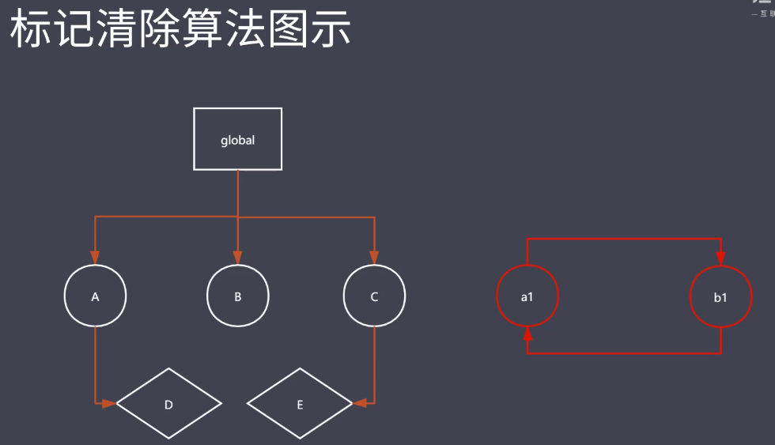

### 标记清除算法
* 核心思想：分标记和清除两个阶段完成
    * 遍历所有对象找标记活动对象（活动对象和可达对象一个道理）
    * 遍历所有对象清除没有标记对象（会把第一阶段的标记抹除，便于GC下次正常工作）
    * 回收相应的空间

一、找到所有可达对象，如果涉及到引用层次关系会递归查找，找完后会给可达对象做标记，标记完进入第二阶段开始清除，找到那些没有做标记的对象，同时会把第一次做的标记清除。会把回收空间放到空闲列表上，后续程序可以申请使用

局部作用域执行完，空间就被回收，所以从全局的链条下找不到局部变量的，那么GC机制就认为他是垃圾对象，没给他做标记，GC工作时找到局部变量把他回收

### 标记清除算法优缺点
优点：
* 可以回收循环引用的对象；相对于引用计数，它可以解决对象循环引用的问题；如上图：函数内对象互相引用，函数执行完必然要释放内部空间，所以当某个函数执行完后，它局部空间的变量就失去了与全局作用域的链接，所以局部变量在global
下无法访问了，这时局部变量就是不可达对象，不可达对象在标记阶段就不能够完成标记，在接下来的第二阶段回收的时候就直接找到没有标记对象把内部空间释放。

缺点：
* 容易产生碎片化空间，浪费空间---由于当前回收的垃圾对象在地址上不连续，由于不连续，回收后他们分散在各个角落，后续想要使用，如果空间多了或少了就不太适合使用了
* 不会立即回收垃圾对象

A可以从根直接查找（可达对象）；根下无法直接查找区域B、C，在进行第二轮清除操作的时候会直接将B C
空间回收，把空间放到空闲链表上，后续程序可以在空闲链表申请相应的空间地址进行使用。

如：空间又两部分组成一个是存储空间的元信息（大小、地址），称为头，还有一部分用来存放数据叫做域；
B C看起来有三个字的空间，但是被A分隔了，所以他们是分散的（地址不连续），如果后续想要申请一个1.5字的空间，如果直接找到B的空间发现是多了0.5字，如果找C释放的空间又不够。造成空间的碎片化的问题

