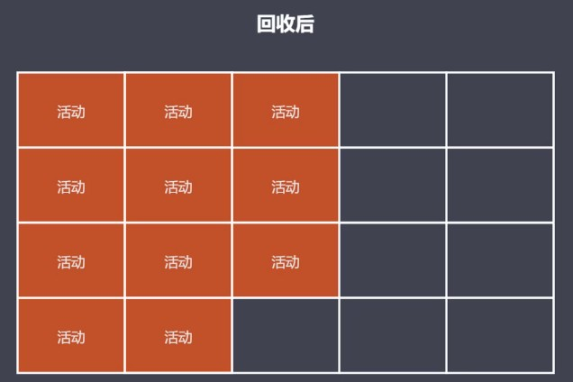

### 标记整理算法
原理：
* 标记整理可以看做是标记清除的增强
* 标记阶段的操作和标记清除一致
* 清除阶段会先执行整理，移动对象位置（地址上产生连续）

优点
* 减少碎片化空间

缺点：
* 不会立即回收垃圾对象

标记整理算法中会对所有的可达对象进行空间整理

如下图有一些活动对象、非活动对象、空闲空间，当执行标记操作时会把活动对象进行标记，然后进行整理操作

整理：位置的改变；先把当前的活动对象进行移动，在地址上变成连续位置；接着把当前活动对象的右侧范围进行整体的回收，这样不会出现大量的分散的小空间，回收到的空间基本是连续的，后续申请可以尽可能最大化的使用空间

