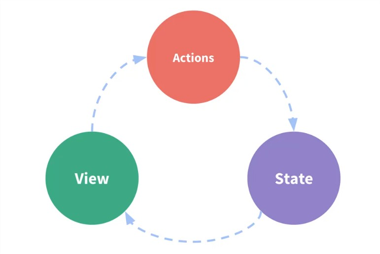
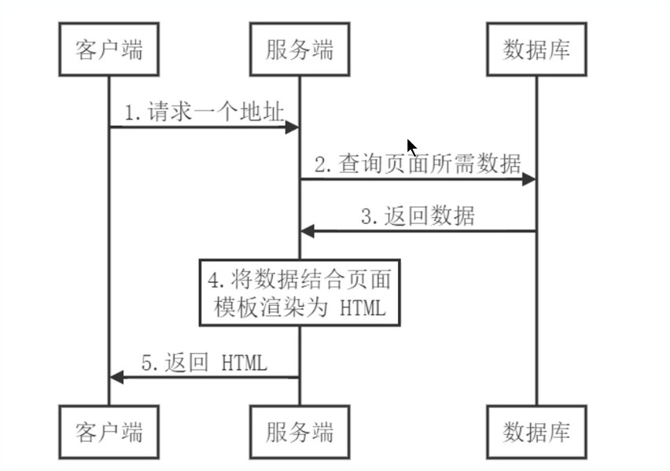
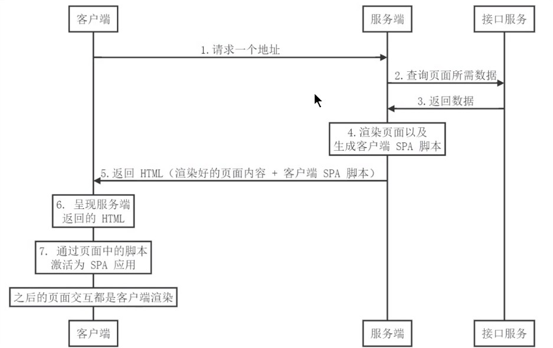
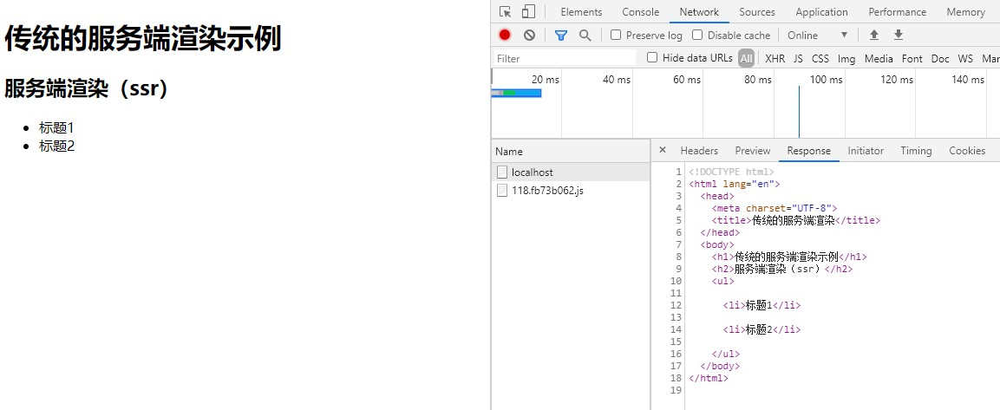
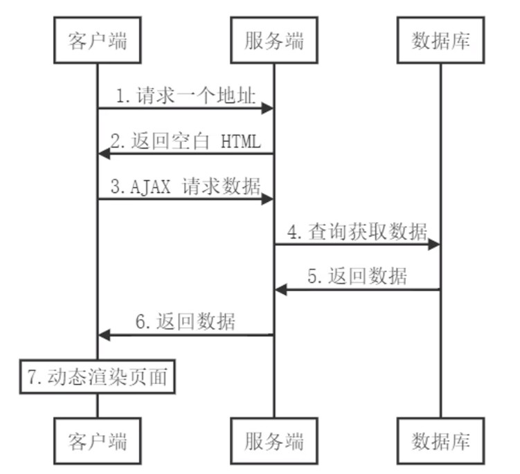
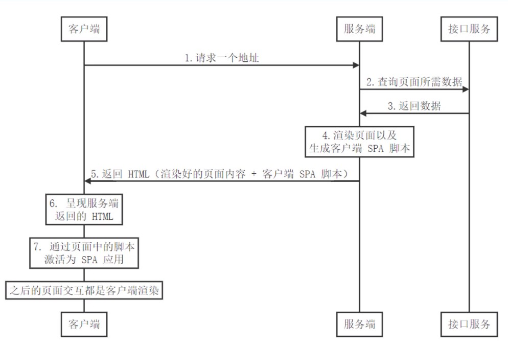
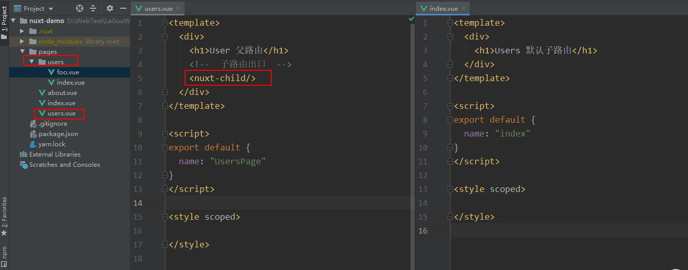
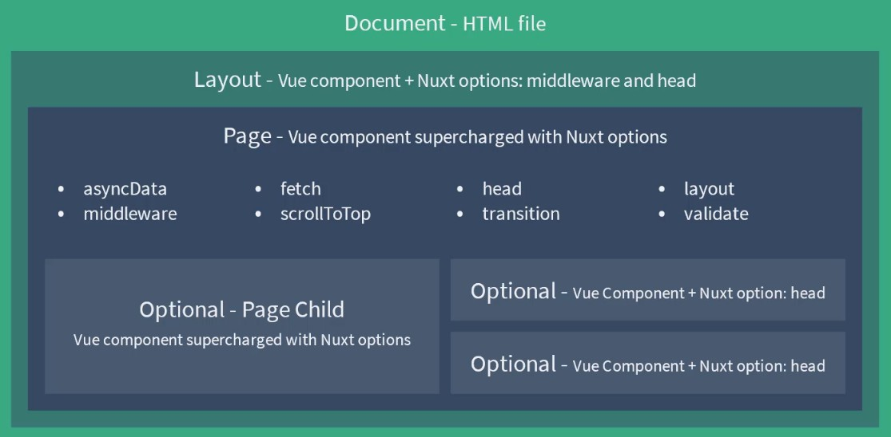
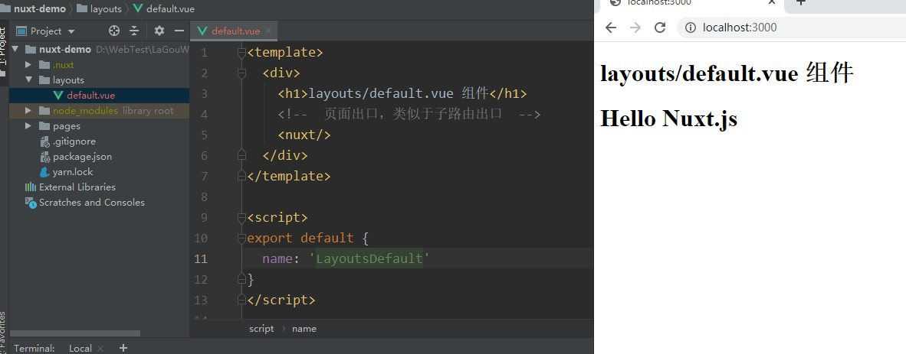
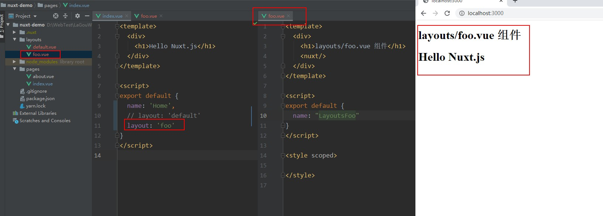

## Vuex状态管理
### 一、组件内的状态管理流程
* 状态管理
    * state，驱动应用的数据源
    * view，以声明方式将 state 映射到视图
    * actions，响应在 view 上的用户输入导致的状态变化
    

### 二、组件间通信方式
1. 父组件给子组件传值
    * 子组件通过props接收数据
    ```base
    <template>
    	<div>
        <h2>{{title}}</h2>
      </div>
    </template>
    
    <script>
    export default {
      // props: ['title'],
      props: {
        title: String
      }
    }
    </script>
    ```
    * 父组件中给子组件通过响应属性传值
    ```base
    <template>
        <div>
            <child title="My Journey with Vue">
        </div>
    </template>
    
    <script>
    import child from './01-child'
        export default {
            components: { child }
        }
    </script>
    ```
2. 子组件给父组件传值
    * 通过自定义事件子组件给父组件传值
    ```base
    <template>
      <div>
        <h1 :style="{ fontSize: fontSize + 'em' }">Props Down Child</h1>
        <button @click="handler">文字增大</button>
      </div>
    </template>
    
    <script>
    export default {
      props: {
        fontSize: Number
      },
      methods: {
        handler () {
          this.$emit('enlargeText', 01)
    		}
      }
    }
    </script>
    ```
   * 父组件中注册子组件内部触发的事件
   ```base
   <template>
   	<div>
       <h1 :style="{ fontSize: hFontSize + 'em' }">Event Up Parent</h1>
       
       这里的文字不需要变化
       
       <child :fontSize="hFontSize" v-on:enlargeText="enlargeText"></child>
       <child :fontSize="hFontSize" v-on:enlargeText="enlargeText"></child>
   		<child :fontSize="hFontSize" v-on:enlargeText="hFontSize + $event"></child>
     </div>
   </template>
   
   <script>
   import child from './02-child'
   export default {
     components: {
       child
     },
     data () {
       return {
         hFontSize: 1
       }
     },
     methods: {
       enlargeText (size) {
         this.hFontSize += size
       }
     }
   }
   </script>
   ```
3. 不相关组件之间传值
    * 通过事件中心eventbus触发和注册事件
    ```javascript
    import Vue from 'Vue'
    export default new Vue()
    ```
   * 触发eventbus中的事件
   ```base
   <template>
   	<div>
       <h1>Event Bus sibling01</h1>
       <div class="number" @click="sub">-</div>
       <input type="text" style="width: 30px; text-align: center": value="value">
       <div class="number" @click="add">+</div>
     </div>
   </template>
   
   <script>
   import bus from './eventbus'
     
   export default {
     props: {
       num: Number
     },
     created () {
       this.value = this.num
     },
     data () {
       return {
         value: -1
       }
     },
     methods: {
   		sub () {
         if (this.value > 1) {
           this.value--
           bus.$emit('numchange', this.value)
         }
       },
       add () {
         this.value++
         bus.$emit('numchange', this.value)
       }
     }
   }
   </script>
   ```
   * 注册事件
   ```base
   <template>
   	<div>
       <h1>Event Bus sibling02</h1>
       
       <div>{{ msg }}</div>
     </div>
   </template>
   
   <script>
   import bus from './eventbus'
   export default {
     data () {
       return {
         msg: ''
       }
     },
     created () {
   		bus.$on('numchange', (value) => {
         this.msg = `您选择了${value}件商品`
       })
     }
   }
   </script>
   ```
4. 其它常见方式（不推荐使用）
* $root
* $parent
* $children
* $ref

ref两个作用：
  1. 在普通HTML标签上使用ref，获取到的是DOM
  2. 在组件标签上使用ref，获取到的是组件实例

子组件中定义ref
```base
<template>
	<div>
    <h1>
      ref Child
  	</h1>
    <input ref="input" type="text" v-model="value">
  </div>
</template>

<script>
export default {
  data () {
    return {
      value: ''
    }
  },
  methods: {
    focus () {
      this.$refs.input.focus()
    }
  }
}
</script>
```
父组件获取子组件的ref
```base
<template>
	<div>
    <h1>
      ref Parent
  	</h1>
    
    <child ref="c"></child>
  </div>
</template>

<script>
import child from './04-child'
export default {
  components: {
    child
  },
  mounted () {
    this.$refs.c.focus()
    this.$refs.c.value = 'hello input'
  }
}
</script>
```
> ref这种方式不到万不得已不要使用，会导致数据的混乱。

### 三、简易的状态管理方案
1. 父子组件传值的问题
    * 多个视图依赖同一状态
    * 来自不同视图的行为需要变更同一状态
2. 集中式的状态管理
    * store.js
    ```javascript
       export default {
         debug: true,
         state: {
           user: {
             name: 'xiaomao',
             age: 18,
             sex: '男'
           }
         },
         setUserNameAction (name) {
           if (this.debug) {
             console.log('setUserNameAction triggered: ', name)
           }
           this.state.user.name = name
         }
       }
    ```
   componentA.vue
   ```base
   <template>
   	<div>
       <h1> componentA </h1>
       user name : {{ sharedState.user.name }}
       <button @click="change"> Change Info </button>
     </div>
   </template>
   
   <script>
   import store from './store'
   export default {
     methods: {
       change () {
         store.setUserNameAction('componentA')
       }
     },
     data () {
       return {
         privateState: {},
         sharedState: store.state
       }
     }
   }
   </script>
   ```
   componentB.vue
   ```base
   <template>
   	<div>
       <h1> componentB </h1>
       user name : {{ sharedState.user.name }}
       <button @click="change"> Change Info </button>
     </div>
   </template>
   
   <script>
   import store from './store'
   export default {
     methods: {
       change () {
         store.setUserNameAction('componentB')
       }
     },
     data () {
       return {
         privateState: {},
         sharedState: store.state
       }
     }
   }
   </script>
   ```
   
### 四、Vuex 回顾
1. 什么是Vuex
    * Vuex是专门为Vue.js设计的状态管理库
    * Vuex采用集中式的方式存储需要共享的状态
    * Vuex的作用是进行状态管理，解决复杂组件通信，数据共享
    * Vuex 集成到了devtools中，提供了time-travel时光旅行历史回滚功能
2. 什么情况下使用Vuex
    * 非必要的情况下不要使用Vuex
    * 大型的单页应用程序
        * 多个视图依赖同一状态
        * 来自不同视图的行为需要变更同一状态
### 五、Vuex核心概念
* Store：是一个容器，包含着应用中的大部分状态，不能直接改变Store中的状态，要通过mutation的方式改变状态
* State：是状态，保存在Store中，因为Store是唯一的，所以State也是唯一的，也成为单一状态树，这里的状态是响应式的
* Getter：是Vuex中的计算属性，方便从一个属性派生出其他的值。它内部会对计算的属性进行缓存，只有依赖改变的时候，才会重新进行计算
* Mutation：状态的变化必须要通过提交Mutation来完成
* Action：和Mutation类型，不同的是Action可以进行异步的操作，内部改变状态的时候，都需要提交Mutation
* Module：当Store太过臃肿时，可以将Store分成多个模块，每个模块里有State、Mutation、Action、Getter，甚至是子模块


### 六、Vuex基本结构
定义store：store/index.js
```javascript
import Vue from 'vue'
import Vuex from 'vuex'

Vue.use(Vuex)

export default new Vuex.Store({
  state: {},
  mutations: {},
  actions: {},
  modules: {}
})
```
注入store：
```javascript
import store from './store'

new Vue({
  router,
  store,
  render: h => h(App)
}).$mount('#app')
```

### 七、State
store/index.js
```javascript
import Vue from 'vue'
import Vuex from 'vuex'

Vue.use(Vuex)

export default new Vuex.Store({
  state: {
    count: 0,
    msg: 'Hello Vuex'
  },
  mutations: {
  },
  actions: {
  },
  modules: {
  }
})

```

APP.vue
```base
<template>
  <div id="app">
    <h1>Vuex-demo</h1>
<!--    count: {{$store.state.count}} <br/>-->
<!--    msg: {{$store.state.msg}}-->
    count: {{count}} <br/>
    msg: {{msg}}
  </div>
</template>

<script>
import { mapState } from 'vuex'

export default {
  computed: {
    // count: state => state.count
    ...mapState(['count', 'msg'])
  }
}
</script>

```
* mapState可以接受一个对象，对象的属性是最终生成计算属性的名称，值是映射的状态属性
* mapState还可以接收一个数组作为参数，数组中元素是需要映射的状态属性
* mapState会返回一个对象，包含计算属性对应的方法，计算属性形式是`count: state => state.count`
* 使用扩展运算符展开mapState返回对象的成员给`computed`
* `$store.state.xxx`和`mapState`展开两种写法都可以。不过使用`mapState`展开成计算属性时，如果原本就有这个属性名，那么`mapState`展开的属性就不起作用，可以通过给属性重命名的方式更改计算属性的名称:
```html
<p>{{num}}</p>
<p>{{message}}</p>
```
```base
...mapState({ num: 'count', message: 'msg' })
```

### 八、Getter
Vuex中的Getter相当于Vue中的计算属性
store/index.js
```javascript
import Vue from 'vue'
import Vuex from 'vuex'

Vue.use(Vuex)

export default new Vuex.Store({
  state: {
    count: 0,
    msg: 'Hello Vuex'
  },
  getters: {
    reverseMsg (state) {
      return state.msg.split('').reverse().join('')
    }
  },
  mutations: {},
  actions: {},
  modules: {}
})

```
App.vue
```base
<template>
  <div id="app">
    <h1>Vuex-demo</h1>
    <!--    count: {{$store.state.count}} <br/>-->
    <!--    msg: {{$store.state.msg}}-->
    <!--    count: {{count}} <br/>-->
    <!--    msg: {{msg}}-->
    count: {{num}} <br/>
    msg: {{message}}
    <h2>Getter</h2>
    reverseMsg: {{$store.getters.reverseMsg}} <br/>
    reverseMsg: {{reverseMsg}}
  </div>
</template>

<script>
import { mapState, mapGetters } from 'vuex'

export default {
  computed: {
    // count: state => state.count
    // ...mapState(['count', 'msg'])
    ...mapState({ num: 'count', message: 'msg' }),
    ...mapGetters(['reverseMsg'])
  }
}
</script>
```
`mapGetters`负责把`Vuex`中的`getter`映射到`Vue`的计算属性，`mapGetters`返回的是对象，`mapGetters`的使用和`mapState`类似

### 九、Mutation
Mutation中修改state，只能支持同步操作

store/index.js
```base
mutations: {
  increate (state, payload) {
    state.count += payload
  }
}
```
在模板中通过$store.commit()来提交mutation

App.vue
```base
<button @click="$store.commit('increate', 3)">
```

* mutation的本质就是方法，可以通过mapMutations，可以把mutation映射到当前组件methods中，返回的是对象，对象存储的是mutation中映射的方法，这些方法不再是计算属性，需要放到组件的methods中
* mapMutation接收的是数组或者对象，作用是把`this.xx`方法映射为`this.$store.commit('xxx','yyy')`

App.vue
```base
<template>
  <div id="app">
    <h1>Vuex-demo</h1>
    <!--    count: {{$store.state.count}} <br/>-->
    <!--    msg: {{$store.state.msg}}-->
    <!--    count: {{count}} <br/>-->
    <!--    msg: {{msg}}-->
    count: {{num}} <br/>
    msg: {{message}}
    <h2>Getter</h2>
    reverseMsg: {{$store.getters.reverseMsg}} <br/>
    reverseMsg: {{reverseMsg}}
    <h2>Mutation</h2>
<!--    <button @click="$store.commit('increate', 2)">Mutation</button>-->
    <button @click="increate(3)">Mutation</button>
  </div>
</template>

<script>
import { mapState, mapGetters, mapMutations } from 'vuex'

export default {
  computed: {
    // count: state => state.count
    // ...mapState(['count', 'msg'])
    ...mapState({ num: 'count', message: 'msg' }),
    ...mapGetters(['reverseMsg'])
  },

  methods: {
    ...mapMutations(['increate'])
  }
}
</script>
```
打开Vue调试工具，可以看到vuex中的mutation变化，每个mutation上面的三个按钮，分别是提交本次mutation、恢复到本次的mutation、时光旅行


### 十、Action
* Action中可以进行异步操作，不过Action如果需要修改state，得提交Mutation(在Action中调用提交Mutation[])，所有状态的更改都要通过Mutation
* Action中的方法第一个参数是上下文对象，包含了commit、dispatch、getters、state等属性
* Action的调用要通过dispatch

store/index.js
```base
import Vue from 'vue'
import Vuex from 'vuex'

Vue.use(Vuex)

export default new Vuex.Store({
  state: {
    count: 0,
    msg: 'Hello Vuex'
  },
  getters: {
    reverseMsg (state) {
      return state.msg.split('').reverse().join('')
    }
  },
  mutations: {
    increate (state, payload) {
      state.count += payload
    }
  },
  actions: {
    increateAsync (context, payload) {
      setTimeout(() => {
        context.commit('increate', payload)
      }, 2000)
    }
  },
  modules: {}
})

```
App.vue

mapActions用法同mapMutations

App.vue
```base
<template>
  <div id="app">
    <h1>Vuex-demo</h1>
    <!--    count: {{$store.state.count}} <br/>-->
    <!--    msg: {{$store.state.msg}}-->
    <!--    count: {{count}} <br/>-->
    <!--    msg: {{msg}}-->
    count: {{num}} <br/>
    msg: {{message}}
    <h2>Getter</h2>
    reverseMsg: {{$store.getters.reverseMsg}} <br/>
    reverseMsg: {{reverseMsg}}
    <h2>Mutation</h2>
<!--    <button @click="$store.commit('increate', 2)">Mutation</button>-->
    <button @click="increate(2)">Mutation</button>
    <h2>Action</h2>
<!--    <button @click="$store.dispatch('increateAsync', 5)">Action</button>-->
    <button @click="increateAsync(5)">Action</button>
  </div>
</template>

<script>
import { mapState, mapGetters, mapMutations, mapActions } from 'vuex'

export default {
  computed: {
    // count: state => state.count
    // ...mapState(['count', 'msg'])
    ...mapState({ num: 'count', message: 'msg' }),
    ...mapGetters(['reverseMsg'])
  },

  methods: {
    ...mapMutations(['increate']),
    ...mapActions(['increateAsync'])
  }
}
</script>

```

### 十一、Module
* Module可以让我们把单一状态树拆分成多个模块，每个模块都可以拥有自己的state、mutation、action、getter甚至可以嵌套子模块
* 子模块通过modules注册到Store中
* 在使用模块里的数据时，可以通过`$store.模块名.state`状态属性名的方式访问
* 在使用模块里的方法时，可以通过`$store.commit('mutation方法名')`的方式提交mutation
* 当想要有更强的封装性时，可以开启命名空间，在导出的模块对象里增加一个namespaced属性为true，然后就可以在Vue中使用 `mapState('模块名', ['state状态属性名'])`的方式获取到属性名称，使用`mapMutations('模块名', ['mutation方法名'])`的方式获取到方法名

store/modules/products.js
```javascript
const state = {
  products: [
    { id: 1, title: 'iPhone 11', price: 8000 },
    { id: 2, title: 'iPhone 12', price: 10000 },
  ]
}

const getters = {}

const mutations = {
  setProducts (state, payload) {
    state.products = payload
  }
}

const actions = {}

export default {
  namespaced: true,
  state,
  getters,
  mutations,
  actions
}

```

store/modules/cart.js
```javascript
const state = {}
const getters = {}
const mutations = {}
const actions = {}

export default {
  namespaced: true,
  state,
  getters,
  mutations,
  actions
}

```

store/index.js
```javascript
import Vue from 'vue'
import Vuex from 'vuex'
import products from './modules/products'
import cart from './modules/cart'

Vue.use(Vuex)

export default new Vuex.Store({
  state: {
    count: 0,
    msg: 'Hello Vuex'
  },
  getters: {
    reverseMsg (state) {
      return state.msg.split('').reverse().join('')
    }
  },
  mutations: {
    increate (state, payload) {
      state.count += payload
    }
  },
  actions: {
    increateAsync (context, payload) {
      console.log(context)
      setTimeout(() => {
        context.commit('increate', payload)
      }, 2000)
    }
  },
  modules: {
    products,
    cart
  }
})

```

App.vue
```base
<template>
  <div id="app">
    <h1>Vuex-demo</h1>
    <!--    count: {{$store.state.count}} <br/>-->
    <!--    msg: {{$store.state.msg}}-->
    <!--    count: {{count}} <br/>-->
    <!--    msg: {{msg}}-->
    count: {{num}} <br/>
    msg: {{message}}
    <h2>Getter</h2>
    reverseMsg: {{$store.getters.reverseMsg}} <br/>
    reverseMsg: {{reverseMsg}}
    <h2>Mutation</h2>
<!--    <button @click="$store.commit('increate', 2)">Mutation</button>-->
    <button @click="increate(2)">Mutation</button>
    <h2>Action</h2>
<!--    <button @click="$store.dispatch('increateAsync', 5)">Action</button>-->
    <button @click="increateAsync(5)">Action</button>
    <h2>Module</h2>
<!--    products: {{$store.state.products.products}}-->
<!--    <button @click="$store.commit('setProducts', [])">Mutation</button>-->
    products: {{products}}
    <button @click="setProducts([])">Mutation</button>
  </div>
</template>

<script>
import { mapState, mapGetters, mapMutations, mapActions } from 'vuex'

export default {
  computed: {
    // count: state => state.count
    // ...mapState(['count', 'msg'])
    ...mapState({ num: 'count', message: 'msg' }),
    ...mapGetters(['reverseMsg']),
    ...mapState('products', ['products'])
  },

  methods: {
    ...mapMutations(['increate']),
    ...mapActions(['increateAsync']),
    ...mapMutations('products', ['setProducts'])
  }
}
</script>

```

### 十二、严格模式
* Vuex中的状态的更新要通过提交mutation来修改，但其实在组件中还可以通过$store.state.msg进行修改，从语法从面来说这是没有问题的，但是这破坏了Vuex的约定，如果在组件中直接修改state，devtools无法跟踪到这次状态的修改
* 开启严格模式之后，如果在组件中直接修改state会抛出错误，但数据仍被成功修改
* 如何开启：在store中增加一个属性strict为true
>不要在生产模块开启，会深度检查状态树来检查不合规的状态，会影响性能
store/index.js
>我们可以在开发模式下开启严格模式，在生产模式中关闭严格模式：`strict: process.env.NODE_ENV !== 'production'`
```javascript
export default new Vuex.Store({
  strict: process.env.NODE_ENV !== 'production',
  state: {
    count: 0,
    msg: 'Hello Vuex'
  },
  // ...
})
```
App.vue
```base
<h2>strict</h2>
<button @click="$store.state.msg = 'lagou'">strict</button>
```


### 十三、购物车案例
1. 模板
    地址：https://github.com/goddlts/vuex-cart-demo-template
    
    用到了ElementUI、Vuex、Vue-Router
    
    项目根目录下的server.js文件是一个node服务，为了模拟项目接口

    三个组件：
    * 商品列表组件
    * 购物车列表组件
    * 我的购物车组件（弹出窗口）

2. 商品列表组件
    * 展示商品列表
    * 添加购物车

3. 我的购物车组件
    * 购买商品列表
    * 统计购物车中的商品数量价格
    * 购物车上的商品数量
    * 删除按钮

4. 购物车组件
    * 展示购物车列表
    * 全选功能
    * 增减商品功能和统计当前商品的小计
    * 删除商品
    * 统计选中商品和价格

5. Vuex 插件结束
    * Vuex的插件就是一个函数
    * 这个函数接收一个store的参数

    这个参数可以订阅一个函数，让这个函数在所有的mutation结束之后执行
    ```javascript
    const myPlugin = store => {
      // 当 store 初始化后调用
      store.subscribe((mutation, state) => {
        // 每次 mutation 之后调用
        // mutation 的格式为 { type, payload }
      })
    }
    ```
    store/index.js
    ```javascript 
    export default new Vuex.Store({
      plugins: [myPlugin]
    })
    ```

### 十四、模拟实现Vuex
myVuex/index.js
```javascript
// eslint-disable-next-line no-unused-vars
let _Vue = null

class Store {
  constructor (options) {
    const { state = {}, getters = {}, mutations = {}, actions = {} } = options
    this.state = _Vue.observable(state)
    this.getters = Object.create(null)
    Object.keys(getters).forEach(key => {
      Object.defineProperty(this.getters, key, {
        get: () => getters[key](state)
      })
    })
    this._mutations = mutations
    this._actions = actions
  }

  commit (type, payload) {
    this._mutations[type](this.state, payload)
  }

  dispatch (type, payload) {
    this._actions[type](this, payload)
  }
}

function install (Vue) {
  _Vue = Vue
  _Vue.mixin({
    beforeCreate () {
      if (this.$options.store) {
        _Vue.prototype.$store = this.$options.store
      }
    }
  })
}

export default {
  Store,
  install
}
```
store/index.js
```javascript
import Vuex from '../myVuex'
```

## 服务端渲染

### 一、概述
* 基于客户端渲染的前端框架
    * Angular
    * React
    * Vue
* 优点
    * 用户体验好
    * 开发效率高
    * 渲染性能好
    * 可维护性好
* 缺点
    * 首屏渲染时间长
    * 不利于SEO
* 借鉴传统的服务端渲染


* 客户端激活为SPA


* 同构应用
    * 通过服务端渲染首屏直出，解决SPA应用首屏渲染慢以及不利于SEO问题
    * 通过客户端渲染接管页面内容交互得到更好的用户体验
    * 这种方式通常称之为现代化的服务端渲染，也叫同构渲染
    * 这种方式构建的应用称之为服务端渲染应用或者是同构应用
* 相关概念
    * 什么是渲染：把数据和模板拼接到一起。渲染的本质就是字符串的解析替换
    * 传统的服务端渲染： 早期的 web 页面渲染都是在服务端进行的
    * 客户端渲染
    * 现代化的服务端渲染（同构渲染）
### 二、传统的服务端渲染
* 案例


index.js
```javascript
const express = require('express')
const fs = require('fs')
const template = require('art-template')

const app = express()

app.get('/', (req, res) => {
  // 1. 获取页面模板
  const templateStr =fs.readFileSync('./index.html', 'utf-8')

  // 2. 获取数据
  const data = JSON.parse(fs.readFileSync('./data.json', 'utf-8'))

  // 3. 渲染：数据 + 模板 = 渲染结果
  const html = template.render(templateStr, data)

  // 4. 把渲染结果发送给客户端
  res.send(html)
})

app.listen(3000, () => console.log('running...'))

```

data.json
```json
{
  "posts": [
    {
      "id": 1,
      "title": "标题1",
      "body": "文章内容1"
    },
    {
      "id": 2,
      "title": "标题2",
      "body": "文章内容2"
    }
  ],
  "title": "服务端渲染（ssr）"
}

```

index.html
```html
<!DOCTYPE html>
<html lang="en">
  <head>
    <meta charset="UTF-8">
    <title>传统的服务端渲染</title>
  </head>
  <body>
    <h1>传统的服务端渲染示例</h1>
    <h2>{{ title }}</h2>
    <ul>
      {{ each posts }}
      <li>{{ $value.title }}</li>
      {{ /each }}
    </ul>
  </body>
</html>

```
* 缺点
    * 前后端代码完全耦合在一起，不利于开发和维护
    * 前端没有足够发挥空间
    * 服务端压力大
    * 用户体验一般

### 三、客户端渲染（CSR）
* 服务端渲染的缺点，随着Ajax技术的普及得到了有效的解决，Ajax使用客户端动态获取数据成为可能，因此服务端渲染工作来到了客户端


以Vue.js项目为例系统了解客户端渲染流程
* 后端负责处理数据接口
* 前端负责将接口数据渲染到页面中

前端更为独立，不再受限制于后端

但客户端也存在一些明显的不足：
* 首屏渲染慢：客户端渲染至少发起三次HTTP请求，第一次是请求页面，第二次是请求JS脚本，第三次是动态数据请求
* 不利于SEO：客户端渲染的内容都是由JS生产的，而搜索引擎只会请求网络路径的html，不会去将html里的脚本再去请求做解析处理，因此搜索引擎获取到的首屏是空的，单页应用SEO几乎为0

```javascript
// 搜索引擎是怎么获取网页内容的？
const http = require('http')

// 通过程序获取指定网页的内容
http.get('http://localhost:8080/', res => {
  let data = ''
  res.on('data', chunk => {
    data += chunk
  })

  res.on('end', () => {
    console.log(data)
  })
})

/*
打印结果：
<!DOCTYPE html>
<html lang="en">
  <head>
    <meta charset="utf-8">
    <meta http-equiv="X-UA-Compatible" content="IE=edge">
    <meta name="viewport" content="width=device-width,initial-scale=1.0">
    <link rel="icon" href="/favicon.ico">
    <title>vuex-cart-demo-template</title>
  <link href="/js/about.js" rel="prefetch"><link href="/js/app.js" rel="preload" as="script"><link href="/js/chunk-vendors.js" rel="preload" as="script"></head>
  <body>
    <noscript>
      <strong>We're sorry but vuex-cart-demo-template doesn't work properly without JavaScript enabled. Please enable it to continue.</strong>
    </noscript>
    <div id="app"></div>
    <!-- built files will be auto injected -->
  <script type="text/javascript" src="/js/chunk-vendors.js"></script><script type="text/javascript" src="/js/app.js"></script></body>
</html>
*/

```

### 四、现代化的服务端渲染
1. 同构渲染 = 后端渲染 + 前端渲染
    * 基于React、Vue等框架，客户端渲染和服务端渲染的结合
        * 在服务器端执行一次，用于实现服务器端渲染（首屏直出）
        * 在客户端再执行一次，用于接管页面交互
    * 核心解决SEO和首屏渲染慢的问题
    * 拥有传统服务端渲染的优点，也有客户端渲染的优点


2. 如何实现同构渲染？
    * 使用Vue、React等框架的官方解决方案
        * 优点：有助于理解原理
        * 缺点：需要搭建环境，比较麻烦
    * 使用第三方解决方案
        * React生态的 Next.js
        * Vue生态的 Nuxt.js
3. 以Vue生态的Nuxt.js为例演示同构渲染应用
* 创建一个文件夹，执行`yarn init`生产包管理器
* 执行 `yarn add nuxt`按照Nuxt
* 在package.json 增加scripts脚本命令`"dev":"nuxt"`
* 创建pages文件夹，在这个文件夹中创建index.vue文件和about.vue文件，nuxt会根据pages路径自动生成路由
```base
// index.vue
<template>
  <div>
    <h1>首页</h1>
  </div>
</template>

<script>
export default {

}
</script>

<style scoped>

</style>
```

```base
// about.vue
<template>
  <div>
    <h1>About</h1>
  </div>
</template>

<script>
export default {

}
</script>

<style scoped>

</style>
```
* 执行`yarn dev`运行这个Nuxt项目，打开localhost:3000端口，默认是pages/index.vue页面，然后访问localhost:3000/about访问的是pages/about.vue页面
* 在pages/index.vue页面中通过`asyncData`方法获取json数据，静态的json数据文件是放在static目录下的。Nuxt中提供的钩子函数`asyncData()`，专门用于获取服务端渲染的数据。axios不要忘了安装：`yarn add axios`

```base
// pages/index.vue
<template>
  <div id="app">
    <h2>{{ title }}</h2>
    <ul>
      <li
        v-for="item in data"
        :key="item.id"
      >{{ item.name }}</li>
    </ul>
  </div>
</template>

<script>
import axios from 'axios'

export default {
  name: 'Home',
  components: {},
  // Nuxt中提供一个钩子函数`asyncData()`，专门用于获取服务端渲染的数据。
  async asyncData () {
    const { data } = await axios({
      method: 'GET',
      // 注意此处的URL要指定当前端口，否则默认会去服务端的80端口去查找。
      url: 'http://localhost:3000/data.json'
    })
    // 这里返回的数据会和data () {} 中的数据合并到一起给页面使用
    return data
  }
}
</script>

<style scoped>

</style>
```
static/data.json
```json
{
  "posts": [
    {
      "id": 1,
      "title": "标题1"
    },
    {
      "id": 2,
      "title": "标题2"
    }
  ],
  "title": "客服端渲染"
}

```
一次请求就拿到了完整页面，Nuxt的服务端渲染方案解决了首屏渲染慢的问题和SEO的问题

* Nuxt生成的是SPA单页应用，可以通过增加路由导航看出来，Home和About两个组件切换时页面没有刷新。创建一个文件夹layouts，然后在这个文件夹中创建一个default.vue文件，这个文件名是固定要求的，不能随意取
```base
<template>
  <div>
    <!-- 路由出口 -->
    <ul>
      <li>
        <!-- 类似于 router-link，用于单页面应用导航 -->
        <nuxt-link to="/">Home</nuxt-link>
      </li>
      <li>
        <nuxt-link to="/about">About</nuxt-link>
      </li>
    </ul>
    <!--  子页面出口  -->
    <nuxt/>
  </div>
</template>

```

### 五、同构渲染的问题
* 开发条件所限
    * 浏览器特定的代码只能在某些生命周期钩子函数中使用
    * 一些外部扩展库可能需要特殊处理才能在服务端渲染应用中运行
    * 不能再服务端渲染期间操作DOM
    * 某些代码操作需要区分运行环境
* 涉及构建设置和部署的更多要求

| | 客户端渲染 | 同构渲染 |
| :---- | :---- | :---- |
| 构建 | 仅构建客户端应用即可 | 需要构建两个端 |
| 部署 | 可以部署在任意 Web 服务器中 | 只能部署在 Node.js Server |
* 更多的服务器端负载
    * 在 Node 中渲染完整的应用程序，相比仅仅提供静态文件的服务器需要大量占用 CPU 资源
    * 如果应用在高流量环境下使用，需要准备相应的服务器负载
    * 需要更多的服务端渲染优化工作处理

服务端渲染使用建议
* 首屏渲染速度是否真的重要？
* **是否真的需求SEO？**


## Nuxt.js
### 一、Nuxt.js介绍
* 一个基于Vue.js生态的第三方开源服务端渲染应用框架
* 它可以帮我们轻松的使用Vue.js技术栈构建同构应用
* 官网：https://zh.nuxtjs.org/
* Github：https://github.com/nuxt/nuxt.js

### 二、Nuxt.js的使用方式
* 初始化项目
* 已有的Node.js服务端项目
    * 直接报 Nuxt 当作一个中间件集成到 Node Web Server 中
* 现有的Vue.js项目
    * 非常熟悉Nuxt.js
    * 至少百分之10的代码改动

### 三、初始化Nuxt.js应用的方式
* 官方文档：https://zh.nuxtjs.org/guide/installation
    * 方式一：使用create-nuxt-app
    * 方式二：手动创建

### 四、Nuxt.js路由

1. 基本路由：pages文件夹下的文件会自动生成路由

Nuxt.js 会依据pages目录结构自动生成vue-router模块的路由配置

2. 路由导航
* a 标签
    * 它会刷新整个页面，不要使用
* nuxt-link 组件
    * https://router.vuejs.org/zh/api/#router-link-props
    * `<router-link to="/">首页</router-link>`
* 编程式导航
    * https://router.vuejs.org/zh/guide/essentials/navigation.html
    * <button @click="onClick">首页</button>
    ```base
    methods: {
      onClick () {
        this.$router.push('/')
      }
    }
    ```
3. 动态路由
* Vue Router动态路由匹配
    * https://router.vuejs.org/zh/guide/essentials/dynamic-matching.html
* Nuxt
    * https://zh.nuxtjs.org/guide/routing/#%E5%8A%A8%E6%80%81%E8%B7%AF%E7%94%B1

pages/user/_id.vue，动态路由参数文件名有下划线开头
```base
<template>
  <div>
    <h1>User page</h1>
    <p>{{$route.params.id}}</p>
  </div>
</template>

<script>
export default {
  name: 'UserPage'
}
</script>

```

4. 嵌套路由
* Vue Router 嵌套路由
    * https://router.vuejs.org/zh/guide/essentials/nested-routes.html
* Nuxt.js嵌套路由
    * https://zh.nuxtjs.org/guide/routing#%E5%B5%8C%E5%A5%97%E8%B7%AF%E7%94%B1
创建内嵌子路由，你需要添加一个 Vue 文件，同时添加一个与该文件**同名的目录**用来存放子视图组件

Warning: 别忘了在父组件(.vue文件) 内增加 <nuxt-child/> 用于显示子视图内容。


5. 路由配置
* 参考文档：https://zh.nuxtjs.org/api/configuration-router
* 在项目根目录创建nuxt.config.js
```javascript
/**
 * Nuxt.js 配置文件
 */

module.exports = {
  router: {
    base: '/abc',
    // routes：就是路由配置表，是个数组
    // resolve：是解析路由路径的
    extendRoutes(routes, resolve) {
      routes.push({
        name: 'hello',
        path: '/hello',
        component: resolve(__dirname, 'pages/about.vue')
      })
      routes.push({
        name: 'custom',
        path: '*',
        component: resolve(__dirname, 'pages/404.vue')
      })
    }
  }
}

```
### 五、视图-模板
Nuxt.js视图-结构


1. 模板
    你可以定制化Nuxt.js默认的应用模板
    
    定制化默认的 html 模板，只需要在 src 文件夹下（默认是应用根目录）创建一个 app.html 的文件
    
    默认模板为：
    ```html
    <!DOCTYPE html>
    <html {{ HTML_ATTRS }}>
      <head {{ HEAD_ATTRS }}>
        {{ HEAD }}
      </head>
      <body {{ BODY_ATTRS }}>
    <!--  渲染的内容最终会注入到这里  -->
        {{ APP }}
      </body>
    </html>
    ```

2. 布局
Nuxt.js 允许你扩展默认的布局，或在 layout 目录下创建自定义的布局

可通过添加 layouts/default.vue 文件来扩展应用的默认布局

提示: 别忘了在布局文件中添加 <nuxt/> 组件用于显示页面的主体内容

默认布局的源码如下：
```html
<template>
  <nuxt />
</template>
```
可以给所有的页面设置公共布局



可以在组件中通过layout属性修改默认布局组件：



Index页面的布局组件变成了foo，但是about页面还是default，因为about页面没有修改其layout属性，所以默认的布局文件还是default

### 六、异步数据
* asyncData方法
Nuxt.js 扩展了 Vue.js，增加了一个叫 asyncData 的方法，使得我们可以在设置组件的数据之前能异步获取或处理数据
    * https://zh.nuxtjs.org/guide/async-data
    * 基本用法
        * 它会将 asyncData 返回的数据融合组件的 data 方法返回数据一并给组件
        * 调用时机：服务端渲染期间和客户端路由更新之前
    * 注意事项
        * 只能在页面组件中使用；只能页面父组件请求数据后传递给子组件
        * 没有 this，因为他是组件初始化之前被调用的
当你想用的动态页面内容有利于SEO或者是提升首屏渲染速度的时候，就在asyncData中发送请求数据。如果是非异步数据或者普通数据，则正常的初始化到data中即可

pages/index.vue
```base
<template>
  <div>
    <h1>Hello ----{{title}}</h1>
    <nuxt-link to="/about">About</nuxt-link>
    <br/>
    <foo />
  </div>
</template>

<script>
import axios from 'axios'
import Foo from '@/components/Foo'
import Foo from "../components/Foo";

export default {
  name: 'Home',
  components: {Foo},
  comments: {
    Foo
  },

  async asyncData() {
    // 如何验证asyncData是在服务端执行？
    // 通过log输出在了服务端控制台，得出这个方法是在服务端执行的。
    // Nuxt.js为了方便调试，把服务端控制台输出数据也打印在了客户端控制台
    // 但是为了区分，在客户端控制台用“Nuxt SSR”包裹起来了
    console.log('asyncData')
    const res = await axios({
      method: 'get',
      // 这里的请求地址要写完整，因为在服务端渲染期间，也要来请求数据
      // 不写完整的话服务端渲染就会走到80端口
      // 如果只是客户端渲染，就会以3000端口为基准来请求根目录下的data.json，服务端渲染就默认走到80了
      url: 'http://localhost:3000/data.json'
    })
    // 返回的数据会与data中的数据混合
    return res.data
  }
}
</script>

```

components/Foo.vue
```base
<template>
  <div>
    <h1>Foo</h1>
    此处会报错，因为这是非页面组件，asyncData方法不会执行，所以foo是未定义
    <p>{{foo}}</p>
  </div>
</template>

<script>
export default {
  name: "Foo",

  async asyncData() {
    return {
      foo: 'bar'
    }
  }
}
</script>

<style scoped>

</style>

```
static这个文件夹可以直接作为根路径访问

* 上下文对象
https://zh.nuxtjs.org/guide/async-data#%E4%B8%8A%E4%B8%8B%E6%96%87%E5%AF%B9%E8%B1%A1

pages/article/_id.vue
```base
<template>
  <div>
    <h1>article Page</h1>
  </div>
</template>

<script>
import axios from 'axios'

export default {
  name: 'ArticlePage',
  async asyncData(context){
    // asyncData的参数为上下文对象，我们无法在这个方法里使用this
    // 所以无法通过this.$router.params.id拿到路由参数
    // 但是可以通过context.params.id获取参数
    const {data} = axios({
      method: 'get',
      url: 'http://localhost:3000/data.json'
    })
    const id = Number.parseInt(context.params.id)
    return {
      article: data.posts.find(item => item.id === id)
    }
  }
}
</script>

```

components/Foo.vue
```base
<template>
  <div>
    <h1>FooPage</h1>
    <ul>
      <li v-for="item in posts">
        <nuxt-link :to="'/article/'+item.id">{{item.title}}</nuxt-link>
      </li>
    </ul>
  </div>
</template>

<script>
export default {
  name: "Foo",
  props: ['posts']
}
</script>

<style scoped>

</style>

```
pages/index.vue
```base
<template>
  <div>
    <h1>Hello {{ title }}!</h1>
    <Foo :posts="posts" />
    <nuxt-link to="/about">about</nuxt-link>
  </div>
</template>

<script>
import axios from 'axios'
import Foo from '@/components/Foo'

export default {
  name: 'HomePage',
  components: {
    Foo
  },
  async asyncData () {
    // 如果验证asyncData是在服务端执行的？可以通过log输出在了服务端控制台，得出这个方法是在服务端执行的。Nuxtjs为了方便调试，把服务端控制台输出数据也打印在了客户端控制台，但是为了区分，在客户端控制台用“Nuxt SSR”包裹起来了
    console.log('asyncData')
    const res = await axios({
      method: 'GET',
      url: 'http://localhost:3000/data.json'// 这里的请求地址要写完整，因为在服务端渲染期间，也要来请求数据，不写完整的话服务端渲染就会走到80端口，如果只是客户端渲染，就会以3000端口为基准来请求根目录下的data.json，服务端渲染就默认走到80了
    })
    // 返回的数据会与data中的数据混合
    return res.data
  },
  data () {
    return {
      foo: 'bar'
    }
  }
}
</script>

<style scoped>

</style>
```
