# 搭建自己的SSR、静态站点生成（SSG）及封装 Vue.js 组件库
## 搭建自己的SSR
### 一、渲染一个Vue实例
* `mkdir vue-ssr`
* `cd vue-ssr`
* `npm init -y`
* `npm install vue vue-server-renderer`
* server.js
```javascript
const Vue = require('vue')
const renderer = require('vue-server-renderer').createRenderer()

const app = new Vue({
  template: `
    <div id="app">
    <h1>{{ message }}</h1>
</div>
  `,
  data: {
    message: '拉勾教育'
  }
})

renderer.renderToString(app, (err, html) => {
  if (err) throw err
  console.log(html)
})

```
* `node server.js` 运行结果：
```html
<div id="app" data-server-rendered="true"><h1>拉勾教育</h1></div>
```
`data-server-rendered="true"`：这个属性是为了将来客服端渲染激活接管的接口

### 二、结合到Web服务中
* `npm install express`
* 解决返回乱码的问题
    * 设置响应头`res.setHeader('Content-Type', 'text/html; charset=utf8')`
    * 返回信息包含`<meta charset="UTF-8">`，即返回一个完整的html结构
server.js
```javascript
const Vue = require('vue')
const express = require('express')

const renderer = require('vue-server-renderer').createRenderer()

const server = express()

server.get('/', (req, res) => {
  const app = new Vue({
    template: `
    <div id="app">
    <h1>{{ message }}</h1>
</div>
  `,
    data: {
      message: '拉勾教育'
    }
  })

  renderer.renderToString(app, (err, html) => {
    if (err) {
      return res.status(500).end('Internal Server Error')
    }
    res.setHeader('Content-Type','text/html; charset=utf8') // 设置编码，防止乱码
    res.end(`
    <!DOCTYPE html>
      <html lang="en">
      <head>
        <meta charset="UTF-8">
        <meta name="viewport" content="width=device-width, initial-scale=1.0">
        <title>Document</title>
      </head>
      <body>
        ${html}
      </body>
      </html>
    `)
  })
})

server.listen(3000, () => {
  console.log('server running at port 3000')
})

```

### 三、使用HTML模板
1. 创建HTML模板文件
    ```html
    <!DOCTYPE html>
    <html lang="en">
      <head>
        <meta charset="UTF-8">
        <meta name="viewport" content="width=device-width, initial-scale=1.0">
        <title>Document</title>
      </head>
      <body>
        <!--vue-ssr-outlet-->
      </body>
    </html>
    
    ```
    `<!--vue-ssr-outlet-->`是占位符，为了接收将来要渲染的变量，不能写错，不能有多余的空格

2. js代码中的createRender方法指定模板文件

    readFileSync：读取到的是Buffer二进制，要给上utf-8，将按照编号转换
    server.js
    ```javascript
    const Vue = require('vue')
    const express = require('express')
    const fs = require('fs')
    
    const renderer = require('vue-server-renderer').createRenderer({
      // 指定模板文件
      template: fs.readFileSync('./index.template.html', 'utf-8') // readFileSync读取到的是Buffer二进制，要给上utf-8，将按照编号转换
    })
    
    const server = express()
    
    server.get('/', (req, res) => {
      const app = new Vue({
        template: `
        <div id="app">
        <h1>{{ message }}</h1>
    </div>
      `,
        data: {
          message: '拉勾教育'
        }
      })
    
      renderer.renderToString(app, (err, html) => { // 此处的html参数是被模板文件处理过了的，可以直接输出到用户页面上
        if (err) {
          return res.status(500).end('Internal Server Error')
        }
        res.setHeader('Content-Type','text/html; charset=utf8') // 设置编码，防止乱码
        res.end(html)
      })
    })
    
    server.listen(3000, () => {
      console.log('server running at port 3000')
    })
    
    ```

### 四、在模板中使用外包数据
index.template.html
```html
<!DOCTYPE html>
<html lang="en">
  <head>
    <meta charset="UTF-8">
    <meta name="viewport" content="width=device-width, initial-scale=1.0">
    <title>{{ title }}</title>
  </head>
  <body>
    <!--vue-ssr-outlet-->
  </body>
</html>

```
> 使用两个花括号可以接受外部数据变量，而标签也会进行转义后输出在页面上。此时可以使用三个花括号原样输出数据，不会对标签进行转义处理

在js代码中给`renderer.renderString`增加第二个参数为外部数据对象
```javascript
renderer.renderToString(app, {
  title: '拉钩教育',
  meta: `<meta name="description" content="拉钩教育">`
}, (err, html) => { // 此处的html参数是被模板文件处理过了的，可以直接输出到用户页面上
  if (err) {
    return res.status(500).end('Internal Server Error')
  }
  res.setHeader('Content-Type','text/html; charset=utf8') // 设置编码，防止乱码
  res.end(html)
})
```

### 五、构建配置
1. 基本思路
    
    

    Server entry：服务端入口，负责服务端渲染
    
    Client entry：客户端入口，客户端渲染，接管服务端渲染的内容，激活为一个动态页面
    
    前端编写这两个 entry 通过 webpack 打包为 bundle

2. 源码结构
    ```base
    src
    ├── components
    │   ├── Foo.vue
    │   ├── Bar.vue
    │   └── Baz.vue
    ├── App.vue
    ├── app.js # 通用 entry(universal entry)
    ├── entry-client.js # 仅运行于浏览器
    └── entry-server.js # 仅运行于服务器
    ```
    App.vue
    ```base
    <template>
      <div id="app">
        <h1>{{message}}</h1>
        <h2>客户端动态交互</h2>
        <div>
          <input v-model="message">
        </div>
        <div>
          <button @click="onClick">点击测试</button>
        </div>
      </div>
    </template>
    
    <script>
    export default {
      name: 'App',
      data: function () {
        return {
          message: '拉勾教育'
        }
      },
      methods: {
        onClick () {
          console.log('Hello World！')
        }
      }
    }
    </script>
    ```
    `app.js` 是我们应用程序的「通用 entry」。在纯客户端应用程序中，我们将在此文件中创建根Vue实例，并直接挂载到DOM。但是，对应服务器端渲染（SSR），责任转移到纯客户端entry文件。`app.js`简单地使用export导出一个`createApp`函数：
    ```base
    /**
     * 通用启动入口
     */
    
    import Vue from 'vue'
    import App from './App.vue'
    
    // 导出一个工厂函数，用于创建新的，
    // 应用程序、router 和 store 实例
    export function createApp () {
      const app = new Vue({
        // 根实例简单的渲染应用程序组件。
        render: h => h(App)
      })
      return { app }
    }
    ```
    `entry-client.js` 客户端 entry 只需创建应用程序，并且将其挂载到 DOM 中：
    ```base
    /**
     * 客户端入口
     */
    
    import { createApp } from './app'
    
    // 客户端特定引导逻辑……
    
    const { app } = createApp()
    
    // 这里假定 App.vue 模板中根元素具有 `id="app"`
    app.$mount('#app')
    ```
    服务器 entry 使用 default export 导出函数，并在每次渲染中重复调用此函数。此时，除了创建和返回应用程序实例之外，它不会做太多事情 - 但是稍后我们将在此执行服务器端路由匹配 (server-side route matching) 和数据预取逻辑 (data pre-fetching logic)
    ```base
    /**
     * 服务端启动入口
     */
    
    import { createApp } from './app'
    
    export default context => {
      const { app } = createApp()
      return app
    }
    ```

3. 安装依赖
    
    (1)安装生产依赖
    ```base
    npm i vue vue-server-renderer express cross-env
    ```
   | 包 | 说明 |
   | ---- | ---- |
   | vue | Vue.js核心库 |
   | vue-server-renderer | Vue服务端渲染工具 |
   | express | 基于Node的webpack服务框架 |
   | cross-env | 通过npm scripts设置跨平台环境变量 |
    (2).安装开发依赖
    ```base
    npm i -D webpack webpack-cli webpack-merge webpack-node-externals @babel/core @babel/plugin-transform-runtime @babel/preset-env babel-loader css-loader url-loader file-loader rimraf vue-loader vue-template-compiler friendly-errors-webpack-plugin
    ```
   | 包 | 说明 |
   | ---- | ---- |
   | webpack | webpack核心包 |
   | webpack-cli | webpack的命令行工具 |
   | webpack-merge | webpack配置信息合并工具 |
   | webpack-node-externals | 排除webpack中的Node模块 |
   | rimraf | 基于Node封装的一个跨平台`rm -rf`工具 |
   | friendly-errors-webpack-plugin | 友好的webpack错误提示 |
   | @babel/core<br/> @babel/plugin-transform-runtime<br/> @babel/preset-env<br/> babel-loader | Babel相关工具 |
   | vue-loader<br/> vue-template-compiler | 处理.vue资源 |
   | file-loader | 处理字体资源 |
   | css-loader | 处理CSS资源 |
   | url-loader | 处理图片资源 |

4. webpack配置文件及打包命令
    
    (1) 初始化webpack打包配置文件
    ```base
    build
    |---webpack.base.config.js # 公共配置
    |---webpack.client.config.js # 客户端打包配置文件
    |---webpack.server.config.js # 服务端打包配置文件
    ```
   
    webpack.base.config.js
    ```base
    /**
     * 公共配置
     */
    const VueLoaderPlugin = require('vue-loader/lib/plugin')
    const path = require('path')
    const FriendlyErrorsWebpackPlugin = require('friendly-errors-webpack-plugin')
    const resolve = file => path.resolve(__dirname, file)
    
    const isProd = process.env.NODE_ENV === 'production'
    
    module.exports = {
      mode: isProd ? 'production' : 'development',
      output: {
        path: resolve('../dist/'),
        publicPath: '/dist/',
        filename: '[name].[chunkhash].js'
      },
      resolve: {
        alias: {
          // 路径别名，@ 指向 src
          '@': resolve('../src/')
        },
        // 可以省略的扩展名
        // 当省略扩展名的时候，按照从前往后的顺序依次解析
        extensions: ['.js', '.vue', '.json']
      },
      devtool: isProd ? 'source-map' : 'cheap-module-eval-source-map',
      module: {
        rules: [
          // 处理图片资源
          {
            test: /\.(png|jpg|gif)$/i,
            use: [
              {
                loader: 'url-loader',
                options: {
                  limit: 8192,
                },
              },
            ],
          },
    
          // 处理字体资源
          {
            test: /\.(woff|woff2|eot|ttf|otf)$/,
            use: [
              'file-loader',
            ],
          },
    
          // 处理 .vue 资源
          {
            test: /\.vue$/,
            loader: 'vue-loader'
          },
    
          // 处理 CSS 资源
          // 它会应用到普通的 `.css` 文件
          // 以及 `.vue` 文件中的 `<style>` 块
          {
            test: /\.css$/,
            use: [
              'vue-style-loader',
              'css-loader'
            ]
          },
    
          // CSS 预处理器，参考：https://vue-loader.vuejs.org/zh/guide/pre-processors.html
          // 例如处理 Less 资源
          // {
          //   test: /\.less$/,
          //   use: [
          //     'vue-style-loader',
          //     'css-loader',
          //     'less-loader'
          //   ]
          // },
        ]
      },
      plugins: [
        new VueLoaderPlugin(),
        new FriendlyErrorsWebpackPlugin()
      ]
    }
    ```
   
    webpack.client.config.js
    ```base
    /**
     * 客户端打包配置
     */
    const { merge } = require('webpack-merge')
    const baseConfig = require('./webpack.base.config.js')
    const VueSSRClientPlugin = require('vue-server-renderer/client-plugin')
    
    module.exports = merge(baseConfig, {
      entry: {
        app: './src/entry-client.js' // 相对于执行打包所处的目录（这里是vue-ssr目录）
      },
    
      module: {
        rules: [
          // ES6 转 ES5
          {
            test: /\.m?js$/,
            exclude: /(node_modules|bower_components)/,
            use: {
              loader: 'babel-loader',
              options: {
                presets: ['@babel/preset-env'],
                cacheDirectory: true,
                plugins: ['@babel/plugin-transform-runtime']
              }
            }
          },
        ]
      },
    
      // 重要信息：这将 webpack 运行时分离到一个引导 chunk 中，
      // 以便可以在之后正确注入异步 chunk。
      optimization: {
        splitChunks: {
          name: "manifest",
          minChunks: Infinity
        }
      },
    
      plugins: [
        // 此插件在输出目录中生成 `vue-ssr-client-manifest.json`。
        new VueSSRClientPlugin()
      ]
    })
    ```
    
    webpack.server.config.js
    ```base
    /**
     * 服务端打包配置
     */
    const { merge } = require('webpack-merge')
    const nodeExternals = require('webpack-node-externals')
    const baseConfig = require('./webpack.base.config.js')
    const VueSSRServerPlugin = require('vue-server-renderer/server-plugin')
    
    module.exports = merge(baseConfig, {
      // 将 entry 指向应用程序的 server entry 文件
      entry: './src/entry-server.js',
    
      // 这允许 webpack 以 Node 适用方式处理模块加载
      // 并且还会在编译 Vue 组件时，
      // 告知 `vue-loader` 输送面向服务器代码(server-oriented code)。
      target: 'node',
    
      output: {
        filename: 'server-bundle.js',
        // 此处告知 server bundle 使用 Node 风格导出模块(Node-style exports)
        libraryTarget: 'commonjs2'
      },
    
      // 不打包 node_modules 第三方包，而是保留 require 方式直接加载
      externals: [nodeExternals({
        // 白名单中的资源依然正常打包
        allowlist: [/\.css$/]
      })],
    
      plugins: [
        // 这是将服务器的整个输出构建为单个 JSON 文件的插件。
        // 默认文件名为 `vue-ssr-server-bundle.json`
        new VueSSRServerPlugin()
      ]
    })
    ```

5. 配置构建命令
    ```base
    "scripts": {
      "build:client": "cross-env NODE_ENV=production webpack --config build/webpack.client.config.js",
      "build:server": "cross-env NODE_ENV=production webpack --config build/webpack.server.config.js",
      "build": "rimraf dist && npm run build:client && npm run build:server"
    }
    ```

6. 启动应用

    server.js
    ```base
    const Vue = require('vue')
    const express = require('express')
    const fs = require('fs')
    
    const serverBundle = require('./dist/vue-ssr-server-bundle.json')
    const clientManifest = require('./dist/vue-ssr-client-manifest.json')
    const { static } = require('express')
    const template = fs.readFileSync('./index.template.html', 'utf-8')
    const renderer = require('vue-server-renderer').createBundleRenderer(serverBundle, {
      template,
      clientManifest
    })
    
    const server = express()
    
    // 请求前缀，使用express中间件的static处理
    // 当请求'/dist'路径资源的时候，去'./dist'目录查找
    server.use('/dist', express.static('./dist'))
    
    server.get('/', (req, res) => {
    
      renderer.renderToString({
        title: '拉勾教育',
        meta: `
          <meta name="description" content="拉勾教育" >
        `
      }, (err, html) => {
        if (err) {
          return res.status(500).end('Internal Server Error.')
        }
        res.setHeader('Content-Type', 'text/html; charset=utf8') // 设置编码，防止乱码
        res.end(html)
      })
    })
    
    server.listen(3000, () => {
      console.log('server running at port 3000...')
    })

    ```
    
7. 解析渲染流程

    (1).vue-ssr-server-bundle.json解析
    
    `renderer.renderToString()`方法需要把Vue实例渲染为html，只不过是在`createBundleRenderer()`方法创建了
    
    `createBundleRenderer()`方法第一个参数是服务端打包的结果`vue-ssr-server-bundle.json`
    
    `vue-ssr-server-bundle.json`描述服务端打包信息，'entry'属性是服务端打包后的入口，值是打包配置文件定义的，值所指向的文件就在该文件的'files'属性中
    
    `files`中的模块代码就是在服务端打包通过`entry-server`打包出来的一个结果文件
    
    `maps`属性就是`files`中的js模块的信息，开发调试使用
    
     (2).vue-ssr-server-bundle.json如何使用的
      renderer在渲染的时候，会加载serverBundle当中的入口（entry）文件，加载里面的代码，然后执行，就得到了`entry-server.js`中的创建的Vue实例，把Vue实例渲染，把渲染结果注入到模板当中，最后把数据发送给客户端
      
     (3).`clientManifest`
      客户端渲染激活，把客户端打包的js注入到页面中，clientManifest，对应`vue-ssr-client-manifest.json`客户端打包后的文件
      
      `publicPath`属性，对应客户端打包中配置的出口`publicPath`
      
      `all`属性是客户端打包所有构建出来的资源文件app.js、app.map
      
      `initial`属性值是打包后的app.js，serverRender在渲染的时候把`initial`中的资源自动的注入到模板页面的`<!--vue-ssr-outlet-->`之后
      
      `async`属性存储一些异步资源的资源信息，如，在代码中加载了一些异步组件、模块
      
      `modules`是针对原始模块依赖信息说明
       
       客户端激活：https://ssr.vuejs.org/zh/guide/hydration.html

### 六、构建配置开发模式
1. 基本思路
    
    生产模式直接渲染，开发模式监视打包构建，重新生成Renderer渲染器

2. 提取处理模块
    
    server.js
    ```base
    const Vue = require('vue')
    const express = require('express')
    const fs = require('fs')
    const {createBundleRenderer} = require('vue-server-renderer')
    const setupDevServer = require('./build/setup-dev-server')
    
    const server = express()
    
    // 请求前缀，使用express中间件的static处理
    server.use('/dist', express.static('./dist'))
    
    const isProd = process.env.NODE_ENV === 'production'
    
    let renderer
    let onReady
    if (isProd) {
      const serverBundle = require('./dist/vue-ssr-server-bundle.json')
      const clientManifest = require('./dist/vue-ssr-client-manifest.json')
      const {static} = require('express')
      const template = fs.readFileSync('./index.template.html', 'utf-8')
      renderer = createBundleRenderer(serverBundle, {
        template,
        clientManifest
      })
    } else {
      // 开发模式 -> 监视打包构建 -> 重新生成 Renderer 渲染器
      // 为什么传server？在开发模式给web服务挂载中间件
      // 每当监视构建打包完成后，回调函数会被执行
      onReady = setupDevServer(server, (serverBundle, template, clientManifest) => {
        renderer = createBundleRenderer(serverBundle, {
          template,
          clientManifest
        })
      })
    }
    
    const render = (req, res) => {
      renderer.renderToString({
        title: '拉勾教育',
        meta: `
          <meta name="description" content="拉勾教育" >
        `
      }, (err, html) => {
        if (err) {
          return res.status(500).end('Internal Server Error.')
        }
        res.setHeader('Content-Type', 'text/html; charset=utf8') // 设置编码，防止乱码
        res.end(html)
      })
    }
    
    server.get('/', isProd ? render : async (req, res) => {
      // TODO: 等待有了 Renderer 渲染器以后，调用 render 进行渲染
      await onReady
      render()
    })
    
    server.listen(3000, () => {
      console.log('server running at port 3000...')
    })

    ```
    build/setup-dev-server.js
    ```base
    module.exports = (server, callback) => {
      let ready // ready就是promise中的resolve
      const onReady = new Promise(r => ready = r)
    
      // 监视构建 -> 更新 Renderer
    
      let template
      let serverBundle
      let clientManifest
      
      return onReady
      
    }
    ```
3. update更新函数
    ```base
    const update = () => {
        if (template && serverBundle && clientManifest) {
          ready()
          callback(serverBundle, template, clientManifest)
        }
      }
    ```

4. 处理模板文件
    
    安装第三方监视库`npm install chokidar`
    ```base
     const fs = require('fs')
     const path = require('path')
     const chokidar = require('chokidar')
   
     // 监视构建 template -> 调用 update -> 更新 Renderer 渲染器
      const templatePath = path.resolve(__dirname, '../index.template.html')
      template = fs.readFileSync(templatePath, 'utf-8')
      update()
      // 原生监视方法 fs.watch、fs.watchFile
      // 第三方监视库 chokidar
    
      // 监视模板文件变化，文件发生变化重新读取
      chokidar.watch(templatePath).on('change', () => {
        template = fs.readFileSync(templatePath, 'utf-8')
        update()
      })
    ```

5. 服务端监视打包
    ```base
      const resolve = file => path.resolve(__dirname, file)
   
      // 监视构建 serverBundle -> 调用 update -> 更新 Renderer 渲染器
      const serverConfig = require('./webpack.server.config')
      // serverCompiler是一个webpack编译器，直接监听资源改变，进行打包构建
      const serverCompiler = webpack(serverConfig)
      serverCompiler.watch({}, (err, stats) => {
        if (err) throw err // 错误指webpack本身的错误
        // 自己源代码是否有错
        if (stats.hasErrors()) return
    
        // 读取最新构建的server-bundle.json文件 更新 创建renderer渲染器
        serverBundle = JSON.parse(fs.readFileSync(resolve('../dist/vue-ssr-server-bundle.json'), 'utf-8')) // 不用require，有缓存
        update()
      })
    ```

6. 把数据写入内存中

    webpack在打包的时候会把大把的结果写入磁盘进行读写操作，在开发模式会频繁的修改代码意味着频繁的读写磁盘数据，读写磁盘的操作是比较慢的，而把构建结果写入内存中可以提高速度
    
    https://webpack.js.org/api/node/#custom-file-systems，自定义webpack文件系统，打包结果默认写入磁盘，配置第三方包`memfs`可以写入内存
    
    也可以使用webpack官方提供的工具https://github.com/webpack/webpack-dev-middleware，打包结果默认写入内存
    
    ```base
      // 监视构建 serverBundle -> 调用 update -> 更新 Renderer 渲染器
      const serverConfig = require('./webpack.server.config')
      const serverCompiler = webpack(serverConfig)
    
      // 自动的执行打包构建，也是以监视的方式，这样就不用我们watch
      const serverDevMiddleware =  devMiddleware(serverCompiler, {
        logLevel: 'silent' // 关闭日志输出，由 FriendlyErrorsWebpackPlugin 处理
      })
    
      // 每当构建结束触发，'server'是一个自定义标识，可以随便起
      serverCompiler.hooks.done.tap('server', () => {
        // serverDevMiddleware.fileSystem 到devMiddleware内部的操作文件系统的对象
        serverBundle = JSON.parse(serverDevMiddleware.fileSystem.readFileSync(resolve('../dist/vue-ssr-server-bundle.json'), 'utf-8')) // 不用require，有缓存
        update()
      })
    ```

7. 客户端构建
    
    server.js
    ```base
    server.get('/', isProd ? renderer : async (req, res) => {
      // 等待有了 Renderer 渲染器以后，调用 render 进行渲染
      await onReady
      render(req, res)
    })
    ```

    setup-dev-server.js
    ```base
     const devMiddleware = require('webpack-dev-middleware')
   
    // 监视构建 clientManifest -> 调用 update -> 更新 Renderer 渲染器
      const clientConfig = require('./webpack.client.config')
      clientConfig.plugins.push(new webpack.HotModuleReplacementPlugin())
      clientConfig.entry.app = [
        'webpack-hot-middleware/client?quiet=true&reload=true', // 和服务端交互处理热更新一个客户端脚本
        clientConfig.entry.app
      ]
      clientConfig.output.filename = '[name].js' // 热更新模式下确保一致的hash
      const clientCompiler = webpack(clientConfig)
    
      // 自动的执行打包构建，也是以监视的方式，这样就不用我们watch
      const clientDevMiddleware = devMiddleware(clientCompiler, {
        publicPath: clientConfig.output.publicPath,
        logLevel: 'silent' // 关闭日志输出，由 FriendlyErrorsWebpackPlugin 处理
      })
    
      // 每当构建结束触发，'client'是一个自定义标识，可以随便起
      clientCompiler.hooks.done.tap('client', () => {
        // clientDevMiddleware.fileSystem 到devMiddleware内部的操作文件系统的对象
        clientManifest = JSON.parse(clientDevMiddleware.fileSystem.readFileSync(resolve('../dist/vue-ssr-client-manifest.json'), 'utf-8')) // 不用require，有缓存
        update()
      })
    
      server.use(hotMiddleware(clientCompiler, {
        log: false // 关闭它本身的日志输出
      }))
    
      // 重要！！！将clientDevMiddleware挂载到express服务中，提供对其内存中数据的访问
      server.use(clientDevMiddleware)
    ```

8. 热更新

    https://github.com/webpack-contrib/webpack-hot-middleware，可以实现打包后自动更新网页内容（热跟新）
    ```base
    clientConfig.plugins.push(new webpack.HotModuleReplacementPlugin())
    
    clientConfig.entry.app = [
      'webpack-hot-middleware/client?quiet=true&reload=true', // 和服务端交互处理热更新一个客户端脚本
      clientConfig.entry.app
    ]
    clientConfig.output.filename = '[name].js' // 热更新模式下确保一致的 hash
    
    const hotMiddleware = require('webpack-hot-middleware')
    
    server.use(hotMiddleware(clientCompiler, {
      log: false // 关闭它本身的日志输出
    }))
    ```

9. 编写通用应用注意事项

    https://ssr.vuejs.org/zh/guide/universal.html

## 七、路由处理
1. 配置VueRouter
    
    src/router/index.js
    ```base
    import Vue from 'vue'
    import VueRouter from 'vue-router'
    import Home from '@/pages/Home'
    
    Vue.use(VueRouter)
    
    export const createRouter = () => {
      const router = new VueRouter({
        mode: 'history', // 同构不能使用hash，history兼容前后端
        routes: [
          {
            path: '/',
            name: 'home',
            component: Home
          },
          {
            path: '/about',
            name: 'about',
            component: () => import('@/pages/About')
          },
          {
            path: '*',
            name: 'error404',
            component: () => import('@/pages/404')
          }
        ]
      })
      return router
    }
    ```

2. 将路由注册到根实例
    
    src/app.js
    ```base
    /**
     * 通用启动入口
     */
    
    import Vue from 'vue'
    import App from './App.vue'
    import {createRouter} from './router/index'
    
    // 导出一个工厂函数，用于创建新的，否则每个用户访问相同的路由
    // 应用程序、router 和 store 实例
    export function createApp() {
      const router = createRouter()
      const app = new Vue({
        router, // 把路由挂载到 vue 根实例中
        // 根实例简单的渲染应用程序组件。
        render: h => h(App)
      })
      return {app, router}
    }
    ```

3. 适配服务端入口

    https://ssr.vuejs.org/zh/guide/routing.html，拷贝代码替换entry-server.js代码
    ```base
   // entry-server.js
    import { createApp } from './app'
    
    export default context => {
      // 因为有可能会是异步路由钩子函数或组件，所以我们将返回一个 Promise，
      // 以便服务器能够等待所有的内容在渲染前，
      // 就已经准备就绪。（如，异步路由）
      return new Promise((resolve, reject) => {
        const { app, router } = createApp()
    
        // 设置服务器端 router 的位置
        router.push(context.url)
    
        // 等到 router 将可能的异步组件和钩子函数解析完
        router.onReady(() => {
          const matchedComponents = router.getMatchedComponents()
          // 匹配不到的路由，执行 reject 函数，并返回 404
          if (!matchedComponents.length) {
            return reject({ code: 404 })
          }
    
          // Promise 应该 resolve 应用程序实例，以便它可以渲染
          resolve(app)
        }, reject)
      })
    }
    ```
   路由表里已经配置过404页面了，所以不用额外判断404，然后将Promise改成async/await的形式，最终代码如下
   ```base
   import { createApp } from './app'
   
   // context参数是有server.js中的renderToString方法传递的第一个参数
   export default async context => {
   
     // 因为有可能会是异步路由钩子函数或组件，所以我们将返回一个 Promise，
     // 以便服务器能够等待所有的内容在渲染前，
     // 就已经准备就绪。（如，异步路由）
     const { app, router } = createApp()
   
     // 设置服务器端 router 的位置
     router.push(context.url) // 拿到客户端请求路径，设置路由
   
     // 等到 router 将可能的异步组件和钩子函数解析完
     // new Promise((resolve, reject) => {
     //   router.onReady(resolve,reject)
     // })
     await new Promise(router.onReady.bind(router)) // onReady内部有this指向的问题
   
     return app
   }

   ```

4. 服务端server适配

   我们的服务器代码使用了一个 * 处理程序，它接受任意 URL。这允许我们将访问的 URL 传递到我们的 Vue 应用程序中，然后对客户端和服务器复用相同的路由配置！
   ```base
   const render = async (req, res) => {
     try {
       const html = await renderer.renderToString({
         title: '拉勾教育',
         meta: `
         <meta name="description" content="拉勾教育" >
       `,
         url: req.url
       })
       res.setHeader('Content-Type', 'text/html; charset=utf8') // 设置编码，防止乱码
       res.end(html)
     } catch (err) {
       return res.status(500).end('Internal Server Error.')
     }
   }
   
   // 服务端路由设置为 *，意味着所有的路由（服务端本身的路由【express路由】）都会进入这里
   server.get('*', isProd ? render : async (req, res) => {
     // 等待有了 Renderer 渲染器以后，调用 render 进行渲染
     await onReady
     render(req, res)
   })
   ```

5. 适配客户端入口

   https://ssr.vuejs.org/zh/guide/routing.html#%E4%BB%A3%E7%A0%81%E5%88%86%E5%89%B2
   
   需要注意的是，你仍然需要在挂载 app 之前调用 router.onReady，因为路由器必须要提前解析路由配置中的异步组件，才能正确地调用组件中可能存在的路由钩子。这一步我们已经在我们的服务器入口 (server entry) 中实现过了，现在我们只需要更新客户端入口 (client entry)：
   ```base
   /**
    * entry-client.js
    * 客户端入口
    */
   
   import { createApp } from './app'
   
   // 客户端特定引导逻辑……
   
   const { app, router } = createApp()
   
   router.onReady(() => {
     app.$mount('#app')
   })
   ```

6. 处理完成
    
   路由出口(router-view)：
    
   App.vue
   ```base
    <template>
      <div id="app">
        <ul>
          <li>
            <router-link to="/">Home</router-link>
          </li>
          <li>
            <router-link to="/about">About</router-link>
          </li>
        </ul>
        <!--  路由出口  -->
        <router-view/>
      </div>
    </template>
   ```
   
   路由懒加载，在页面head有特殊的link标签，href值是js文件，link标签有rel属性，值有preload、prefetch，表示预加载这里的资源，不会执行代码。
   
   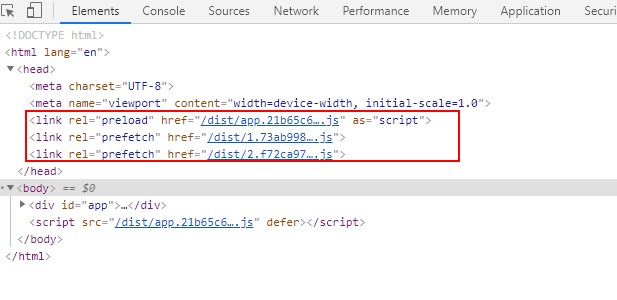
   
   preload加载的是当前页用的资源，prefetch加载的是下一页用到的资源，在浏览器空闲的时候加载，也就是不一定加载成功资源。
   
   当你跳转页面的时候，会在header中插入一个script标签，这里才会真正的执行里面的代码，这个script标签的js，可能之前prefetch已经加载回来了
   
   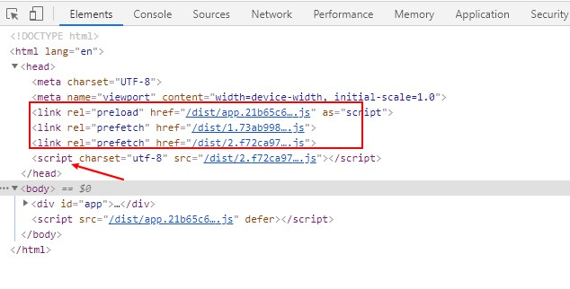
   
   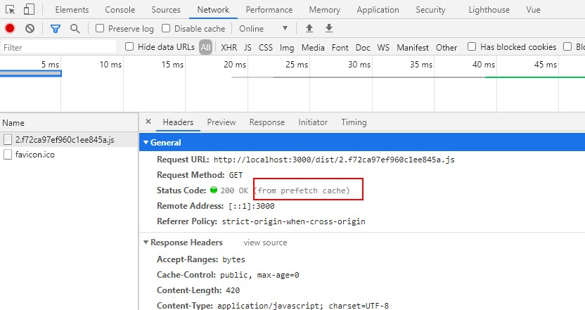
   
   同构时希望客户端尽早接管服务端渲染内容，让他拥有交互能力，如果使用script标签会去下载对应的资源执行里面的代码会阻塞页面的渲染

## 八、管理页面Head内容
1. Head内容
    
    实现不同页面的head内容

    vue官方Head管理：https://ssr.vuejs.org/zh/guide/head.html
    
    第三方模块：GitHub地址https://github.com/nuxt/vue-meta、官网https://vue-meta.nuxtjs.org/guide/
    
    安装依赖库`yarn add vue-meta`
    
    在通用app.js入口导入，https://vue-meta.nuxtjs.org/guide/
    ```base
    import VueMeta from 'vue-meta'
    
    Vue.use(VueMeta)
    
    Vue.mixin({
      metaInfo: {
        titleTemplate: '%s - Vue服务端渲染' // 当页面提供标题后，最终标题会渲染在‘%s’
      }
    })
    ```
   https://vue-meta.nuxtjs.org/guide/ssr.html#add-vue-meta-to-the-context
   
   entry-server.js的导出函数里添加代码：
   
   ```base
   const meta = app.$meta() // 一定要在路由导航之前
   context.meta = meta // 路由导航之后
   ```
   
   将meta数据注入到模板页面index.template.html中
   
   https://vue-meta.nuxtjs.org/guide/ssr.html#inject-metadata-into-page-string
   
   ```base
   <!DOCTYPE html>
   <html lang="en">
   <head>
     <meta charset="UTF-8">
     <meta name="viewport" content="width=device-width, initial-scale=1.0">
     {{{ meta.inject().title.text() }}}
     {{{ meta.inject().meta.text() }}}
   </head>
   <body>
     <!--vue-ssr-outlet-->
   </body>
   </html>
   ```
   
   Home.vue页面
   ```base
   export default {
     name: "Home",
     metaInfo: {
       title: '首页'
     }
   }
   ```
   About.vue页面
   ```base
   export default {
     name: "About",
     metaInfo: {
       title: '关于'
     }
   }
   ```
   metaInfo可以定制的信息https://vue-meta.nuxtjs.org/api/#metainfo-properties

## 九、数据预取和状态管理
1. 思路分析
    
    Vue SSR 数据预取和状态：https://ssr.vuejs.org/zh/guide/data.html
    
    在服务器端渲染(SSR)期间，我们本质上是在渲染我们应用程序的"快照"，所以如果应用程序依赖于一些异步数据，**那么在开始渲染过程之前，需要先预取和解析好这些数据**
    
    另一个需要关注的问题是在客户端，在挂载 (mount) 到客户端应用程序之前，需要获取到与服务器端应用程序完全相同的数据 - 否则，客户端应用程序会因为使用与服务器端应用程序不同的状态，然后导致混合失败
    
    为了解决这个问题，获取的数据需要位于视图组件之外，即放置在专门的数据预取存储容器(data store)或"状态容器(state container)）"中。首先，在服务器端，我们可以在渲染之前预取数据，并将数据填充到 store 中。此外，我们将在 HTML 中序列化(serialize)和内联预置(inline)状态。这样，在挂载(mount)到客户端应用程序之前，可以直接从 store 获取到内联预置(inline)状态
     
2. 数据预取
    
    ```base
    npm install vuex
    ```
    src/store/index.js
    ```base
    import Vue from 'vue'
    import Vuex from 'vuex'
    import axios from 'axios'
    
    Vue.use(Vuex)
    
    export const createStore = () => {
      return new Vuex.Store({
        state: () => ({ // 防止交叉请求带来的数据状态污染
          posts: []
        }),
    
        mutations: {
          setPosts(state, data) {
            state.posts = data
          }
        },
    
        actions: {
          // 在服务端渲染期间务必让 action 返回一个Promise
          async getPosts({ commit }) { // async 默认返回Promise
            // return new Promise()
            const { data } = await axios.get('https://cnodejs.org/api/v1/topics')
            commit('setPosts', data.data)
          }
        }
      })
    }
    ```
   
   将容器注入到入口文件src/app.js
   ```base
   /**
    * 通用启动入口
    */
   
   import Vue from 'vue'
   import App from './App.vue'
   import { createRouter } from './router/index'
   import VueMeta from 'vue-meta'
   import { createStore } from './store'
   
   Vue.use(VueMeta)
   
   Vue.mixin({
     metaInfo: {
       titleTemplate: '%s - Vue服务端渲染' // 当页面提供标题后，最终标题会渲染在‘%s’
     }
   })
   
   // 导出一个工厂函数，用于创建新的，否则每个用户访问相同的路由
   // 应用程序、router 和 store 实例
   export function createApp() {
     const router = createRouter()
     const store = createStore()
     const app = new Vue({
       router, // 把路由挂载到 vue 根实例中
       store, // 把容器挂载到 Vue 跟实例中
       // 根实例简单的渲染应用程序组件。
       render: h => h(App)
     })
     return { app, router, store }
   }
   ```
   src/pages/Posts.vue
   ```base
   <template>
     <div>
       <h1>Post list</h1>
       <ul>
         <li v-for="post in posts" :key="post.id">{{post.title}}</li>
       </ul>
     </div>
   </template>
   
   <script>
   // import axios from 'axios'
   import { mapState, mapActions } from 'vuex'
   
   export default {
     name: 'Posts',
     metaInfo: {
       title: 'Posts'
     },
   
     data() {
       return {
         // posts: []
       }
     },
   
     computed: {
       ...mapState(['posts'])
     },
   
     // Vue SSR 特殊为服务端渲染提供的一个生命周期钩子函数
     serverPrefetch() {
       // 发起action，返回 Promise
       // this.$store.dispatch('getPosts')
       return this.getPosts()
     },
   
     methods: {
       ...mapActions(['getPosts'])
     }
   
     // 服务端渲染
     // 只支持 beforeCreate 和 created
     // 不会等待 beforeCreate 和 created 中的异步操作
     // 不支持响应式数据
     // 所有这种做法在服务端渲染中是不会工作的！！！
     // async created() {
     //   console.log('Posts Created Start')
     //   const { data } = await axios({
     //     method: 'GET',
     //     url: 'https://cnodejs.org/api/v1/topics'
     //   })
     //   this.posts = data.data
     //   console.log('Posts Created End')
     // }
   }
   </script>
   ```
   created钩子函数中异步请求结果:
   
   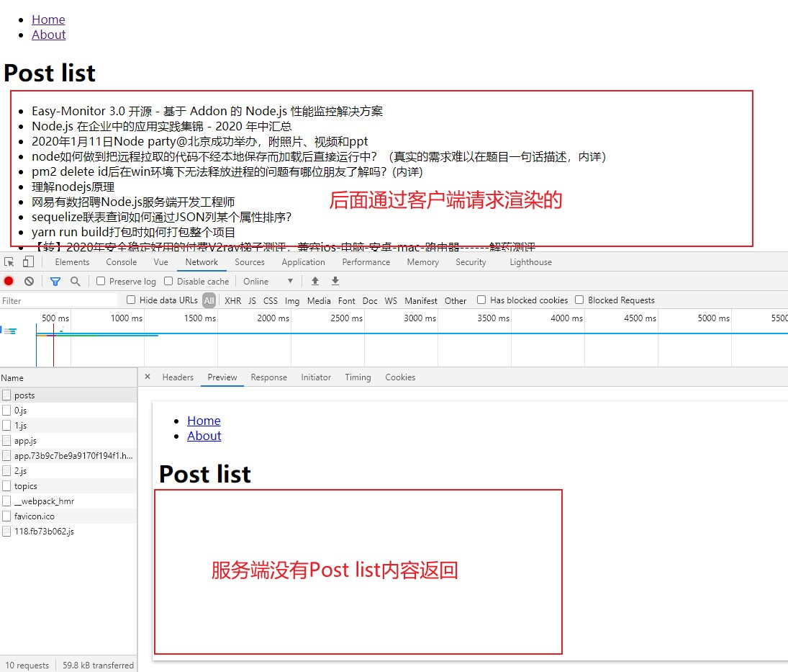
   
   `npm run dev`运行，打开页面发现闪了一下，页面的内容没了，打开网络请求查看发现服务端是有数据返回的
   
   原因是拿到的数据存储到服务端的vuex容器中了，应该同时把数据同步到客户端的vuex容器中
   
   服务端和客户端数据状态不同步导致合并失败，合并失败客户端要重新渲染，但是客户端是没有这个数据状态的，所以页面没数据
   
   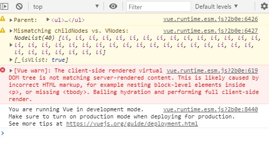

3. 将数据预取同步到客户端

    entry-server.js
    ```base
    /**
     * 服务端启动入口
     */
    
    import { createApp } from './app'
    
    // context参数是有server.js中的renderToString方法传递的第一个参数
    export default async context => {
      // 因为有可能会是异步路由钩子函数或组件，所以我们将返回一个 Promise，
      // 以便服务器能够等待所有的内容在渲染前，
      // 就已经准备就绪。（如，异步路由）
      const { app, router, store } = createApp()
    
      const meta = app.$meta() // 一定要在路由导航之前
    
      // 设置服务器端 router 的位置
      router.push(context.url) // 拿到客户端请求路径，设置路由
    
      context.meta = meta // 路由导航之后
    
      // 等到 router 将可能的异步组件和钩子函数解析完
      // new Promise((resolve, reject) => {
      //   router.onReady(resolve,reject)
      // })
      await new Promise(router.onReady.bind(router)) // onReady内部有this指向的问题
    
      // 服务端渲染完毕以后调用，也就可以拿到容器状态数据
      context.rendered = () => {
        // Renderer 会把 context.state 数据对象内联到页面模板中
        // 最终发送给客户端的页面中会包含一段脚本：window.__INITIAL_STATE__ = context.state
        // 客户端就要把页面中的 window.INITIAL_STATE__拿出来填充到客户端 store 容器中
        context.state = store.state
      }
    
      return app
    }
    ```
    entry-client.js
    ```base
    /**
     * 客户端入口
     */
    
    import { createApp } from './app'
    
    const { app, router, store } = createApp()
    
    if (window.__INITIAL_STATE__) {
      store.replaceState(window.__INITIAL_STATE__) // 替换容器状态
    }
    
    router.onReady(() => {
      app.$mount('#app')
    })
    
    ```


## 静态站点生成
### 一、Gridsome、静态网站生成器介绍
1. Gridsome是什么
    * 一个免费、开源、基于 Vue.js技术栈的静态网站生成器
    * 官网：https://gridsome.org/
    * GitHub：https://github.com/gridsome/gridsome

2. 什么是静态网站生成器
    * 静态网站生成器是使用一系列配置、模板以及数据，生成静态HTML文件及相关资源的工具
    * 这个功能也叫预渲染
    * 生成的网站不需要类似PHP这样的服务器
    * 只需要放到支持静态资源的 Web Server 或 CDN 上即可运行

3. 静态网站的好处
    * 省钱：不需要专业的服务器，只要能托管静态文件的空间即可
    * 快速：不经过后端服务器的处理，只传输内容
    * 安全：没有后端程序的执行，自然会更安全

4. 常见的静态网站生成器
    * Jekyll(Ruby)
    * Hexo(Node)
    * Hugo(Golang)
    * Gatsby(Node/React)
    * Gridsome(Node/Vue)
    * 另外，Next.js，Nuxt.js 也能生成静态网站，但是他们更多被认为是SSR（服务端渲染）框架

5. JAMStack
    * 这类静态网站生成器还有个漂亮的名字叫JAMStack
    * JAMStack的 JAM是javascript、API和Markup的首字母组合
    * 本质上是一种胖前端，通过调用各种API来实现更多的功能
    * 其实也是一种前后端的模式，只不过离得比较开，甚至前后端来自多个不同的厂商

6. 静态应用的使用场景
    * 不适合有大量路由页面的应用
        * 如果您的站点有成百上千条路由页面，则预渲染将非常缓慢。当然，您每次更新只需要做一次，但是可能要花一些时间。大多数人不会最终获得数千条静态路由页面，而只是以防万一
    * 不适合有大量动态内容的应用
        * 如果渲染路线中包含特定于用户查看其内容或其他动态源的内容，则应确保您具有可以显示的占位符组件，直到动态内容加载到客户端为止。否则可能有点怪异

### 二、Gridsome基础
1. 创建Gridsom项目
    
    Gridsome依赖sharp，国内的用户很难安装成功sharp，所以使用淘宝镜像安装sharp
    ```base
    npm config set sharp_binary_host "https://npm.taobao.org/mirrors/sharp"
    npm config set sharp_libvips_binary_host "https://npm.taobao.org/mirrors/sharp-libvips"
    ```
    sharp是C++语言编写的，所以还要安装C++环境
    
    安装node-gyp，编译C++扩展包
    
    根据node-gyp的官方文档 https://github.com/nodejs/node-gyp 的说明对不同操作系统进行安装命令：

    On Unix
    * Python v2.7, v3.5, v3.6, v3.7, or v3.8
    * `make`
    * A proper C/C++ compiler toolchain, like [GCC](https://gcc.gnu.org/)

    * On macOS
    ATTENTION: If your Mac has been upgraded to macOS Catalina (10.15), please read [macOS_Catalina.md](https://github.com/nodejs/node-gyp/blob/master/macOS_Catalina.md).
    * Python v2.7, v3.5, v3.6, v3.7, or v3.8
    * Xcode
        * You also need to install the `XCode Command Line Tools` by running `xcode-select --install`. Alternatively, if you already have the full Xcode installed, you can find them under the menu `Xcode -> Open Developer Tool -> More Developer Tools....` This step will install `clang`, `clang++`, and `make`.
    
    On Windows
    Install the current version of Python from the [Microsoft Store package.](https://docs.python.org/3/using/windows.html#the-microsoft-store-package)
    
    然后根据Gridsome官网https://gridsome.org/docs/ 的教程安装gridsome，
    ```base
    npm install --global @gridsome/cli 
    ```
   拉取远程模板到本地：
   ```base
   gridsome create my-gridsome-site
   ```
   安装依赖的时候比较慢，又没有进度条，可以按ctrl+C中断掉，然后进入已经生成的`my-gridsome-site`目录下，执行`rm -rf node_modules`删除半成品`node_modules`，然后重新执行`npm install`，此时就能看到进度了
   
   安装好依赖之后，可以在package.json里查看命令
   
   执行`npm run develop`启动项目

2. 预渲染
    
    Gridsome会把`pages`目录下的组件自动生成路由
    
    在pages目录下创建一个Foo.vue页面
    ```base
    <template>
      <div>
        <h1>Foo Page</h1>
      </div>
    </template>
    
    <script>
    export default {
      name: 'FooPage'
    }
    </script>
    
    <style>
    
    </style>

    ```
   访问http://localhost:8080/foo
   
   然后执行`npm run build`进行打包，打包后生成了一个dist文件
   
   安装serve：`npm i -g serve`
   
   然后在这个dist路径下起一个静态服务：`serve dist`
   然后访问http://localhost:5000 就可以看到页面是由服务端渲染好了返回的，然后客户端的交互都是单页面应用形式。

3. 目录结构

   `src/main.js`是整个项目的入口，加载了`/layouts/Default.vue`
   ```base
   // This is the main.js file. Import global CSS and scripts here.
   // The Client API can be used here. Learn more: gridsome.org/docs/client-api
   
   import DefaultLayout from '~/layouts/Default.vue'
   
   export default function (Vue, { router, head, isClient }) {
     // Set default layout as a global component
     Vue.component('Layout', DefaultLayout)
   }
   ```
   Default.vue 特殊之处
   ```base
   <static-query>
   query {
     metadata {
       siteName
     }
   }
   </static-query>
   ```
   专门查询`Graphql`数据给`Gridsom`用
   
   `src/templates`文件夹是放集合的节点(组件)
   
   `src/pages`是路由页面，自动生成路由，我们不需要配置路由
   
   `src/layouts`放布局组件
   
   `src/components`放公共组件
   
   `src/.temp`放打包过程生成的文件
   
   `.catch`是缓存的一些内容
   
   `node_modules`放第三方包
   
   `static`放不需要打包编译的文件，指静态的资源
   
   `gridsome.config.js` Gridsome的配置文件
   
   `gridsome.server.js` 也是Girdsome的配置文件，是配置服务端的，Gridsome内部的服务配置
   
4. 项目配置

   在 https://gridsome.org/docs/config 可以查看Gridsome的配置

   `gridsome.config.js`
   ```base
   // This is where project configuration and plugin options are located.
   // Learn more: https://gridsome.org/docs/config
   
   // Changes here require a server restart.
   // To restart press CTRL + C in terminal and run `gridsome develop`
   
   module.exports = {
     siteName: '拉勾教育',
     siteDescription: '大前端',
     plugins: []
   }
   ```
   运行，浏览器打开可以看到浏览器的标签、meta标签description 显示对应的数据

5. Pages
   
   (1) 基于文件形式
   
   直接在src/pages目录下创建一个文件
   
   (2) 基于编程方式

   gridsome.server.js
   
   ```base
   api.createPages(({ createPage }) => {
       // Use the Pages API here: https://gridsome.org/docs/pages-api/
       createPage({
         path: '/my-page',
         component: './src/templates/MyPage.vue'
       })
     })
   ```
   
   src/templates/MyPage.vue
   
   ```base
   <template>
     <div>
       <h1>
         MyPage
       </h1>
     </div>
   </template>
   
   <script>
   export default {
     name: 'MyPage',
     metaInfo: {
       title: 'MyPage' // 配置header中的title
     }
   }
   </script>
   
   <style>
   
   </style>
   ```
   重启项目后访问http://localhost:8080/my-page就可以看到MyPage页面

6. 动态路由
   
   (1) pages下面创建的页面文件名称用方括号括起来，作为动态路由参数

   src/pages/user/[id].vue
   ```base
   <template>
     <div>
       <h1>
         User {{$route.params.id}} Page
       </h1>
     </div>
   </template>
   
   <script>
   export default {
     name: "UserPage"
   }
   </script>
   
   <style scoped>
   
   </style>
   ```
   访问：http://localhost:8080/user/1
   
   就可以看到 User 1 Page 这个内容了

   (2) 编程方式
   
   gridsome.server.js

   ```base
   api.createPages(({ createPage }) => {
     createPage({
       path: '/user/:id(\\d+)', //正则表达式，id必须是数字
       component: './src/templates/User.vue'
     })
   })
   ```
   
7. 集合
   
   ```base
   <template>
     <Layout>
       <h1>Posts1</h1>
       <ul>
         <li v-for="post in posts" :key="post.id">{{ post.title }}</li>
       </ul>
     </Layout>
   </template>
   
   <script>
   import axios from 'axios'
   export default {
     name: 'Posts1',
     data () {
       return {
         posts: []
       }
     },
     async created () {
       const { data } = await axios.get('https://jsonplaceholder.typicode.com/posts')
       this.posts = data
     }
   }
   </script>
   
   <style>
   
   </style>
   ```
   数据是在客户端动态加载请求过来的，不是预渲染生成的
   
   想要数据预渲染，得使用Gridsome中的集合Collections
   ```base
   // gridsome.server.js
   const axios = require('axios')
   
   module.exports = function (api) {
     api.loadSource(async actions => {
       const collection = actions.addCollection('Post')
   
       const { data } = await axios.get('https://api.example.com/posts')
   
       for (const item of data) {
         collection.addNode({
           id: item.id,
           title: item.title,
           content: item.content
         })
       }
     })
   }
   ```

8. 在GraphQL中查询数据
   
   运行项目，访问http://localhost:8080/___explore
   
   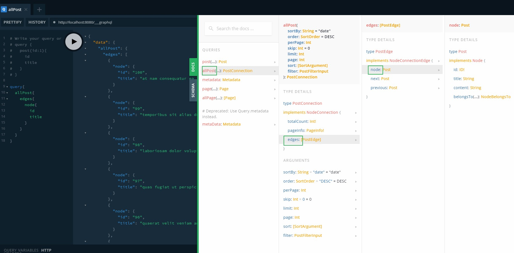

   点击`DOCS`可以查看有哪些数据被查询
   
   左侧是我们需要查询的数据
   
   点击中间的按钮
   
   右侧返回数据

9. 在页面中查询GraphQL

   Posts2.vue，静态页面，服务端渲染的

   ```base
   <template>
     <Layout>
         <h1>Posts2</h1>
         <ul>
           <li v-for="edge in $page.posts.edges" :key="edge.node.id">
             <g-link to="/">{{edge.node.title}}</g-link>
           </li>
         </ul>
       </Layout>
   </template>
   
   <script>
   export default {
     name: 'Posts2',
   }
   </script>
   
   <style>
   
   </style>
   
   <page-query>
   query {
     posts: allPost {
       edges {
         node {
           id
           title
         }
       }
     }
   }
   </page-query>
   ```

10. 使用模板渲染节点页面
    
    配置动态路由模板
    ```base
    // gridsome.config.js
    module.exports = {
      siteName: '拉钩教育',
      siteDescription: '大前端',
      plugins: [],
      templates: {
        Post: [
          {
            path: '/posts/:id',
            component: './src/templates/Post.vue'
          }
        ]
      }
    }
    ```
    
    模板页面src/template/Post.vue，预渲染页面，从GraphQL获取的数据
    ```base
    <template>
      <Layout>
        <h1>{{$page.post.title}}</h1>
        <p>{{$page.post.content}}</p>
      </Layout>
    </template>
    
    <page-query>
      query($id: ID!) { # 动态路由参数会自动传入进来
        post(id: $id) {
          id
          title
          content
        }
      }
    </page-query>
    <script>
    export default {
      name: 'PostPage',
      metaInfo () {
        return {
          title: this.$page.post.title
        }
      }
    }
    </script>
    
    <style>
    
    </style>
    ```
    
    metaInfo写成函数形式可以通过this.$page获取到graphQL返回的数据


### 三、Gridsome案例
1. 创建项目
   ```base
   gridsome create blog-with-gridsome
   ```
   当进入install的时候按ctrl C中断，然后进入文件夹执行npm install来安装第三方包
   ```base
   cd blog-with-gridsome
   npm install
   ```

2. 处理首页模板
   
   Fork Bootstrap的一个模板：https://github.com/StartBootstrap/startbootstrap-clean-blog
   
   然后执行git clone https://github.com/YuYun95/startbootstrap-clean-blog.git --depth=1，只克隆最后一个版本就行了
   
   然后回到我们的项目中，安装需要的依赖
   
   ```base
   npm i bootstrap
   npm i @fortawesome/fontawesome-free
   ```
   新建目录文件 src/assets/css/index.css，内容：
   ```base
   @import url("https://fonts.googleapis.com/css?family=Lora:400,700,400italic,700italic");
   @import url("https://fonts.googleapis.com/css?family=Open+Sans:300italic,400italic,600italic,700italic,800italic,400,300,600,700,800");
   ```
   
   在main.js 引入资源
   ```base
   import 'bootstrap/dist/css/bootstrap.min.css'
   import '@fortawesome/fontawesome-free/css/all.min.css'
   
   import './assets/css/index.css'
   ```
   
   把克隆的 startbootstrap-clean-blog项目中的 css/clean-blog.css 内容拷贝到刚才新建的index.css文件中

   把startbootstrap-clean-blog中的index.html里面的body部分的HTML代码拷贝到我们的项目中的src/pages/Index.vue中
   
   把startbootstrap-clean-blog中的img文件夹拷贝到我们的项目中的static中，作为静态资源使用，static里的文件不会经过打包编译，可以提高构建速度
   
   把模板中的img路径，前加`/`，如：`/img/home-bg.jpg`

3. 处理其他页面模板
   
   将Index.vue中的头部、尾部代码剪切到layouts/Default.vue中，注意头尾代码中间要放一个<slot/>插槽
   
   然后将Index.vue的最外层组件由div改为Layout。Layout已经在全局注册过了，可以直接使用
   
   然后pages目录写Post.vue、About.vue、Contact.vue页面，把startbootstrap-clean-blog中的post.html、about.html、contact.html中的代码拿过来即可
   
4. 使用本地md文件管理文章内容
   
   ```base
   npm i @gridsome/source-filesystem
   npm i @gridsome/transformer-remark # 转换MD文件
   ```
   创建两个md文件，content/blog/article1.md、contetn/blog/artcle2.md
   
   在gridsome.config.js中配置
   ```base
   module.exports = {
     siteName: 'Gridsome',
     siteDescription: '',
     plugins: [
       {
         use: '@gridsome/source-filesystem',
         options: {
           typeName: 'BlogPost',
           path: './content/blog/**/*.md'
         }
       }
     ]
   }
   ```
   运行项目访问 http://localhost:8080/___explore
   
   在GraphQL中查询数据可以把配置path路径的md文件的内容查询到
   
   
   
5. Strapi介绍

   网址：https://strapi.io/

   strapi是一个通用的内容管理系统。
   
   执行创建strapi命令

   ```base
   yarn create strapi-app my-project --quickstart
   ```

   

   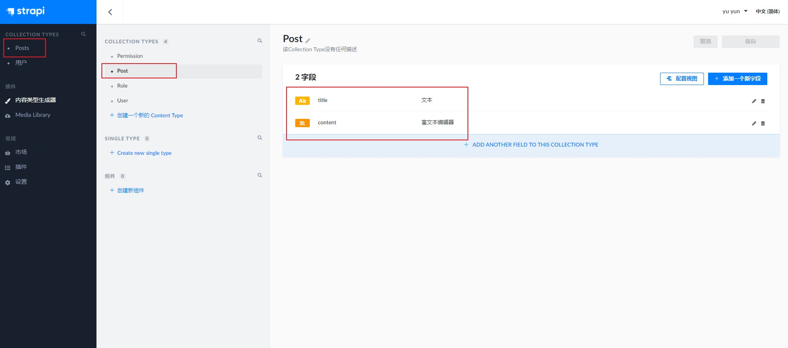
   
   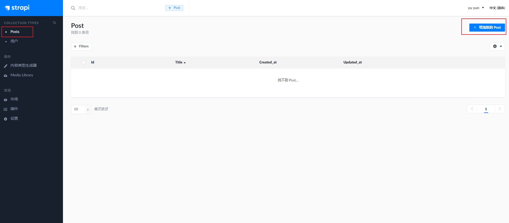
   
6. 使用Strapi接口数据
   
   默认是Restful API
   
   https://strapi.io/documentation/v3.x/content-api/api-endpoints.html#get-an-entry
   
   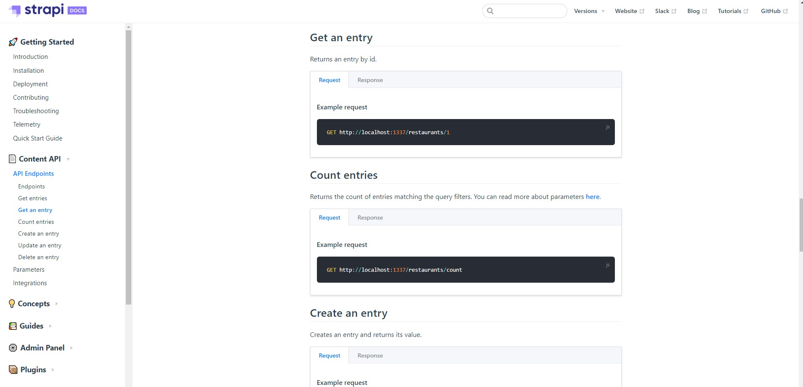
   
   给用户配置权限：
   
   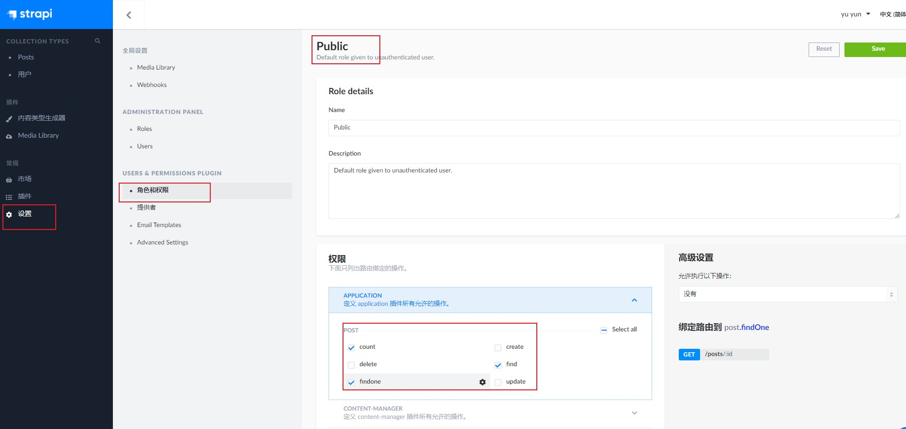
   
   使用Postman进行接口测试：
   
   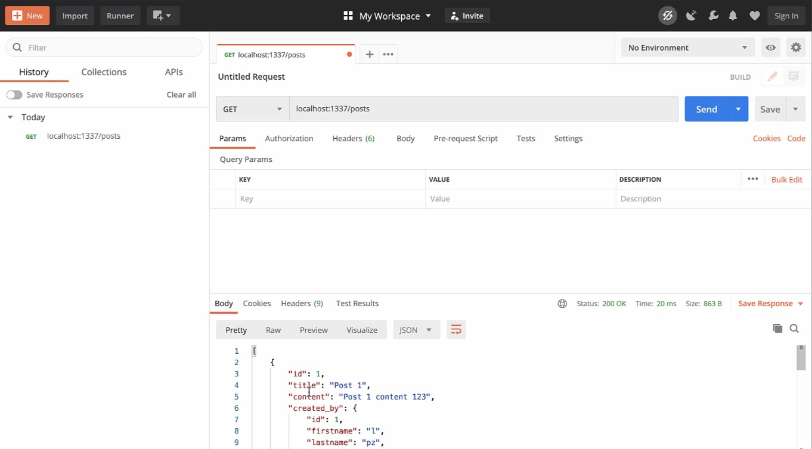
   
7. 访问受保护的API
   
   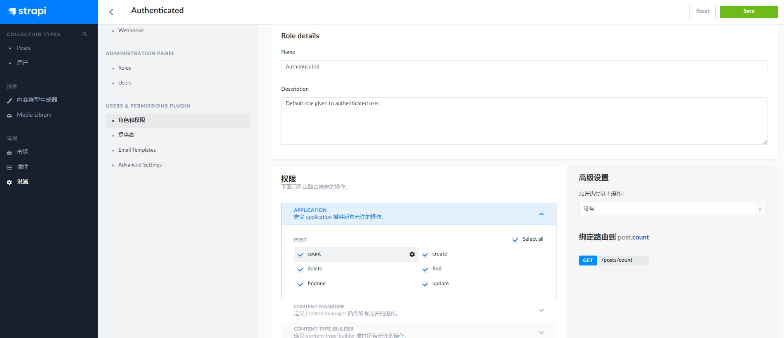
   
   创建一个用户：admin, 123456
   
   注册、登录的API：https://strapi.io/documentation/v3.x/plugins/users-permissions.html#concept
   
   使用Postman测试登录接口
   
   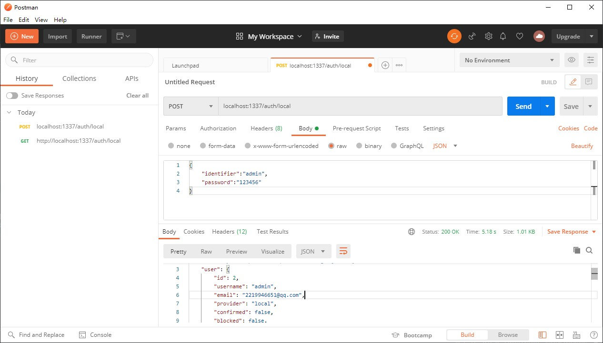
   
   请求其他接口时，http头部要增加授权信息Authorization: Bearer ${token}
   
   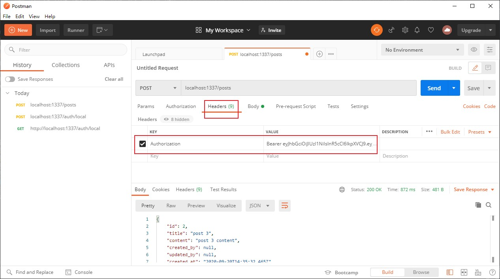
   
8. 通过GraphQL访问Strapi
   
   安装
   
   ```base
   npm install @gridsome/source-strapi
   ```
   
   使用
   
   ```base
   // gridsome.config.js
   export default {
     plugins: [
       {
         use: '@gridsome/source-strapi',
         options: {
           apiURL: 'http://localhost:1337',
           queryLimit: 1000, // Defaults to 100
           contentTypes: ['article', 'user'],
           singleTypes: ['impressum'],
           // Possibility to login with a Strapi user,
           // when content types are not publicly available (optional).
           loginData: {
             identifier: '',
             password: ''
           }
         }
       }
     ]
   }
   ```
   重启应用，才会拉取最新数据(后台新增了数据，要重启应用拉取最新数据)
   
9. 设计文章和标签数据模型
   
   删除原来的测试数据：
   
   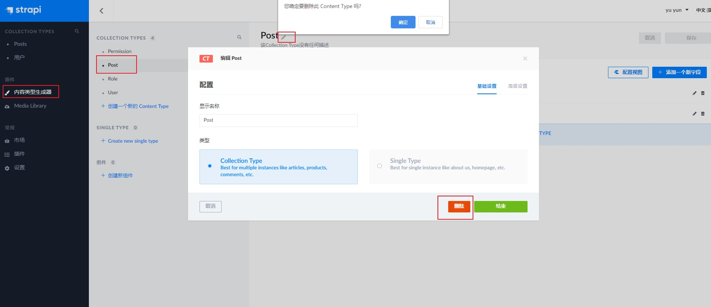
   
   创建新的Content Type，名称为Post，有四个字段
   
   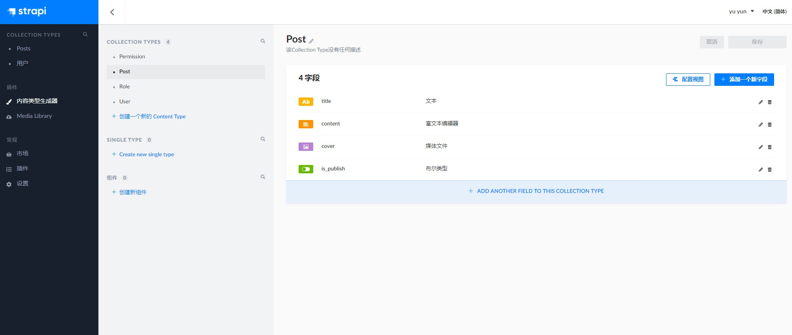
   
   再创建一个新的Content Type，名称为Tag，有两个字段，其中字段posts为引用类型，为多对多的关系
   
   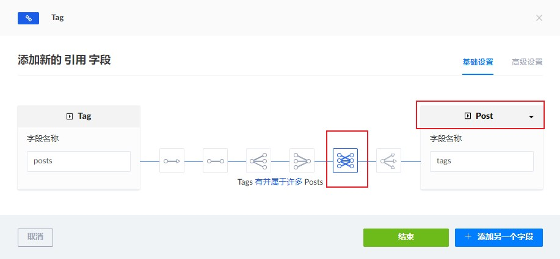
   
   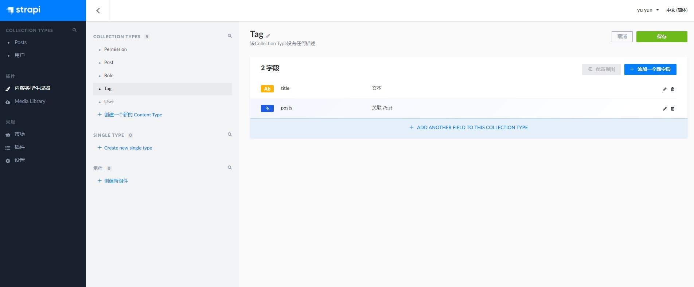
   
   新增一个Tag，标题为HTML
   
   然后修改post里面的标题为post 1的数据，选择Tags为HTML
   
   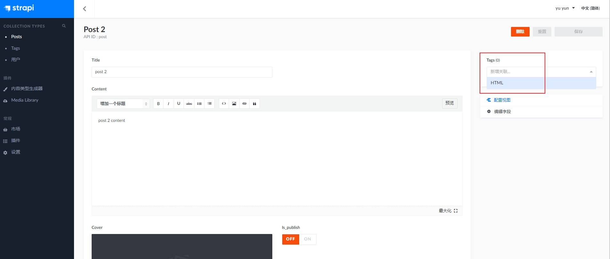
   
   然后回到Tags表中的HTML数据的编辑屏，还可以再关联别的Posts
   
   在角色和权限中设置public角色权限查询Posts和Tags的权限
   
   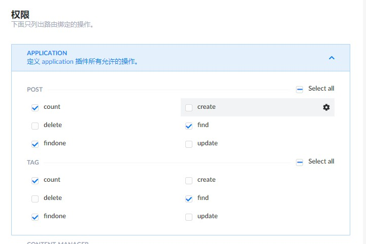
   
   
   
   
   
   
   
   
   
   
   
   
   
   
   
   
   
   
   
   
   
   
   
   
