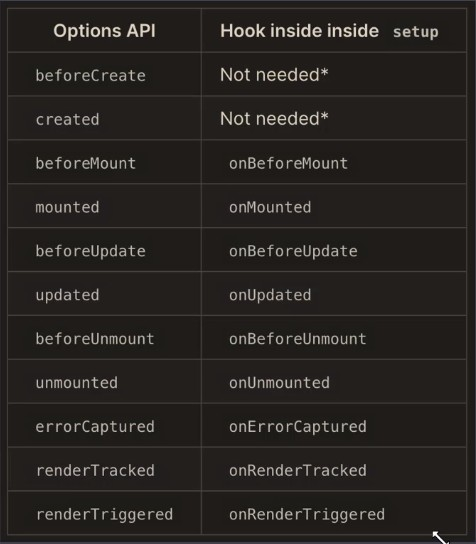

# Vue.js 3.0 Composition APIs 及 3.0 原理剖析
## Vue.js 3.0介绍
### 一、Vue.js 源码组织方式
1. 源码采用 Typescript 重写

   提高了代码的可维护性。大型项目的开发都推荐使用类型化的语言，在编码的过程中检查类型的问题

2. 使用 Monorepo 管理项目结构
   
   使用一个项目管理多个包，把不同功能的代码放到不同的package中管理，这样每个功能模块划分明确，模块之间的依赖关系也明确，每个功能模块都可以单独测试、单独发布、单独使用

3. 不同的构建版本

    Vue3不再构建UMD模块化的方式，因为UMD会让代码有更多的冗余，它要支持多种模块化的方式。Vue3中将CJS、ESModule和自执行函数的方式分别打包到了不同的文件中。在package/vue中有Vue3的不同构建版本
    * cjs(commonjs模块化方式，两个都是完整版，包含运行时和编译器)
        * vue.cjs.js 开发版，代码没有被压缩
        * vue.cjs.prod.js 生产版，代码被压缩过
    * global 四个文件在浏览器中都可以通过script标签导入，导入后去增加一个全局的Vue对象
        * vue.global.js 完整版，包含编译器和运行时
        * vue.global.prod.js 完整版，生产版代码压缩，包含编译器和运行时
        * vue.runtime.global.js 只包含运行时的构建版本
        * vue.runtime.global.prod.js 只包含运行时的构建版本
    * browser 四个版本都包含esm，浏览器的原生模块化方式，可以直接通过`<script type="module" />`的方式来导入模块
        * vue.esm-browser.js
        * vue.esm-browser.prod.js
        * vue.runtime.esm-browser.js
        * vue.runtime.esm-browser.prod.js
    * bundler 这两个版本没有打包所有的代码，只会打包使用的代码，需要配合打包工具来使用，会让Vue体积更小
        * vue.esm-bundler.js
        * vue.runtime.esm-bundler.js

### 二、Composition API
* RFC(Request For Comments)
   * https://github.com/vuejs/rfcs
* Composition API RFC
   * https://composition-api.vuejs.org

1. 设计动机

   * Options API
       * 包含一个描述组件选项（data、methods、props等）的对象
       * Options API 开发复杂组件，同一个功能逻辑的代码被拆分到不同选项
   * Composition API
       * Vue.js 3.0 新增的一组 API
       * 一组基于函数的API
       * 可以更灵活的组织组件的逻辑

### 三、性能提升
1. 响应式系统升级

   Vue 3.0 使用 Proxy 对象重写了响应式系统
   * Vue.js 2.X 中响应式系统的核心 defineProperty
       * 初始化的时候递归遍历所有的属性，转化为getter、setter
       * 动态添加属性调用vue.set()处理
       * 监听不到属性的删除，数组的索引和length属性也监听不到
   * Vue.js 3.0 中使用 Proxy 对象重写响应式系统
       * 可以监听动态新增的属性
       * 可以监听删除的属性
       * 可以监听数组的索引和length属性
   
2. 编译优化
   
   优化编译过程和重写虚拟DOM提升渲染性能
   * Vue.js 2.x 中通过标记静态根节点，优化 diff 的过程
   * Vue.js 3.0 中标记和提升所有的静态根节点，diff 的时候只需要对比动态节点内容
       * Fragments(vscode升级vetur插件)
       * 静态提升
       * Patch flag
       * 缓存事件处理函数
   
3. 源码体积的优化
   
   优化代码体积和Tree-shaking支持，减小打包体积
   * Vue.js 3.0 中移除了一些不常用的API
       * 如：inline-template、filter 等
   * Tree-shaking
       * 如：Vue3中的没用到的模块不会被打包，但是核心模块会打包。Keep-Alive、transition等都是按需引入的

### 四、Vite
Vue的打包工具。Vite是法语中的"快"的意思

1.ES Module
   * 现代浏览器都支持 ES Module（IE不支持）
   * 通过下面的方式加载模块 `<script type="module" src="..."></script>`
   * 有了type="module"的模块是延迟加载的，类似于 script 标签设置 defer
       * 在文档解析完成后，也就是DOM树生成之后，触发 DOMContentLoaded 事件前执行

2. Vite as Vue-CLI
   * Vite 在开发模式下不需要打包可以直接运行
   * Vue-CLI开发模式下必须对项目打包才可以运行
   * Vite 开发模式使用浏览器原生支持的ESM加载模块，也就是通过import导入模块，支持ESM的现代浏览器通过`<script type="module" src="..."></script>`的方式加载模块
   * Vite在生产环境下使用Rollup打包，Rollup基于浏览器原生ESM打包，不需要使用babel把import转换为require，以及一些辅助函数，所以打包体积小
       * 基于ES Module的方式打包
    * Vue-CLI使用Webpack打包

3. Vite 特点
   * 快速冷启动
   * 按需编译
   * 模块热更新

4. Vite 创建项目
   * Vite 创建项目
       * `npm init vite-app <project-name>`
       * `cd <project-name>`
       * `npm install`
       * `npm run dev`
   * 基于模板创建项目
       * npm init vite-app --template react
       * npm init vite-app --template preact
   
   * Vite开启的web服务会劫持`.vue`请求，首先会把`.vue`文件解析成js文件，并且把响应头中的`Content-Type`设置为`application/javascript`，目的是告诉浏览器发送的是javascript脚本

## Composition API
### 一、Composition API使用
1. 使用Vue3.0

   先创建一个空文件夹，然后进入文件夹执行`npm init -y`，再执行`npm install vue@3.0.0-rc.1`安装vue3.0

   ```base
   <div id="app">
     x: {{position.x}} <br/>
     y: {{position.y}}
   </div>
   <script type="module">
   import {createApp} from './node_modules/vue/dist/vue.esm-browser.js'
   
   const app = createApp({
     data() {
       return {
         position: {
           x: 0,
           y: 0
         }
       }
     }
   })
   console.log(app)
   
   app.mount('#app')
   </script>
   ```

2. setup、reactive的使用
   * createAPP：创建Vue对象
   * setup：Composition API入口
   * reactive：把一个对象转换为响应式对象，嵌套属性也会转换为响应式，返回的是一个Proxy对象
   ```base
   <div id="app">
     x: {{position.x}} <br/>
     y: {{position.y}}
   </div>
   <script type="module">
   import {createApp, reactive} from './node_modules/vue/dist/vue.esm-browser.js'
   
   const app = createApp({
     setup(){ // setup在props解析完毕，在组件实例创建之前执行，this获取不到组件实例
       // 第一个参数 props，响应式对象，不能被解构
       // 第二个参数 context，有三个成员attrs、emit、slots
   
       const position = reactive({
         x: 0,
         y: 0
       })
       return {
         position
       }
     },
     mounted(){
       this.position.x = 100
     }
   })
   console.log(app)
   
   app.mount('#app')
   </script>
   ```

### 二、setup中使用生命周期钩子函数
在setup中使用生命周期钩子函数只需要在生命周期前面加上on，然后生命周期首字母大写。原本的生命周期中的destroy对应的是onUnmounted；setup是在创建组件实例前执行的，所以beforeCreate、created中的代码都可以放在setup中



```base
<div id="app">
  x: {{position.x}} <br/>
  y: {{position.y}}
</div>
<script type="module">
import {createApp, reactive, onMounted, onUnmounted} from './node_modules/vue/dist/vue.esm-browser.js'

function useMousePosition() {
  const position = reactive({
    x: 0,
    y: 0
  })

  const update = e => {
    position.x = e.pageX
    position.y = e.pageY
  }

  onMounted(() => {
    window.addEventListener('mousemove', update)
  })

  onUnmounted(() => {
    window.removeEventListener('mousemove', update)
  })

  return position
}

const app = createApp({
  setup() { // setup在props解析完毕，在组件实例创建之前执行，this获取不到组件实例
    // 第一个参数 props，响应式对象，不能被解构
    // 第二个参数 context，有三个成员attrs、emit、slots

    const position = useMousePosition()
    return {
      position
    }
  },
  mounted() {
    this.position.x = 100
  }
})
console.log(app)

app.mount('#app')
</script>
```

### 三、reactive-toRefs-ref
reactive创建的响应式数据(reactive返回的是Proxy对象)，解构后不再是响应式，相对于声明变量接收属性值，基本类型的赋值就是把值在内存中复制一份，所以解构后的变量是基本类型

toRefs可以把响应式对象的所有属性也转化成响应式

toRefs要求传入的是一个代理对象，如果传入的是非代理对象会报警告

toRefs内容会创建一个新对象，遍历传入的代理对象的所有属性，把所有属性的值都转换为响应式对象，然后挂载到新创建的对象，把新对象返回

toRefs内部会为代理对象的每一个属性创建一个有value属性的对象，该对象是响应式的，value具有getter和setter

所以可以解构toRefs返回的对象，解构之后还是响应式数据，解构的每一个属性也是响应式的

reactive是将普通对象转化成响应式对象，而ref是将基本类型数据包装成了响应式对象，创建具有value属性的对象，value具有getter和setter

ref的使用
```base
<div id="app">
  <button @click="increase">按钮</button>
  <span>{{count}}</span>
</div>
<script type="module">
import {createApp, ref} from './node_modules/vue/dist/vue.esm-browser.js'

function useCount() {
  const count = ref(0) // 将基本类型数据转化成响应式对象
  return {
    count,
    increase: () => {
      count.value++
    }
  }
}

createApp({
  setup() {
    return {
      ...useCount()
    }
  }
}).mount('#app')
</script>
```

如果ref传入的是对象会调用reactive，如果传入的是基本数据类型会创建具有value属性的对象

模板中使用ref的值是可以直接`{{count}}`，但是在js代码中使用ref的值要`xxx.value`

### 四、Computed
computed可以创建一个响应式数据，这个响应式数据依赖于其他响应式数据，就是计算属性
* 第一种用法
    * watch(() => count.value +1)
* 第二种用法
```base
const count = ref(1)
const plusOne = computed({
    get: () => count.value + 1,
    set: value => {
        count.value = value - 1
    }
})
```
使用：
```base
<div id="app">
  <button @click="push">按钮</button>
  未完成： {{activeCount}}
</div>
<script type="module">
import {createApp, reactive, computed} from './node_modules/vue/dist/vue.esm-browser.js'

const data = [
  {text: '看书', completed: false},
  {text: '敲代码', completed: false},
  {text: '约会', completed: true}
]
createApp({
  setup(){
    const todos = reactive(data)

    const activeCount = computed(() => {
      return todos.filter(item => !item.completed).length
    })

    return {
      activeCount,
      push:() => {
        todos.push({
          text: '开会',
          completed: false
        })
      }
    }
  }
}).mount('#app')
</script>
```

### 五、Watch
1. Watch 的三个参数

    * 第一个参数：要监听的数据
    * 第二个参数：监听到数据变化后执行的函数，这个函数有两个参数分别是新值和旧值
    * 第三个参数：选项对象，deep和immediate
    
2. Watch 的返回值

    * 取消监听的函数

使用
```base
<div id="app">
  请选择一个yes/no的问题：
  <input v-model.lazy="question">
  <p>{{answer}}</p>
</div>
<script type="module">
import {createApp, ref, watch} from './node_modules/vue/dist/vue.esm-browser.js'

createApp({
  setup() {
    const question = ref('')
    const answer = ref('')

    watch(question, async (newValue, onlValue) => {
      const response = await fetch('https://yesno.wtf/api')
      const data = await response.json()
      answer.value = data.answer
    })

    return {
      question,
      answer
    }
  }
}).mount('#app')
</script>
```

### 六、WatchEffect
* 是Watch函数的简化版，也用来监视数据的变化
* 接收一个函数作为参数，监听函数内响应式数据的变化
```base
<div id="app">
  <button @click="increase">increase</button>
  <button @click="stop">stop</button>
  <p>{{count}}</p>
</div>
<script type="module">
import {createApp, ref, watchEffect} from './node_modules/vue/dist/vue.esm-browser.js'

createApp({
  setup() {
    const count = ref(0)
    const stop = watchEffect(() => { // watchEffect在初始化的时候执行一次，数据变化时再次执行
      console.log(count.value)
    })

    return {
      count,
      stop,
      increase: () => count.value++
    }
  }
}).mount('#app')
</script>
```

### 七、ToDoList 功能演示
1. ToDoList 功能列表
    * 添加待办事项
    * 删除待办事项
    * 编辑待办事项
    * 切换待办事项
    * 存储待办事项

2. 项目结构

    使用vue脚手架创建项目，需要脚手架4.5以上，[Vue Cli安装、升级](https://cli.vuejs.org/zh/guide/installation.html)，创建项目时可以选择vue版本
    
    使用vue create 创建项目，选择vue 3.0版本
    ```base
    vue create todolist
    ```
    选择 Default (Vue 3 Preview) ([Vue 3] babel, eslint)

3. 添加待办事项
   
   在输入框输入文本按下enter键提交待办事项
   ```javascript
   // 1. 添加待办事项
   const useAdd = todos => {
     const input = ref('')
     // eslint-disable-next-line no-unused-vars
     const addTodo = () => {
       const text = input.value && input.value.trim()
       if (text.length === 0) return
       todos.value.unshift({
         text,
         completed: false
       })
       input.value = ''
     }
     return {
       input,
       addTodo
     }
   }
   
   export default {
     name: 'App',
     setup() {
       const todos = ref([])
   
       return {
         ...useAdd(todos),
         todos
       }
     }
   }
   ```

4. 删除待办事项
   
   点击待办事项右侧的按钮删除待办事项
   ```javascript
   // 2. 删除待办事项
   const useRemove = todos => {
     const remove = todo => {
       const index = todos.value.indexOf(todo)
       todos.value.splice(index, 1)
     }
     return { remove }
   }
   
   export default {
     name: 'App',
     setup() {
       const todos = ref([])
   
       return {
         todos,
         ...useAdd(todos),
         ...useRemove(todos)
       }
     }
   }
   ```
   
5. 编辑待办事项
   
   * 双击待办事项显示编辑文本框
   * 显示文本框的时候获取焦点
   * 按esc退出编辑
   * 按enter或者文本框失去焦点提交编辑
   * 如果删光文本，则删除这一项
   ```javascript
   // 3、编辑待办事项
   const useEdit = remove => {
     let beforeEditingText = ''
     const editingTodo = ref(null)
     const editTodo = todo => {
       beforeEditingText = todo.text
       editingTodo.value = todo
     }
     const doneEdit = todo => {
       if (!editingTodo.value) return
       todo.text = todo.text.trim()
       todo.text || remove(todo)
       editingTodo.value = null
     }
     const cancelEdit = todo => {
       editingTodo.value = null
       todo.text = beforeEditingText
     }
   
     return {
       editingTodo,
       editTodo,
       doneEdit,
       cancelEdit
     }
   }
   
   export default {
     name: 'App',
     setup() {
       const todos = ref([])
   
       const { remove } = useRemove(todos)
   
       return {
         todos,
         remove,
         ...useAdd(todos),
         ...useEdit(remove)
       }
     }
   }
   ```
   模板：
   ```base
   <ul class="todo-list">
     <li v-for="todo in todos" :key="todo" :class="{editing: todo === editingTodo}">
       <div class="view">
         <input type="checkbox" class="toggle">
         <label @dblclick="editTodo(todo)">{{ todo.text }}</label>
         <button class="destroy" @click="remove(todo)"></button>
       </div>
       <input type="text" class="edit" v-model="todo.text" @keyup.enter="doneEdit(todo)" @blur="doneEdit(todo)" @keyup.esc="cancelEdit(todo)">
     </li>
   </ul>
   ```
   这里li的key值绑定 todo，如果绑定 todo.text，在编辑的时候 vue 在对比 VNode 的时候发现 newVNode 和 oldVNode 不同，重新渲染DOM，这时输入框会失去焦点

6. 编辑文本框获取焦点--Vue3.0 自定义指令
   
   传对象形式：
   * Vue 2.x
   ```base
   Vue.directive('editingFocus', {
     bind(el, binding, vnode, prevVnode) {},
     inserted() {},
     update() {},
     componentUpdated() {},
     unbind() {}
   })
   ```
   
   * Vue 3.0
   ```base
   app.directive('editingFocus', {
     beforeMount(el, binding, vnode, pervVnode) {},
     mounted() {},
     beforeUpdate() {},
     updated() {},
     beforeUnmount() {},
     unmounted() {}
   })
   ```
   
   传函数形式
   * Vue 2.x
   ```base
   Vue.directive('editingFocus', (el, binding) => {
     binding.value && el.focus()
   })
   ```
   
   * Vue 3.0
   ```base
   app.directive('editingFocus', (el, binding) => {
     binding.value && el.focus()
   })
   ```
   
   实现自定义指令，获取真正编辑的文本框焦点
   ```base
   export default {
     name: 'App',
     
     // setup() {...},
   
     directives: {
       editingFocus: (el, binding) => {
         binding.value && el.focus()
       }
     }
   }
   ```
   
   模板中
   ```base
   <input
     class="edit"
     type="text"
     v-editing-focus="todo === editingTodo"
     v-model="todo.text"
     @keyup.enter="doneEdit(todo)"
     @blur="doneEdit(todo)"
     @keyup.esc="cancelEdit(todo)"
   >
   ```

7. 切换待办事项的状态

   * 点击 CheckBox 可以改变所有代办项状态
   * All/Active/Completed
   * 其他
       * 显示未完成代办项个数
       * 移除所有完成的项目
       * 如果没有待办项，隐藏 main 和 footer
       
   ```javascript
   // 2. 删除待办事项
   const useRemove = todos => {
     const remove = todo => {
       const index = todos.value.indexOf(todo)
       todos.value.splice(index, 1)
     }
   
     // 删除全部已完成待办事项
     const removeCompleted = () => {
       todos.value = todos.value.filter(todo => !todo.completed)
     }
     return {
       remove,
       removeCompleted
     }
   }
   
   // 4、切换待办项完成状态
   const useFilter = todos => {
   
     // 切换全部状态
     const allDone = computed({
       get() {
         return !todos.value.filter(todo => !todo.completed).length
       },
       set(value) {
         todos.value.forEach(todo => {
           todo.completed = value
         })
       }
     })
   
     const filter = {
       all: list => list,
       active: list => list.filter(todo => !todo.completed),
       completed: list => list.filter(todo => todo.completed)
     }
   
     const type = ref('all')
     const filteredTodos = computed(() => filter[type.value](todos.value))
     const remainingCount = computed(() => filter.active(todos.value).length)
     const count = computed(() => todos.value.length)
   
     const onHashChange = () => {
       const hash = window.location.hash.replace('#/', '')
       if (filter[hash]) {
         type.value = hash
       } else {
         type.value = 'all'
         window.location.hash = ''
       }
     }
   
     onMounted(() => {
       window.addEventListener('hashchange', onHashChange)
       onHashChange()
     })
   
     onUnmounted(() => {
       window.removeEventListener('hashchange', onHashChange)
     })
   
     return {
       allDone,
       count,
       filteredTodos,
       remainingCount,
     }
   }
   
   export default {
     // 略
     setup() {
       const {removeCompleted } = useRemove(todos)
       return {
         // ...   
         removeCompleted
       }
     }
   }
   ```
   
   模板
   ```html
   <section v-show="count" class="main">
     <input id="toggle-all" class="toggle-all" type="checkbox" v-model="allDone">
     <label for="toggle-all">Mark all as complete</label>
     <ul class="todo-list">
       <li
         v-for="todo in filteredTodos"
         :key="todo"
         :class="{ editing: todo=== editingTodo, completed: todo.completed }"
       >
         <div class="view">
           <input class="toggle" type="checkbox" v-model="todo.completed">
           <label @dblclick="editTodo(todo)">{{ todo.text }}</label>
           <button class="destroy" @click="remove(todo)"></button>
         </div>
         <input
           class="edit"
           type="text"
           v-editing-focus="todo === editingTodo"
           v-model="todo.text"
           @keyup.enter="doneEdit(todo)"
           @blur="doneEdit(todo)"
           @keyup.esc="cancelEdit(todo)"
         >
       </li>
     </ul>
   </section>
   <footer v-show="count" class="footer">
         <span class="todo-count">
           <strong>{{ remainingCount }}</strong> {{ remainingCount > 1 ? 'items' : 'item' }} left
         </span>
     <ul class="filters">
       <li><a href="#/all">All</a></li>
       <li><a href="#/active">Active</a></li>
       <li><a href="#/completed">Completed</a></li>
     </ul>
     <button v-show="count > remainingCount" class="clear-completed" @click="removeCompleted">
       Clear completed
     </button>
   </footer>
   ```

8. 存储待办事项
   
   把待办事项存储到本地，刷新页面是加载数据，数据改变时更新本地存储
   
   ```javascript
   import useLocalStorage from './utils/useLocalStorage'
   const storage = useLocalStorage()
   
   // 5、存储待办事项
   const useStorage = () => {
     const KEY = 'TODOKEYS'
     const todos = ref(storage.getItem(KEY) || [])
   
     // watchEffect监视todos，todos变化时执行回调函数
     watchEffect(() => {
       storage.setItem(KEY, todos.value)
     })
   
     return todos
   }
   
   export default {
   
     setup() {
       const todos = useStorage()
       // 略   
     }
     // 略
   }
   ```
   
   utils/useLocalStorage.js
   ```javascript
   function parse (str) {
     let value
     try {
       value = JSON.parse(str)
     } catch {
       value = null
     }
     return value
   }
   
   function stringify (obj) {
     let value
     try {
       value = JSON.stringify(obj)
     } catch {
       value = null
     }
     return value
   }
   
   export default function useLocalStorage () {
     function setItem (key, value) {
       value = stringify(value)
       window.localStorage.setItem(key, value)
     }
   
     function getItem (key) {
       let value = window.localStorage.getItem(key)
       if (value) {
         value = parse(value)
       }
       return value
     }
   
     return {
       setItem,
       getItem
     }
   }
   ```
   
9. 完整代码

   APP.vue
   ```base
   <template>
     <section id="app" class="todoapp">
       <header class="header">
         <h1>todos</h1>
         <input
           class="new-todo"
           placeholder="What needs to be done?"
           autocomplete="off"
           autofocus
           v-model="input"
           @keyup.enter="addTodo"
         >
       </header>
       <section v-show="count" class="main">
         <input id="toggle-all" class="toggle-all" type="checkbox" v-model="allDone">
         <label for="toggle-all">Mark all as complete</label>
         <ul class="todo-list">
           <li
             v-for="todo in filteredTodos"
             :key="todo"
             :class="{ editing: todo=== editingTodo, completed: todo.completed }"
           >
             <div class="view">
               <input class="toggle" type="checkbox" v-model="todo.completed">
               <label @dblclick="editTodo(todo)">{{ todo.text }}</label>
               <button class="destroy" @click="remove(todo)"></button>
             </div>
             <input
               class="edit"
               type="text"
               v-editing-focus="todo === editingTodo"
               v-model="todo.text"
               @keyup.enter="doneEdit(todo)"
               @blur="doneEdit(todo)"
               @keyup.esc="cancelEdit(todo)"
             >
           </li>
         </ul>
       </section>
       <footer v-show="count" class="footer">
         <span class="todo-count">
           <strong>{{ remainingCount }}</strong> {{ remainingCount > 1 ? 'items' : 'item' }} left
         </span>
         <ul class="filters">
           <li><a href="#/all">All</a></li>
           <li><a href="#/active">Active</a></li>
           <li><a href="#/completed">Completed</a></li>
         </ul>
         <button v-show="count > remainingCount" class="clear-completed" @click="removeCompleted">
           Clear completed
         </button>
       </footer>
     </section>
     <footer class="info">
       <p>Double-click to edit a todo</p>
       <!-- Remove the below line ↓ -->
       <p>Template by <a href="http://sindresorhus.com">Sindre Sorhus</a></p>
       <!-- Change this out with your name and url ↓ -->
       <p>Created by <a href="https://www.lagou.com">教瘦</a></p>
       <p>Part of <a href="http://todomvc.com">TodoMVC</a></p>
     </footer>
   </template>
   
   <script>
   import './assets/index.css'
   import useLocalStorage from './utils/useLocalStorage'
   import { ref, computed, onMounted, onUnmounted, watchEffect } from 'vue'
   
   const storage = useLocalStorage()
   
   // 1. 添加待办事项
   const useAdd = todos => {
     const input = ref('')
     // eslint-disable-next-line no-unused-vars
     const addTodo = () => {
       const text = input.value && input.value.trim()
       if (text.length === 0) return
       todos.value.unshift({
         text,
         completed: false
       })
       input.value = ''
     }
     return {
       input,
       addTodo
     }
   }
   
   // 2. 删除待办事项
   const useRemove = todos => {
     const remove = todo => {
       const index = todos.value.indexOf(todo)
       todos.value.splice(index, 1)
     }
   
     // 删除全部已完成待办事项
     const removeCompleted = () => {
       todos.value = todos.value.filter(todo => !todo.completed)
     }
     return {
       remove,
       removeCompleted
     }
   }
   
   // 3、编辑待办事项
   const useEdit = remove => {
     let beforeEditingText = ''
     const editingTodo = ref(null)
   
     const editTodo = todo => {
       beforeEditingText = todo.text
       editingTodo.value = todo
     }
   
     const doneEdit = todo => {
       if (!editingTodo.value) return
       todo.text = todo.text.trim()
       todo.text || remove(todo)
       editingTodo.value = null
     }
   
     const cancelEdit = todo => {
       editingTodo.value = null
       todo.text = beforeEditingText
     }
   
     return {
       editingTodo,
       editTodo,
       doneEdit,
       cancelEdit
     }
   }
   
   // 4、切换待办项完成状态
   const useFilter = todos => {
   
     // 切换全部状态
     const allDone = computed({
       get() {
         return !todos.value.filter(todo => !todo.completed).length
       },
       set(value) {
         todos.value.forEach(todo => {
           todo.completed = value
         })
       }
     })
   
     const filter = {
       all: list => list,
       active: list => list.filter(todo => !todo.completed),
       completed: list => list.filter(todo => todo.completed)
     }
   
     const type = ref('all')
     const filteredTodos = computed(() => filter[type.value](todos.value))
     const remainingCount = computed(() => filter.active(todos.value).length)
     const count = computed(() => todos.value.length)
   
     const onHashChange = () => {
       const hash = window.location.hash.replace('#/', '')
       if (filter[hash]) {
         type.value = hash
       } else {
         type.value = 'all'
         window.location.hash = ''
       }
     }
   
     onMounted(() => {
       window.addEventListener('hashchange', onHashChange)
       onHashChange()
     })
   
     onUnmounted(() => {
       window.removeEventListener('hashchange', onHashChange)
     })
   
     return {
       allDone,
       count,
       filteredTodos,
       remainingCount,
     }
   }
   
   // 5、存储待办事项
   const useStorage = () => {
     const KEY = 'TODOKEYS'
     const todos = ref(storage.getItem(KEY) || [])
   
     // watchEffect监视todos，todos变化时执行回调函数
     watchEffect(() => {
       storage.setItem(KEY, todos.value)
     })
   
     return todos
   }
   
   export default {
     name: 'App',
   
     setup() {
       const todos = useStorage()
   
       const { remove, removeCompleted } = useRemove(todos)
   
       return {
         todos,
         remove,
         removeCompleted,
         ...useAdd(todos),
         ...useEdit(remove),
         ...useFilter(todos)
       }
     },
   
     directives: {
       editingFocus: (el, binding) => {
         binding.value && el.focus()
       }
     }
   }
   </script>
   ```
   
## Vue 3.0 响应式系统原理
### 一、介绍
1. Vue3.0 响应式回顾
   * Proxy 对象实现属性监听
   * 多层属性嵌套，在访问属性过程中处理下一级属性
   * 默认监听动态添加的属性
   * 默认监听属性的删除操作
   * 默认监听数组索引和 length 属性
   * 可以作为单独的模块使用

2. 核心方法
   * reactive/ref/toRefs/computed
   * effect
   * track
   * trigger

### 二、Proxy对象回顾
1. 在严格模式下，Proxy需要返回布尔类型的值，否则会报 TypeError
   
   > Uncaught TypeError: 'set' on proxy: trap returned falsish for property 'foo'
   
   ```base
   'use strict'
   // 问题1： set 和 deleteProperty 中需要返回布尔类型的值，
   // 在严格模式下，如果返回 false 的话会出现 type Error 的异常
   
   const target = {
     foo: 'xxx',
     bar: 'yyy'
   }
   // Reflect.getPrototypeOf()
   // Object.getPrototypeOf()
   const proxy = new Proxy(target, {
     get(target, key, receiver) {
       // return target[key]
       return Reflect.get(target, key, receiver)
     },
     set(target, key, value, receiver) {
       // target[key] = value
       return Reflect.set(target, key, value, receiver) // 这里要写 return
     },
     deleteProperty(target, key) {
       // delete target[key]
       return Reflect.deleteProperty(target, key) // 这里要写 return
     }
   })
   
   proxy.foo = 'zzz'
   // delete proxy.foo
   ```

2. Proxy 和 Reflect 中使用receiver

   Proxy 中 receiver：Proxy 或者继承 Proxy 的对象 Reflect 中 receiver：如果 target 对象中设置了 getter，getter 中的 this 指向 receiver
   ```base
   const obj = {
     get foo() {
       console.log(this)
       return this.bar
     }
   }
   
   const proxy = new Proxy(obj,{
     get(target, key, receiver) {
       if (key === 'bar') {
         return 'value - bar'
       }
       return Reflect.get(target, key, receiver) // 指向this.bar的时候，this指向代理对象，也就是获取target.bar
     }
   })
   
   console.log(proxy.foo) // value - bar
   ```

### 三、reactive
* 接收一个参数，判断这个参数是否是对象
* 创建拦截器对象handler，设置get/set/deleteProperty
* 返回Proxy对象

