# Vue.js + TypeScript 实战项目开发与项目优化

## 一、搭建项目架构
### 一、使用VueCli创建项目
```base
vue create edu-boss-fed
```


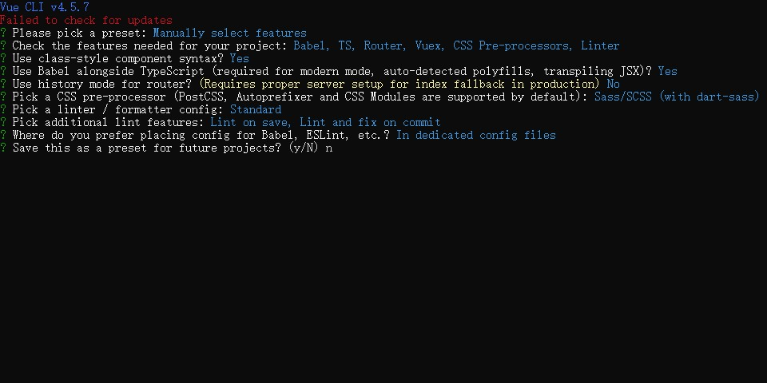

```base
cd edu-boss-fed
yarn serve
```

### 二、加入Git版本管理
创建一个空的GitHub仓库，将本地项目同步到GitHub上
```base
git init
git add README.md
git commit -m "first commit"
git branch -M main
git remote add origin https://github.com/YuYun95/edu-boss-fed.git
git push -u origin main
```

### 三、初始目录结构说明
main.ts 入口文件

App.vue 项目根组件

shims-tsx.d.ts 和 shims-vue.d.ts TypeScript配置文件

view/Home.vue 首页组件

view/About.vue about页面组件

store/index.ts 容器模块

router/index.ts 路由模块，配置了路由表

components文件夹，放公共组件

assets文件夹，存放静态资源

public文件夹，纯静态资源，不会被打包，可以直接 '/文件名'访问

.browserslistrc 浏览器兼容配置

.editorconfig 编辑器配置

.eslintrc.js ESLint的配置

.gitignore Git忽略文件

babel.config.js Babel配置文件

package.json 依赖清单

package-lock.json 第三方包具体版本号，确保协同开发时版本一致

tsconfig.json TS相关配置文件

### 四、调整初始目录结构
1. 删除默认示例文件

    * App.vue 删除样式、路由连接，不删除vue-router组件
    * router/index.ts 清空路由表数组
    * 删除views文件夹里的Home.vue和About.vue，删除components文件里的HelloWorld.vue，删除assets里的logo.png

2. 新增一些文件或目录

    * 在src里面创建一个utils（放工具函数）、styles（放全局样式）、services（放请求接口）

### 五、Typescript配置
1. Typescript 相关的依赖项
    * vue-class-component 提供使用Class语法写Vue组件
    * vue-property-decorator 在Class语法基础上提供了一些辅助装饰器
    * @typescript-eslint/eslint-plugin 使用ESLint校验Typescript代码
    * @typescript-eslint/parser 将Typescript转为AST提供ESLint校验使用
    * @vue/cli-plugin-typescript 使用TS + ts-loader-fork-ts-checker-webpack-plugin进行更快的类型检查
    * @vue/eslint-config-typescript 兼容ESLint的TS校验规则
    * typescript TS编译器，提供类型校验和转换JavaScript功能

2. Typescript配置文件tsconfig.json
    ```base
    {
        "compilerOptions": {
            "target": "esnext",
            "module": "esnext",
            "strict": true,
            "jsx": "preserve",
            "importHelpers": true,
            "moduleResolution": "node",
            "experimentalDecorators": true,
            "skipLibCheck": true,
            "esModuleInterop": true,
            "allowSyntheticDefaultImports": true,
            "sourceMap": true,
            "baseUrl": ".",
            "types": [
            "webpack-env"
            ],
            "paths": {
                "@/*": [
                    "src/*"
                ]
            },
            "lib": [
                "esnext",
                "dom",
                "dom.iterable",
                "scripthost"
            ]
        },
        "include": [
            "src/**/*.ts",
            "src/**/*.tsx",
            "src/**/*.vue",
            "tests/**/*.ts",
            "tests/**/*.tsx"
        ],
        "exclude": [
            "node_modules"
        ]
    }
    ```

3. shims-vue.d.ts 文件的作用
    ```base
    // 主要用于 Typescript 识别 .vue 文件模块
    // Typescript 默认不支持导入 .vue 模块，这个文件告诉 Typescript 导入 .vue 文件模块都按VueConstructor<vue> 类型识别处理
    declare module '*.vue' {
        import vue from 'vue'
        export default vue
    }
    ```

4. shims-tsx.d.ts 文件的作用
    ```base
    // 为jsx组件模块补充类型声明
    import vue, { VNode } from 'vue'
    declare global {
        namespace JSX {
            // tslint:disable no-empty-interface
            interface Element extends VNode {}
            // tslint:disable no-empty-interface
            interface ElementClass extends Vue {}
            interface IntrinsicElements {
                [elem: string]: any;
            }
        }
    }
    ```

5. Typescript 模块都使用 .ts 后缀

### 六、使用ts开发项目
1. 使用 Options APIs
    ```base
   <script>
   // 1.编译器给的类型提示
   // 2.typescript编译期间的类型验证
   export default {
     data() {
       return {
         a: 1,
         b: "2",
         c: [],
         d: {
           a: 1,
           b: "2"
         }
       }
     },
     methods: {
       test(){
         // this.a.
         // this.b
         // this.a.test()
       }
     }
   }
   </script>
    ```
    指定script标签的lang属性为ts，则控制台会有ts类型推断检测

    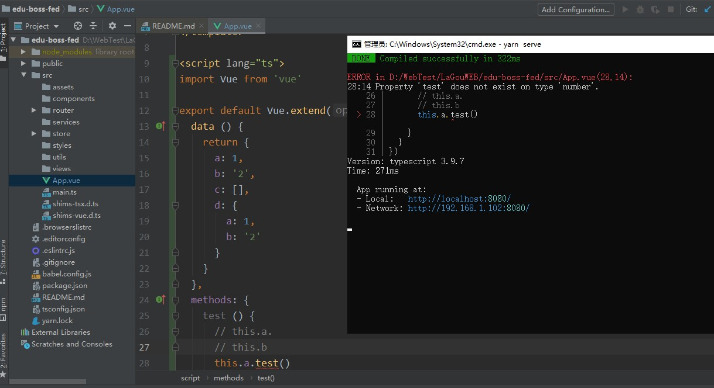
    
    Typescript在编译阶段就可以知道代码是错误的
    
    在打包项目时，如果有错误typescript编译不通过，打包不成功

2. 使用ClassAPIs定义Vue组件

    使用教程：https://class-component.vuejs.org/
    ```base
    <template>
      <div id="app">
        <h1>拉勾教育</h1>
        <p>{{ a }}</p>
        <button @click="test">测试</button>
        <!-- 跟路由出口 -->
        <router-view/>
      </div>
    </template>
    
    <script lang="ts">
    import Vue from 'vue'
    import Component from 'vue-class-component'
    
    @Component
    
    export default class App extends Vue {
      a = 1
      b = '2'
      c = {
        a: 1,
        b: '2'
      }
    
      test () {
        console.log(this.a)
      }
    }
    </script>
    ```

3. 装饰器语法
    
    装饰器是ES草案的一个新特性，不过这个草案最近有可能发生重大调整，所以不建议在生产环境中使用。
    
    类的装饰器：
    ```base
    function testable (target) {
      target.isTestable = true
    }
   
    @testable
    class MyTableClass {
      // ...
    }
    // 写了上面的两行代码后，会自动的调用testable函数，然后把类传递给函数
    // 装饰器就是扩展类的属性
   
    console.log(MyTestableClass.isTestable) // true
    ```
   
4. 使用vue-property-decorator创建Vue组件

    是在vue-class-component基础上封装的
    
    装饰器语法不稳定

5. 总结创建组件的方式
    * Options APIs
    * Class APIs
    * Class + decorator
    
    个人建议：No Class APIs，只用Options APIs
    > Class语法仅仅是一种写法而已，最终还是要转换为普通的组件数据结构。

    > 装饰器语法还没有正式定稿发布，建议了解即可，正式发布以后再选择使用也可以
    
    使用Options APIs最好是使用`export default Vue.extend({...})`而不是 `export default {...}`
    
### 七、代码规范
1. 标准是什么
   * https://standardjs.com/ Standard Style 宽松一点，适合个人或小团队
   * https://github.com/airbnb/javascript Airbnb 更严格，适合大型团队
   * http://google.github.io/ google 更严格，适合大型团队

2. 如何约束代码规范
    
   只靠口头约定肯定不行，所以要利用工具来强制执行
   * JSLint（不推荐，快被淘汰了）
   * JSHint（不推荐，快被淘汰了）
   * ESLint（主流）
   
   .eslintrc.js
   ```base
   module.exports = {
     root: true,
     env: {
       node: true
     },
     // 使用插件的编码校验规则
     extends: [
       'plugin:vue/essential',
       '@vue/standard',
       '@vue/typescript/recommended'
     ],
     parserOptions: {
       ecmaVersion: 2020
     },
     // 自定义编码校验规则
     rules: {
       'no-console': process.env.NODE_ENV === 'production' ? 'warn' : 'off',
       'no-debugger': process.env.NODE_ENV === 'production' ? 'warn' : 'off'
     }
   }
   ```

3. 自定义校验规则
   
   ESLint官网：https://cn.eslint.org/
   
   Error级别的警告会显示到页面上，Warning级别的警告会输出到控制台

   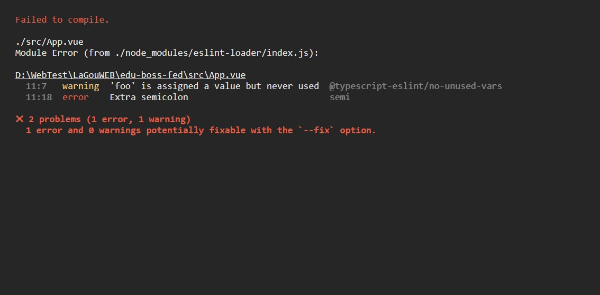
   
   如果想屏蔽掉这个规则，则去.eslintrc.js文件中配置,在rules数组里配置了'semi': 'off'，然后重启服务，这个报错就没有了
   
   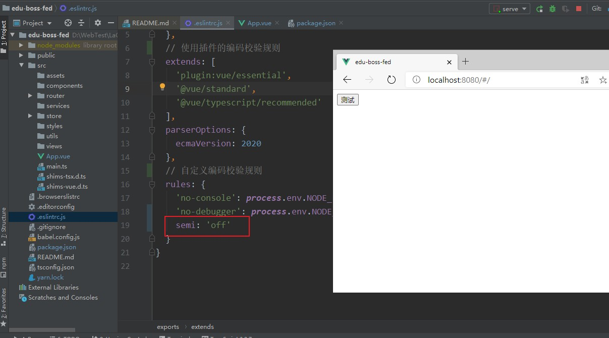

   如果必须要有分号，则配置为semi: ['error', 'always']
   
   然后删除node_modules/.cache文件，再重启项目，就可以看到效果了，报错缺少分号

   Typescript 的 interface会要有分号分割要求，为了与standard分割保持一致，我们期望去掉这个规则
   
   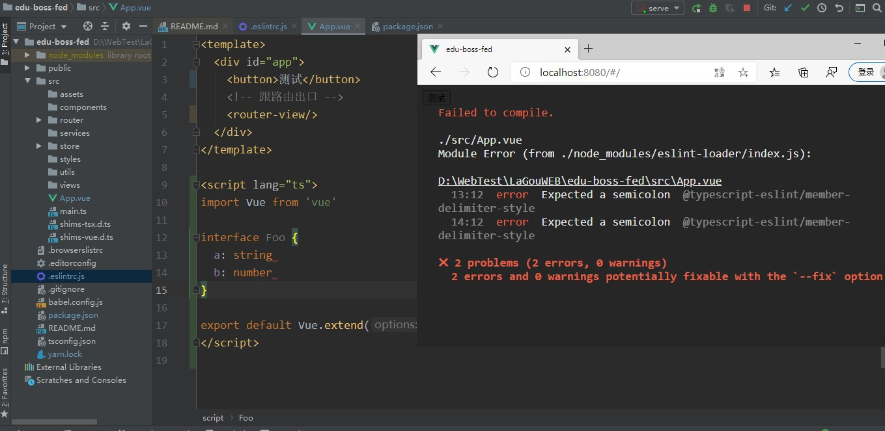

   从package.json里找到@vue/eslint-config-typescript依赖的地址：https://github.com/vuejs/eslint-config-typescript#readme
   
   然后在[这里](https://github.com/typescript-eslint/typescript-eslint/tree/master/packages/eslint-plugin)查到这个规则，在[规则详细配置](https://github.com/typescript-eslint/typescript-eslint/blob/master/packages/eslint-plugin/docs/rules/member-delimiter-style.md)查看怎么配置，在.eslintrc.js里增加规则：
   ```base
   '@typescript-eslint/member-delimiter-style': ['error', {
     "multiline": {
       "delimiter": "none",
       "requireLast": true
     }
   }]
   ```
   然后重启项目，interface里面不写分号分割也不报错了，如果写上分号反而会报错

### 八、引入ElementUI组件库
ElementUI官方文档：https://element.eleme.cn/
```base
npm i element-ui -S
```
main.js中增加ElementUI的导入和使用：
```base
import Vue from 'vue'
import ElementUI from 'element-ui'
import 'element-ui/lib/theme-chalk/index.css'
import App from './App.vue'
import router from './router'
import store from './store'

Vue.use(ElementUI)

Vue.config.productionTip = false

new Vue({
  router,
  store,
  render: h => h(App)
}).$mount('#app')
```

### 九、样式处理
```base
src/styles
|-- index.scss # 全局样式（在入口模块被加载生效）
|-- mixin.scss # 公共的 mixin 混入（可以把重复的样式封装为 mixin 混入到复用的地方）
|-- reset.scss # 重置基础样式
|-- variables.scss # 公共样式变量
```
elementUI的样式就不需要导入了，改为导入全局样式文件

main.js
```base
import Vue from 'vue'
import ElementUI from 'element-ui'
// import 'element-ui/lib/theme-chalk/index.css'
import App from './App.vue'
import router from './router'
import store from './store'

// 加载全局样式
import './styles/index.scss'

Vue.use(ElementUI)

Vue.config.productionTip = false

new Vue({
  router,
  store,
  render: h => h(App)
}).$mount('#app')
```

### 十、共享全局样式变量
[向预处理器 Loader 传递选项](https://cli.vuejs.org/zh/guide/css.html#%E5%90%91%E9%A2%84%E5%A4%84%E7%90%86%E5%99%A8-loader-%E4%BC%A0%E9%80%92%E9%80%89%E9%A1%B9)
```base
// vue.config.js
module.exports = {
  css: {
    loaderOptions: {
      // 默认情况下 `sass` 选项会同时对 `sass` 和 `scss` 语法同时生效
      // 因为 `scss` 语法在内部也是由 sass-loader 处理的
      // 但是在配置 `prependData` 选项的时候
      // `scss` 语法会要求语句结尾必须有分号，`sass` 则要求必须没有分号
      // 在这种情况下，我们可以使用 `scss` 选项，对 `scss` 语法进行单独配置
      scss: {
        prependData: `@import "~@/styles/variables.scss";` // css 里要加~符号才能使用@目录
      }
    }
  }
}
```
然后就可以在任意组件中使用全局样式变量了；如果没有配置，那么如果想用全局样式变量要在相应的文件引入样式文件

App.vue
```base
<template>
  <div id="app">
    <!-- 跟路由出口 -->
    <router-view/>

    <p class="text">hell</p>
  </div>
</template>

<script lang="ts">
import Vue from 'vue'

export default Vue.extend({})
</script>

<style lang="scss">
.text{
  color: $success-color;
}
</style>

```

### 十一、接口处理
1. 配置接口文档

   如果前端应用和后端API服务器没有运行在同一个主机上，需要在开发环境下将API请求代理到API服务器，这可以通过`vue.config.js`中的`devServer.proxy`选项来配置
   ```base
   devServer: {
     proxy: {
       '/boss': {
         target: 'http://eduboss.lagou.com',
           changeOrigin: true // 把请求头中的 host 配置为 target
       },
       '/front': {
         target: 'http://edufront.lagou.com',
           changeOrigin: true // 把请求头中的 host 配置为 target
       }
     }
   }
   ```

2. 封装请求模块
   ```base
   yarn add axios
   ```
   创建`src/utils/request.ts`
   ```base
   import axiso from 'axios'
   
   const request = axiso.create({
     // 配置选项
     // baseURL
     // timeout
   })
   
   // 请求拦截器
   
   // 响应拦截器
   
   export default request
   ```
   测试接口
   
   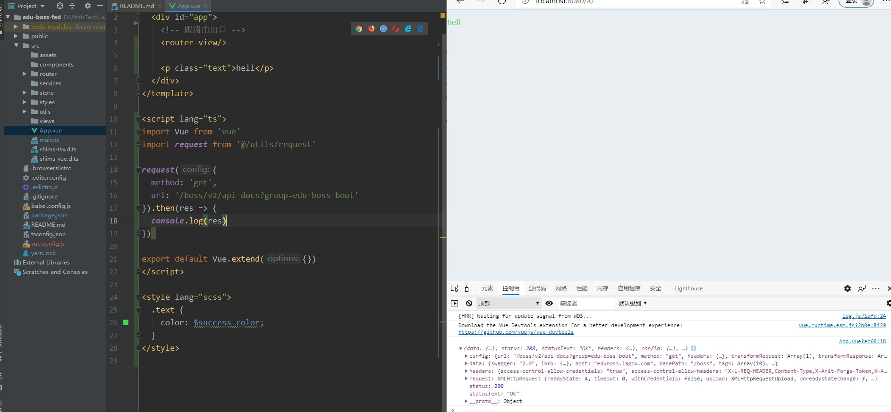

### 十二、布局
1. 初始化路由组件
   
   在src/views文件夹下创建对应的组件
   
   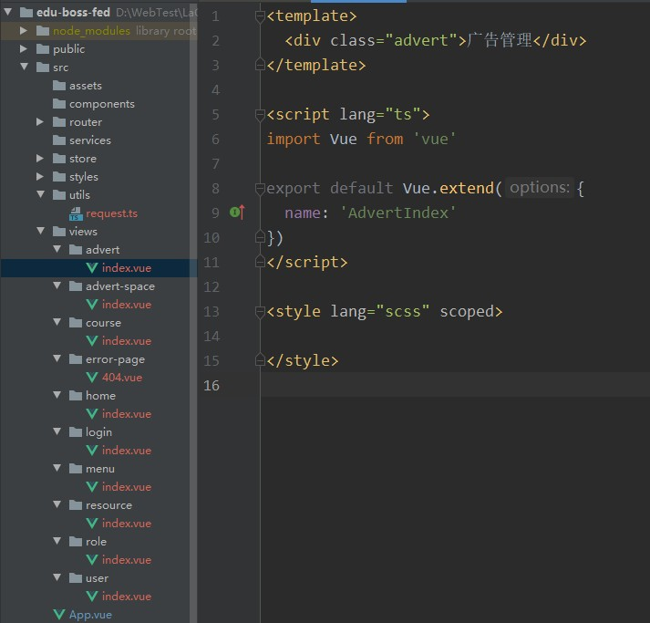
   
   路由表配置：router/index.ts
   
   ```base
   import Vue from 'vue'
   import VueRouter, { RouteConfig } from 'vue-router'
   
   Vue.use(VueRouter)
   
   // 路由配置规则
   const routes: Array<RouteConfig> = [
     {
       path: '/login',
       name: 'login',
       component: () => import(/* webpackChunkName: 'login' */'@/views/login/index.vue')
     },
     {
       path: '/',
       name: 'home',
       component: () => import(/* webpackChunkName: 'home' */'@/views/home/index.vue')
     },
     {
       path: '/role',
       name: 'role',
       component: () => import(/* webpackChunkName: 'role' */'@/views/role/index.vue')
     },
     {
       path: '/menu',
       name: 'menu',
       component: () => import(/* webpackChunkName: 'menu' */'@/views/menu/index.vue')
     },
     {
       path: '/resource',
       name: 'resource',
       component: () => import(/* webpackChunkName: 'resource' */'@/views/resource/index.vue')
     },
     {
       path: '/course',
       name: 'course',
       component: () => import(/* webpackChunkName: 'course' */'@/views/course/index.vue')
     },
     {
       path: '/user',
       name: 'user',
       component: () => import(/* webpackChunkName: 'user' */'@/views/user/index.vue')
     },
     {
       path: '/advert',
       name: 'advert',
       component: () => import(/* webpackChunkName: 'advert' */'@/views/advert/index.vue')
     },
     {
       path: '/advert-space',
       name: 'advert-space',
       component: () => import(/* webpackChunkName: 'advert-space' */'@/views/advert-space/index.vue')
     },
     {
       path: '*',
       name: '404',
       component: () => import(/* webpackChunkName: '404' */'@/views/error-page/404.vue')
     }
   ]
   
   const router = new VueRouter({
     routes
   })
   
   export default router
   ```

2. 布局容器
   
   src/layout/index.vue
   ```base
   <template>
     <el-container>
       <el-aside width="200px">Aside</el-aside>
       <el-container>
         <el-header>Header</el-header>
         <el-main>Main</el-main>
       </el-container>
     </el-container>
   </template>
   
   <script lang="ts">
   import Vue from 'vue'
   
   export default Vue.extend({
     name: 'LayoutIndex'
   })
   </script>
   
   <style lang="scss" scoped>
     .el-container{
       height: 100vh;
       min-width: 980px;
     }
     .el-aside {
       background-color: #d3dce6;
     }
     .el-header{
       background-color: #b3c0d1;
     }
     .el-main{
       background-color: #e9eef3;
     }
   </style>

   ```
   
   路由配置修改 src/router/index.ts
   ```base
   import Vue from 'vue'
   import VueRouter, { RouteConfig } from 'vue-router'
   import Layout from '@/layout/index.vue'
   
   Vue.use(VueRouter)
   
   // 路由配置规则
   const routes: Array<RouteConfig> = [
     {
       path: '/login',
       name: 'login',
       component: () => import(/* webpackChunkName: 'login' */'@/views/login/index.vue')
     },
     {
       path: '/',
       component: Layout,
       children: [
         {
           path: '',
           name: 'home',
           component: () => import(/* webpackChunkName: 'home' */'@/views/home/index.vue')
         },
         {
           path: '/role',
           name: 'role',
           component: () => import(/* webpackChunkName: 'role' */'@/views/role/index.vue')
         },
         {
           path: '/menu',
           name: 'menu',
           component: () => import(/* webpackChunkName: 'menu' */'@/views/menu/index.vue')
         },
         {
           path: '/resource',
           name: 'resource',
           component: () => import(/* webpackChunkName: 'resource' */'@/views/resource/index.vue')
         },
         {
           path: '/course',
           name: 'course',
           component: () => import(/* webpackChunkName: 'course' */'@/views/course/index.vue')
         },
         {
           path: '/user',
           name: 'user',
           component: () => import(/* webpackChunkName: 'user' */'@/views/user/index.vue')
         },
         {
           path: '/advert',
           name: 'advert',
           component: () => import(/* webpackChunkName: 'advert' */'@/views/advert/index.vue')
         },
         {
           path: '/advert-space',
           name: 'advert-space',
           component: () => import(/* webpackChunkName: 'advert-space' */'@/views/advert-space/index.vue')
         },
         {
           path: '*',
           name: '404',
           component: () => import(/* webpackChunkName: '404' */'@/views/error-page/404.vue')
         }
       ]
     }
   ]
   
   const router = new VueRouter({
     routes
   })
   
   export default router

   ```
   
   App.vue
   ```base
   <template>
     <div id="app">
       <!-- 跟路由出口 -->
       <router-view/>
     </div>
   </template>
   ```

3. 侧边栏组件
   
   layout/components/app-aside.vue
   ```base
   <template>
     <div class="aside">
       <el-menu
         default-active="2"
         @open="handleOpen"
         @close="handleClose"
         background-color="#545c64"
         text-color="#fff"
         active-text-color="#ffd04b"
         router
       >
         <el-submenu index="1">
           <template slot="title">
             <i class="el-icon-location"></i>
             <span>权限管理</span>
           </template>
           <el-menu-item index="/role">
             <i class="el-icon-setting"></i>
             <span slot="title">角色管理</span>
           </el-menu-item>
           <el-menu-item index="/menu">
             <i class="el-icon-setting"></i>
             <span slot="title">菜单管理</span>
           </el-menu-item>
           <el-menu-item index="/resource">
             <i class="el-icon-setting"></i>
             <span slot="title">资源管理</span>
           </el-menu-item>
         </el-submenu>
   
         <el-menu-item index="/course">
           <i class="el-icon-menu"></i>
           <span slot="title">课程管理</span>
         </el-menu-item>
   
         <el-menu-item index="/user">
           <i class="el-icon-menu"></i>
           <span slot="title">用户管理</span>
         </el-menu-item>
   
         <el-submenu index="4">
           <template slot="title">
             <i class="el-icon-location"></i>
             <span>广告管理</span>
           </template>
           <el-menu-item index="/advert">
             <i class="el-icon-setting"></i>
             <span slot="title">广告列表</span>
           </el-menu-item>
           <el-menu-item index="/advert-space">
             <i class="el-icon-setting"></i>
             <span slot="title">广告位列表</span>
           </el-menu-item>
         </el-submenu>
       </el-menu>
     </div>
   </template>
   
   <script lang="ts">
   import Vue from 'vue'
   
   export default Vue.extend({
     name: 'AppAside',
   
     methods: {
       handleOpen (key: string, keyPath: string): void {
         console.log(key, keyPath)
       },
       handleClose (key: string, keyPath: string): void {
         console.log(key, keyPath)
       }
     }
   })
   </script>
   
   <style lang="scss" scoped>
   .aside {
     .el-menu {
       min-height: 100vh;
     }
   }
   </style>
   ```
   
   el-menu添加router属性就是以index作为导航链接
   
   然后在layout/index.vue里面引入app-aside组件，然后将路由出口放在el-main里面
   
   layout/index.vue
   ```base
   <template>
     <el-container>
       <el-aside width="200px">
         <app-aside/>
       </el-aside>
       <el-container>
         <el-header>Header</el-header>
         <el-main>
           <!--子路由出口-->
           <router-view/>
         </el-main>
       </el-container>
     </el-container>
   </template>
   
   <script lang="ts">
   import Vue from 'vue'
   import AppAside from './components/app-aside.vue'
   
   export default Vue.extend({
     name: 'LayoutIndex',
   
     components: {
       AppAside
     }
   })
   </script>
   
   <style lang="scss" scoped>
   .el-container {
     height: 100vh;
     min-width: 980px;
   }
   
   .el-aside {
     background-color: #d3dce6;
   }
   
   .el-header {
     background-color: #b3c0d1;
   }
   
   .el-main {
     background-color: #e9eef3;
   }
   </style>

   ```

3. 头部Header

   layout/components/app-header.vue
   ```base
   <template>
     <div class="header">
       <el-breadcrumb separator-class="el-icon-arrow-right">
         <el-breadcrumb-item :to="{ path: '/' }">首页</el-breadcrumb-item>
         <el-breadcrumb-item>活动管理</el-breadcrumb-item>
         <el-breadcrumb-item>活动列表</el-breadcrumb-item>
         <el-breadcrumb-item>活动详情</el-breadcrumb-item>
       </el-breadcrumb>
       <el-dropdown>
         <span class="el-dropdown-link">
           <el-avatar shape="square" :size="40" src="https://cube.elemecdn.com/9/c2/f0ee8a3c7c9638a54940382568c9dpng.png"></el-avatar>
           <i class="el-icon-arrow-down el-icon--right"></i>
         </span>
         <el-dropdown-menu slot="dropdown">
           <el-dropdown-item>用户ID</el-dropdown-item>
           <el-dropdown-item divided>退出</el-dropdown-item>
         </el-dropdown-menu>
       </el-dropdown>
     </div>
   </template>
   
   <script lang="ts">
   import Vue from 'vue'
   
   export default Vue.extend({
     name: 'AppHeader'
   })
   </script>
   
   <style lang="scss" scoped>
   .header{
     height: 100%;
     display: flex;
     align-items: center;
     justify-content: space-between;
     .el-dropdown-link{
       display: flex;
       align-items: center;
     }
   }
   </style>
   ```
   
   layout/index.vue
   ```base
   <template>
     <el-container>
       <el-aside width="200px">
         <app-aside/>
       </el-aside>
       <el-container>
         <el-header>
           <app-header/>
         </el-header>
         <el-main>
           <!--子路由出口-->
           <router-view/>
         </el-main>
       </el-container>
     </el-container>
   </template>
   
   <script lang="ts">
   import Vue from 'vue'
   import AppAside from './components/app-aside.vue'
   import AppHeader from './components/app-header.vue'
   
   export default Vue.extend({
     name: 'LayoutIndex',
   
     components: {
       AppAside,
       AppHeader
     }
   })
   </script>
   
   <style lang="scss" scoped>
   .el-container {
     height: 100vh;
     min-width: 980px;
   }
   
   .el-aside {
     background-color: #d3dce6;
   }
   
   .el-header {
     background-color: #fff;
   }
   
   .el-main {
     background-color: #e9eef3;
   }
   </style>

   ```

### 十三、登录页面
1. 登录页面布局
   
   views/login/index.vue
   ```base
   <template>
     <div class="login">
       <el-form
         class="login-form"
         ref="form"
         :model="form"
         label-width="80px"
         label-position="top"
       >
         <el-form-item label="手机号">
           <el-input v-model="form.name"></el-input>
         </el-form-item>
   
         <el-form-item label="密码">
           <el-input v-model="form.name"></el-input>
         </el-form-item>
   
         <el-form-item>
           <el-button class="login-btn" type="primary" @click="onSubmit">登录</el-button>
         </el-form-item>
       </el-form>
     </div>
   </template>
   
   <script>
   export default {
     name: 'LoginIndex',
   
     data () {
       return {
         form: {
           name: '18201288771',
           region: '111111',
           date1: '',
           date2: '',
           delivery: false,
           type: [],
           resource: '',
           desc: ''
         }
       }
     },
   
     methods: {
       onSubmit () {
         console.log('submit!')
       }
     }
   }
   </script>
   
   <style lang="scss" scoped>
   .login {
     height: 100vh;
     display: flex;
     justify-content: center;
     align-items: center;
   
     .login-form {
       width: 300px;
       background-color: #fff;
       padding: 20px;
       border-radius: 4px;
     }
   
     .login-btn {
       width: 100%;
     }
   }
   </style>
   ```

2. 登录接口测试
   
   PostMan测试接口工具
   
   创建接口集合
   
   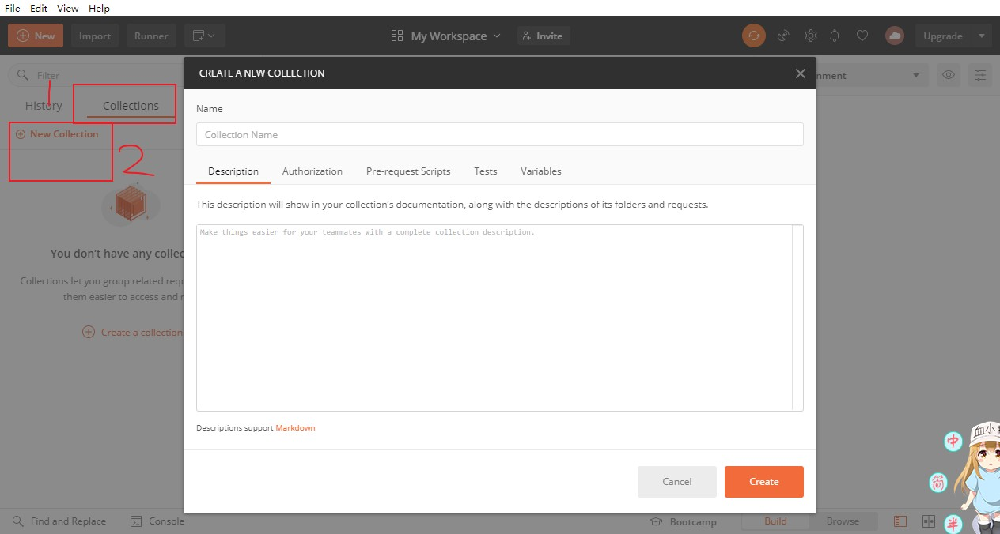
   
   创建文件夹
   
   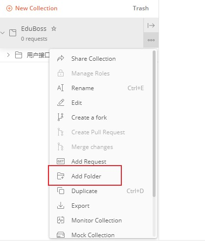
   
   将接口保存到刚才创建的用户接口文件夹，并且重命名这个接口为用户登录(点击save或者ctrl+s保存)
   
   创建集合变量
   
   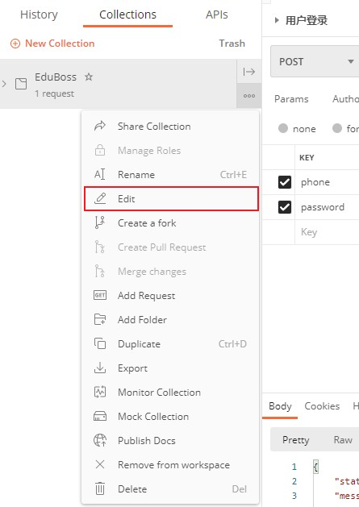
   
   变量名为URL，变量值为http://edufront.lagou.com
   
   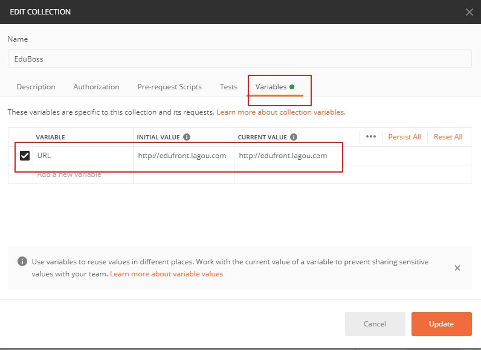
   
   然后在接口中就可以使用这个变量了，写成这样：{{URL}}/front/user/login
   
   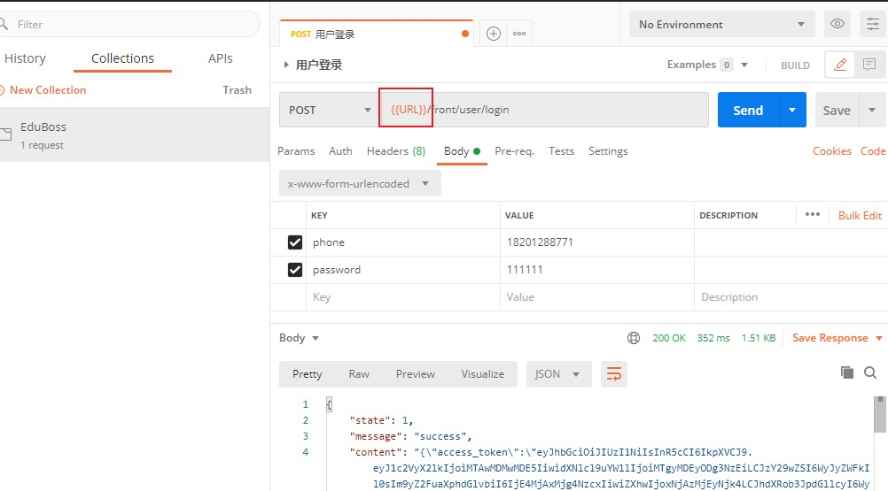
   
3. 请求登录
   
   axios 默认的发送的数据格式是`application/json`，但是接口接收`application/x-www-form-urlencoded`的数据格式，可以借助第三库`qs`也可以使用[axios提供的方案](https://github.com/axios/axios#using-applicationx-www-form-urlencoded-format)
   
   ```base
   yarn add qs
   ```
   ```base
   import request from '@/utils/request'
   import qs from 'qs'
   
   async onSubmit () {
     // 表单验证
     // 验证通过 -> 提交表单
     const { data } = await request({
       method: 'POST',
       url: '/front/user/login',
       headers: { 'content-type': 'application/x-www-form-urlencoded' },
       data: qs.stringify(this.form) // axios 默认发送的是 application/json 格式的数据
     })
     // 处理请求结果
     //   成功:跳转到首页
     //   失败:给出提示
   }
   ```

4. 处理请求结果
   ```base
   // 3.处理请求结果
   //   失败:给出提示
   if (data.state !== 1) {
     return this.$message.error(data.message)
   }
   //   成功:跳转到首页
   this.$message.success('登录成功')
   this.$router.push({
     name: 'home'
   })
   ```

5. 表单验证
   
   ```base
   model="form"
   :rules="rules"
   ref="ruleForm"
   el-form-item 绑定 prop 属性
   ```

   ```base
   rules: {
    phone: [
      { required: true, message: '请输入手机号', trigger: 'blur' },
      { pattern: /^1\d{10}$/, message: '请输入正确的手机号', trigger: 'blur' }
    ],
    password: [
        { required: true, message: '请输入密码', trigger: 'blur' },
        { min: 6, max: 18, message: '长度在 6 到 18 个字符', trigger: 'blur' }
      ]
    }
   ```
   指定类型
   ```base
   import { Form } from 'element-ui'
   await (this.$refs.form as Form).validate()
   ```

6. 请求期间禁用按钮点击
   
   给el-button增加一个属性:loading="isLoginLoading"
   
   data里isLoginLoading默认为false，在表单通过验证时this.isLoginLoading = true，将按钮设为loading状态，在完成提交无论请求结果是成功还是失败，将表单loading状态去掉this.isLoginLoading = false

7. 封装请求方法
   
   services/user.ts
   ```base
   /**
    * 用户相关请求模块
    */
    import request from '@/utils/request'
    import qs from 'qs'

    interface User {
        phone: string
        password: string
    }

    export const login = (data: User) => {
        return request({
            method: 'POST',
            url: '/front/user/login',
            headers: { 'content-type': 'application/x-www-form-urlencoded' },
            data: qs.stringify(data) // axios 默认发送的是 application/json 格式的数据
        })
    }
   ```

   login/index.vue
   ```base
   <template>
     <div class="login">
       <el-form
         class="login-form"
         ref="form"
         :model="form"
         :rules="rules"
         label-width="80px"
         label-position="top"
       >
         <el-form-item label="手机号" prop="phone">
           <el-input v-model="form.phone"></el-input>
         </el-form-item>
   
         <el-form-item label="密码" prop="password">
           <el-input type="password" v-model="form.password"></el-input>
         </el-form-item>
   
         <el-form-item>
           <el-button :loading="isLoginLoading " class="login-btn" type="primary" @click="onSubmit">登录</el-button>
         </el-form-item>
       </el-form>
     </div>
   </template>
   
   <script lang="ts">
   import request from '@/utils/request'
   import qs from 'qs'
   import { Form } from 'element-ui'
   import { login } from '@/services/user'
   
   export default {
     name: 'LoginIndex',
   
     data () {
       return {
         isLoginLoading: false,
         form: {
           phone: '18201288771',
           password: '111111'
         },
         rules: {
           phone: [
             { required: true, message: '请填写手机号', trigger: 'blur' },
             { pattern: /^1\d{10}$/, message: '请输入正确的手机号', trigger: 'blur' }
           ],
           password: [
             { required: true, message: '请输入密码', trigger: 'blur' },
             { min: 6, max: 18, message: '长度在 6 到 18 个字符', trigger: 'blur' }
           ]
         }
       }
     },
   
     methods: {
       async onSubmit () {
         try {
           // 1.表单验证
           // await (this.$refs.form as Form).validate() // 如果验证不通过，会抛出一个 Promise 异常，阻断后面程序的运行
           // 把this.$refs.form转为Form类型
           await (this.$refs.form as Form).validate()
   
           this.isLoginLoading = true
           // 2.验证通过 -> 提交表单
           const { data } = await login(this.form)
   
           // 3.处理请求结果
           //   失败:给出提示
           if (data.state !== 1) {
             return this.$message.error(data.message)
           }
           //   成功:跳转到首页
           this.$message.success('登录成功')
           this.$router.push({
             name: 'home'
           })
         } catch (err) {
           console.log('登录失败' + err)
         }
         this.isLoginLoading = false
       }
     }
   }
   </script>
   
   <style lang="scss" scoped>
   .login {
     height: 100vh;
     display: flex;
     justify-content: center;
     align-items: center;
   
     .login-form {
       width: 300px;
       background-color: #fff;
       padding: 20px;
       border-radius: 4px;
     }
   
     .login-btn {
       width: 100%;
     }
   }
   </style>
   ```


