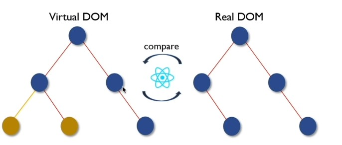
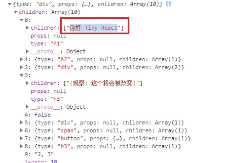
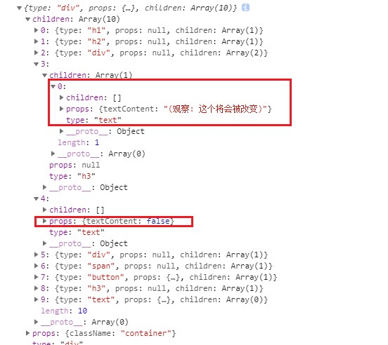
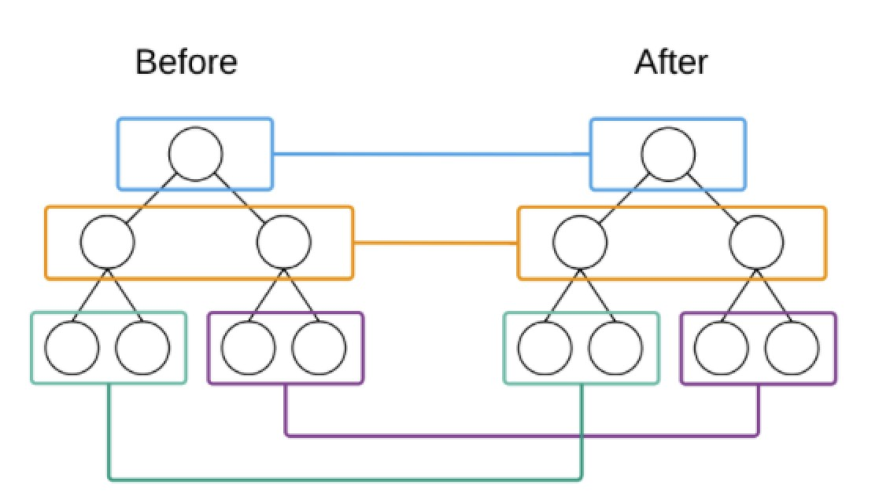
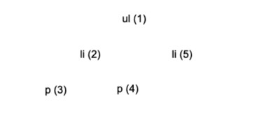

## VirtualDOM 及 Diff 算法
### 1. JSX到底是什么
使用React就一定会写JSX，JSX到底是什么呢？他是一种javascript语法扩展，React使用它来描述用户界面长什么样子，虽然他看起来非常像HTML，但他确实是javascript。在React代码执行之前，Babel会将JSX编译为React API
```react
<div className="container">
    <h3>Hello React</h3>
    <p>React is great</p>
</div>
```
```js
React.createElement(
    'div',
    {
        className: 'container'
    },
    React.createElement('h3', null, 'Hello React'),
    React.createElement('p', null, 'React is great')
)
```
从两种语法对比来看，JSX语法的出现是为了让React开发人员编写用户界面代码更加轻松
[Babel REPL](https://babeljs.io/repl)

### 2. DOM操作问题
在现代web应用程序中使用javascript操作DOM是必不可少的，但遗憾的是他比其他大多数javascript操作要慢的多。

大多数javascript框架对应DOM的更新远远超过其必须进行的更新，从而使得这种缓慢操作变得更糟

例如假设你有包含是个项目的列表，你仅仅更改了列表中的第一项，大多数javascript框架会重建整个列表，这比必要的工作要多十倍。

更新效率低下宜家成为严重问题，为了解决这个问题，React普及了一种Virtual DOM的东西

### 3. 什么是 Virtual DOM
Virtual DOM出现的目的就是为了提高javascript操作DOM对象的效率

在React中，每个DOM对象都有一个对应的Virtual DOM对象，他是DOM对象的javascript对象表现形式，其实就是使用javascript对象来描述DOM对象信息，比如DOM对象的类型是什么，他身上有哪些属性，它拥有哪些子元素

可以把Virtual DOM对象理解为DOM对象的副本，但是他不能直接显示在屏幕上
```html
<div className="container">
  <h3>Hello React</h3>
  <p>React is great</p>
</div>
```
```js
{
  type: 'div',
  props: { className: 'container' },
  children: [
    {
      type: 'h3',
      props: null,
      children:[
        {
          type: 'text',
          props: { textContent: 'Hello React' }
        }
      ]
    },
    {
      type: 'p',
      props: 'null',
      children: [
        {
          type: 'text',
          props: { textContent: 'React is great' }
        }
      ]
    }
  ]
}
```

### 4. Virtual DOM 如何提升效率
精准找出发生改变的DOM对象，只更新发生变化的部分

在React第一次创建DOM对象后，会为每个DOM对象创建其对应的Virtual DOM对象，在DOM对象发生变化更新之前，React会先更新所有的Virtual DOM对象，然后React会将更新后的Virtual DOM和更新前的Virtual DOM进行比较，从而找出发生变化的部分，React会将发生变化的部分更新到真实DOM对象中，React仅更新必要更新的部分

Virtual DOM对象的更新和比较仅发生在内存中，不会在视图中渲染任何内容，所以这一部分的性能损耗成本是微不足道的。



```html
<div id="container">
	<p>Hello React</p>
</div>
```
```html
<div id="container">
	<p>Hello Angular</p>
</div>
```
```js
const before = {
  type: "div",
  props: { id: "container" },
  children: [
    {
      type: "p",
      props: null,
      children: [
        { type: "text", props: { textContent: "Hello React" } }
      ]
    }
  ]
}
```
```js
const after = {
  type: "div",
  props: { id: "container" },
  children: [
    {
      type: "p",
      props: null,
      children: [
        { type: "text", props: { textContent: "Hello Angular" } }
      ]
    }
  ]
}
```

### 5. 创建 Virtual DOM
在React代码执行前，JSX 会被Babel转为React.createElement方法的调用，在调用从reactElement方法时会传入元素的类型，元素的属性，以及元素的子元素，createElement方法的返回值为构建好的Virtual DOM 对象
```js
// .babelrc
{
  "presets": [
    "@babel/preset-env",
    [
      "@babel/preset-react",
      {
        "pragma": "TinyReact.createElement"
      }
    ]
  ]
}
```
Babel配置，会将JSX语法调用 createElement 方法转换为 Virtual DOM 对象

```js
{
  type: "div",
  props: null,
  children: [{type: "text", props: {textContent: "Hello"}}]
}
```

```js
/**
 * createElement.js
 * 创建 Virtual DOM
 * @param {string} type 类型
 * @param {object | null} props 属性
 * @param  {createElement[]} children 子元素
 * @return {object} Virtual DOM
 */
export default function createElement(type, props, ...children) {
  // 由于 map 方法无法从数据中刨除元素, 所以此处将 map 方法更改为 reduce 方法
  const childElements = [].concat(...children).reduce((result, child) => {
    // 判断子元素类型 刨除 null true false
    if (child !== null && child !== false && child !== true) {
      if (child instanceof Object) {
        result.push(child)
      } else {
        result.push(createElement("text", { textContent: child }))
      }
    }
    // 将需要保留的 Virtual DOM 放入 result 数组
    return result
  }, [])
  return {
    type,
    props: Object.assign({ children: childElements }, props),
    children: childElements
  }
}

```

从createElement方法的第三个参数开始就都是子元素了，在定义createElement方法时，通过...children将所有的子元素放置到children数组中。
```js
const virtualDOM = (
  <div className="container">
    <h1>你好 Tiny React</h1>
    <h2>(编码必杀技)</h2>
    <div>
      嵌套1 <div>嵌套 1.1</div>
    </div>
    <h3>(观察: 这个将会被改变)</h3>
    {2 == 1 && <div>如果2和1相等渲染当前内容</div>}
    {2 == 2 && <div>2</div>}
    <span>这是一段内容</span>
    <button onClick={() => alert("你好")}>点击我</button>
    <h3>这个将会被删除</h3>
    2, 3
  </div>
)
console.log(virtualDOM) 
// 打印的是Virtual DOM对象，因为Bable调用createElement转换为Virtual DOM对象
```
上面的代码会根据Babel的配置调用 createElement 方法转换为Virtual DOM对象
通过以上代码测试，发现返回的 Virtual DOM 存在一些问题，第一个问题是文本节点被直接放入到了数组中



而我们期望是文本节点应该是这样的

```js
children: [
  {
    type: "text",
    props: {
      textContent: "React is great"
    }
  }
]
```
通过以下代码对 Virtual DOM 进行改造，重新构建 Virtual DOM。
```js
// 将原有 children 拷贝一份 不要在原有数组上进行操作
const childElements = [].concat(...children).map(child => {
  // 判断 child 是否是对象类型
  if (child instanceof Object) {
    // 如果是 什么都不需要做 直接返回即可
    return child
  } else {
    // 如果不是对象就是文本 手动调用 createElement 方法将文本转换为 Virtual DOM
    return createElement("text", { textContent: child })
  }
})
return {
  type,
  props,
  children: childElements
}
```



通过观察返回的 Virtual DOM，文本节点已经被转化成了对象类型的 Virtual DOM，但是布尔值也被当做文本节点被转化了，在 JSX 中，如果 Virtual DOM 被转化为了布尔值或者null，是不应该被更新到真实 DOM 中的，所以接下来要做的事情就是清除 Virtual DOM 中的布尔值和null。
```js
// 由于 map 方法无法从数据中刨除元素, 所以此处将 map 方法更改为 reduce 方法
const childElements = [].concat(...children).reduce((result, child) => {
  // 判断子元素类型 刨除 null true false
  if (child != null && child != false && child != true) {
    if (child instanceof Object) {
      result.push(child)
    } else {
      result.push(createElement("text", { textContent: child }))
    }
  }
  // 将需要保留的 Virtual DOM 放入 result 数组
  return result
}, [])
```

在 React 组件中，可以通过 props.children 获取子元素，所以还需要将子元素存储在 props 对象中。
```js
return {
  type,
  props: Object.assign({ children: childElements }, props),
  children: childElements
}
```

### 6.渲染 Virtual DOM 对象为真实 DOM 对象
通过调用render方法可以将Virtual DOM对象更新为真实DOM对象

在更新之前需要确定是否存在旧的 Virtual DOM，如果存在需要比较差异，如果不存在可以直接将Virtual DOM 转为 DOM对象

目前先只考虑不存在旧 Virtual DOM 的情况，就是说想直接将Virtual DOM对象更新为真实DOM对象

```js
// render.js
import diff from './diff'

export default function render(virtualDOM, container, oldDOM) {
  diff(virtualDOM, container, oldDOM)
}
```

```js
// diff.js
import mountElement from './mountElement'

export default function diff(virtualDOM, container, oldDOM) {
  // 判断 oldDOM 是否存在
  if (!oldDOM) {
    // 如果 oldDOM 不存在 不需要对比 直接将Virtual DOM 转换为真实DOM
    mountElement(virtualDOM, container)
  }
}
```

在进行 Virtual DOM 转换之前还需要确定 Virtual DOM 的是普通的Virtual DOM对象还是组件形式的Virtual DOM（Component VS Native Element）

类型不同需要做不同的处理，如果是Native Element直接转换

如果是组件 还需要等到组件实例对象，通过组件实例对象获取组件返回的Virtual DOM然后再进行转换

目前只考虑Native Element的情况
```js
// mountElement.js
import mountNativeElement from './mountNativeElement'

export default function mountElement(virtualDOM, container) {
  // Component VS NativeElement
  // 如果是普通的Virtual DOM对象，直接转换为DOM
  mountNativeElement(virtualDOM, container)

  // 如果是组件Virtual DOM
}
```

```js
// mountNativeElement.js
import createDOMElement from './createDOMElement'

export default function mountNativeElement(virtualDOM, container) {
  let newElement = createDOMElement(virtualDOM) // 创建的新元素

  // 将转换后的DOM对象放置页面（子节点添加到父节点，最外层的将添加到根节点root）
  container.appendChild(newElement)
}
```

```js
// createDOMElement.js
import mountElement from './mountElement'

export default function createDOMElement(virtualDOM) {
  let newElement = null // 创建的新元素
  if (virtualDOM.type === 'text') {
    // 文本节点
    newElement = document.createTextNode(virtualDOM.props.textContent)
  } else {
    // 元素节点
    newElement = document.createElement(virtualDOM.type)
  }
  // 递归创建子节点
  virtualDOM.children.forEach(child => {
    // 这里没有直接调用 mountNativeElement，是因为不知道virtualDOM 是 NativeElement 还是 Component
    mountElement(child, newElement)
  })

  return newElement
}
```

### 7. 为元素节点添加属性
```js
// createDOMElement.js
import mountElement from './mountElement'
import updateNodeElement from './updateNodeElement'

export default function createDOMElement(virtualDOM) {
  let newElement = null // 创建的新元素
  if (virtualDOM.type === 'text') {
    // 文本节点
    newElement = document.createTextNode(virtualDOM.props.textContent)
  } else {
    // 元素节点
    newElement = document.createElement(virtualDOM.type)
    updateNodeElement(newElement, virtualDOM) // 为元素设置属性
  }
  // 递归创建子节点
  virtualDOM.children.forEach(child => {
    // 这里没有直接调用 mountNativeElement，是因为不知道virtualDOM 是 NativeElement 还是 Component
    mountElement(child, newElement)
  })

  return newElement
}
```

```js
// updateNodeElement.js
export default function updateNodeElement(newElement, virtualDOM) {
  // 获取要解析的Virtual DOM节点对象的属性对象
  const newProps = virtualDOM.props
  // 将属性对象中的属性名称放到一个数组中并循环数组
  Object.keys(newProps).forEach(propName => {
    const newPropsValue = newProps[propName]
    // 考虑属性名称是否以 on 开头，如果是就表示是个事件属性
    // 判断属性是否是事件属性
    if (propName.startsWith('on')) {
      // 事件名称
      const eventName = propName.toLowerCase().slice(2)
      // 为元素添加事件
      newElement.addEventListener(eventName, newPropsValue)
      // 如果属性名称是 value 或者 checked 需要通过 [] 的形式添加
    } else if (propName === 'value' || propName === 'checked') {
      newElement[propName] = newPropsValue
      // 刨除 children 因为他是子元素 不是属性
    } else if (propName !== 'children') {
      if (propName === 'className') {
        // className 属性单独处理 不直接在元素上添加 class 属性是因为 class 是 javascript 中的关键字
        newElement.setAttribute('class', newPropsValue)
      } else {
        // 普通属性
        newElement.setAttribute(propName, newPropsValue)
      }
    }
  })
}
```

### 8.组件渲染
#### 8.1函数组件
在渲染组件之前首先要明确的是，组件的Virtual DOM 类型值为函数，函数组件和类组件都是这样的
```base
// 原始组件
const Heart = () => <span>&hearts;</span>
```
```base
<Heart />
```
```js
// 组件的 Virtual DOM
{
  type: f function() {},
  props: {},
  children: []
}
```
在渲染组件时，要先将Component 与 Native Element 区分开，如果是 Native Element 可以直接开始渲染，如果是组件，特别处理
```js
// mountElement.js
import isFunction from './isFunction'

export default mountElement(virtualDOM, container) {
  // 无论是类组件还是函数组件，其实本质上都是函数
  // 如果 Virtual DOM 的type 属性值为函数 就说明当前这个 Virtual DOM 为组件
  if (isFunction(virtualDOM)) {
    // 如果是组件 调用 mountComponent 方法进行组件渲染
    mountComponent(virtualDOM, container)
  } else {
    mountNativeElement(virtualDOM, container)
  }
}
```

```js
// isFunction.js
// Virtual DOM 是否为函数类型
export default function isFunction(virtualDOM) {
  return virtualDOM && typeof virtualDOM.type === "function"
}
```

在 mountComponent 方法中再进行函数组件和类型的区分，然后再分别进行处理
```js
// mountComponent.js
import mountNativeElement from './mountNativeElement'
import isFunctionComponent from './isFunctionComponent'

export default function mountComponent(virtualDOM, container) {
  // 存放组件调用后的 virtual DOM 的容器
  let nextVirtualDOM = null
  // 区分函数类型组件和类组件
  if (isFunctionComponent(virtualDOM)) {
    // 函数组件 调用 buildFunctionalComponent 方法处理函数组件
    nextVirtualDOM = buildFunctionalComponent(virtualDOM)
  } else {
    // 类组件
  }
  // 判断得到的 Virtual DOM 是否是组件（组件调用组件的情况）
  if (isFunction(nextVirtualDOM)) {
    // 如果是组件 继续调用 mountComponent 解剖组件
    mountComponent(nextVirtualDOM, container)
  } else {
    // 如果是Navtive Element 就去渲染
    mountNativeElement(nextVirtualDOM, container)
  }
}

/**
 * 函数组件处理
 * type: function Heart(props) {
 *   return <div>&heart;{props.title}</div>
 * }
 * @param virtualDOM
 * @returns {*}
 */
function buildFunctionalComponent(virtualDOM) {
  // 通过 Virtual DOM 中的 type 属性获取到组件函数并调用
  // 调用组件函数是将 Virtual DOM 对象中的 props 属性传递给组件函数 这样在组件中就可以通过 props 属性获取数据了
  // 组件返回要渲染的 Virtual DOM
  return virtualDOM && virtualDOM.type(virtualDOM.props || {})
}
```

```js
// isFunctionComponent.js
// Virtual DOM 是否是函数型组件
// 条件有两个：1. Virtual DOM 的 type 属性值为函数 2.函数的原型对象中不能有render方法
// 只有类组件的原型对象中有render方法
export default function isFunctionComponent(virtualDOM) {
  const type = virtualDOM && virtualDOM.type
  return (
    type && isFunction(virtualDOM) && !(type.prototype && prototype.render)
  )
}
```

#### 8.2类组件
类组件也是 Virtual DOM，可以通过 Virtual DOM 中的 type 属性确定当前需要渲染的组件时类组件还是函数组件

在确定当前渲染的组件为类组件后，需要实例化类组件得到类组件实例对象，通过类组件实例对象调用类组件中的 render 方法，获取组件要渲染的 Virtual DOM。

类组件需要基础Component父类，子类需要通过 super 方法将自身的 props 属性传递给 Component 父类，父类会将props属性挂载为父类属性，子类继承了父类，所以子类也就拥有了props属性。这样做的好处是当 props 发生更新后，父类可以根据更新后的props帮助子类更新视图
```js
class Alert extends TinyReact.Component{
  constructor(props) {
    super(props)
  }
  render() {
    return (
      <div>
        {this.props.title}
        {this.props.message}
      </div>
    )
  }
}
```
```js
// Component.js
export default class Component {
  constructor(props) {
    this.props = props
  }
}
```
在 mountComponent 方法中通过调用 buildStatefulComponent 方法得到类组件要渲染的 Virtual DOM
```js
import isFunctionComponent from './isFunctionComponent'
import mountNativeElement from './mountNativeElement'
import isFunction from './isFunction'

export default function mountComponent(virtualDOM, container) {
  // 存放组件调用后的 virtual DOM 的容器
  let nextVirtualDOM = null
  // 判断组件时类组件还是函数组件
  if (isFunctionComponent(virtualDOM)) {
    // 函数组件 调用 buildFunctionalComponent 方法处理函数组件
    nextVirtualDOM = buildFunctionComponent(virtualDOM)
  } else {
    // 类组件
    nextVirtualDOM = buildClassComponent(virtualDOM)
  }

  // 判断得到的 Virtual DOM 是否是组件(组件调用组件的情况【父子组件】)
  if (isFunction(nextVirtualDOM)) {
    // 如果是组件 继续调用 mountComponent 解剖组件
    mountComponent(nextVirtualDOM, container)
  } else {
    // 如果是Navtive Element 就去渲染
    mountNativeElement(nextVirtualDOM, container)
  }
}

/**
 * type: function Heart(props) {
 *   return <div>&heart;{props.title}</div>
 * }
 * @param virtualDOM
 * @returns {*}
 */
function buildFunctionComponent(virtualDOM) {
  // 通过 Virtual DOM 中的 type 属性获取到组件函数并调用
  // 调用组件函数是将 Virtual DOM 对象中的 props 属性传递给组件函数 这样在组件中就可以通过 props 属性获取数据了
  // 组件返回要渲染的 Virtual DOM
  return virtualDOM.type(virtualDOM.props || {})
}

// 处理类组件
function buildClassComponent(virtualDOM) {
  // 实例化类组件 得到类组件实例对象 并将 props 属性传递进类组件
  const component = new virtualDOM.type(virtualDOM.props || {})
  // 调用类组件中的render方法得到要渲染的 virtualDOM 并返回
  const nextVirtualDOM = component.render()
  return nextVirtualDOM
}
```

### 9.Virtual DOM 比对
在进行 Virtual DOM 对比时，需要用到更新后的 Virtual DOM 和更新前的 Virtual DOM 目前我们可以通过 render 方法进行传递，现在的问题是更新前的 Virtual DOM 要如何获取

对于更新前的 Virtual DOM ，对应的其实就是已经在页面中显示的真实 DOM 对象。既然是这样，那么我们在创建真实 DOM 对象时，就可以将 Virtual DOM 添加到真实 DOM 对象的属性中。在进行 Virtual
 DOM对比之前，就可以通过真实 DOM 对象获取其对应的 Virtual DOM 对象了，其实就是通过render方法的第三个参数获取的，container.firstChild
 
 ```js
// render.js
export default function render(virtualDOM, container, oldDOM = container.firstChild) {
  console.log('old', oldDOM)
  diff(virtualDOM, container, oldDOM)
}
```
 
 在创建真实 DOM 对象时为其添加对应的 Virtual DOM 对象
 
 ```js
// createDOMElement.js
export default function createDOMElement(virtualDOM) {
  // ...
  // 将 Virtual DOM 挂载到真实 DOM 对象的属性中，方便在对比时获取其 Virtual DOM
  newElement._virtualDOM = virtualDOM
}
```



#### 9.1 Virtual DOM 类型相同
Virtual DOM 类型相同，如果是元素节点，就对比元素节点属性是否发生变化，如果是文本节点就对比文本节点内容是否发生变化

要实现对比，需要先从已存在的 DOM 对象中获取其对应 Virtual DOM 对象（即获取旧Virtual DOM 对象）

```js
// diff.js
// 获取旧Virtual DOM
const oldVirtualDOM = oldDOM && oldDOM._virtualDOM
```

判断 oldVirtualDOM 是否存在，如果存在则继续判断要对比的Virtual DOM 类型是否相同，如果类型相同判断节点类型是否是文本节点，如果是文本节点，调用 updateTextNode方法对比内容，如果内容不一致这更新内容和 __virtualDOM，如果是元素节点就调用 setAttributeForElement 方法对比更新，还需要循环遍历对比更新子元素

```js
if (!oldDOM) {
} else if (oldVirtualDOM && virtualDOM.type === oldVirtualDOM.type) {
  if (virtualDOM.type === 'text') {
    // 更新文本内容
    updateTextNode(virtualDOM, oldVirtualDOM, oldDOM)
  } else {
    // 元素节点 对比元素属性是否发生变化
    setAttributeForElement(oldDOM, virtualDOM, oldVirtualDOM)
  }
}
```

updateTextNode 方法用于对比文本节点内容是否发生变化，如果发生变化则更新真实 DOM 对象中的内容，既然真实 DOM 对象发生了变化，还要将最新的 Virtual DOM 同步给真实 DOM 对象

```js
// updateTextNode.js
export default function updateTextNode(virtualDOM, oldVirtualDOM, oldDOM) {
  // 如果文本节点内容不同
  if (virtualDOM.props.textContent !== oldVirtualDOM.props.textContent) {
    // 更新真实 DOM 对象中的内容
    oldDOM.textContent = virtualDOM.props.textContent
    // 同步真实 DOM 对应的 Virtual DOM
    oldDOM._virtualDOM = virtualDOM
  }
}

```

setAttributeForElement方法用于设置/更新元素节点属性

思路是先分别获取更新后和更新前的 Virtual DOM 中的 props 属性，循环新 Virtual DOM 中的 props 属性，通过对比看一下新 Virtual DOM
 中的属性值是否发生了变化，如果发生变化需要将变化的值更新到真实 DOM 对象中
 
 再循环未更新前的 Virtual DOM 对象，通过对比看看新的 Virtual DOM中是否有被删除的属性，如果存在删除的属性，需要将 DOM 对象中对应的属性也删除掉
 
 ```js
// updateNodeElement.js
export default function updateNodeElement(newElement, virtualDOM, oldVirtualDOM = {}) {
  // 获取要解析的Virtual DOM节点对象的属性对象
  const newProps = virtualDOM.props || {}
  const oldProps = oldVirtualDOM.props || {}
  // 将属性对象中的属性名称放到一个数组中并循环数组
  Object.keys(newProps).forEach(propName => {
    // 获取属性值
    const newPropsValue = newProps[propName]
    const oldPropsValue = oldProps[propName]
    if (newPropsValue !== oldPropsValue) {
      // 考虑属性名称是否以 on 开头，如果是就表示是个事件属性
      // 判断属性是否是事件属性
      if (propName.startsWith('on')) {
        // 事件名称
        const eventName = propName.toLowerCase().slice(2)
        // 为元素添加事件
        newElement.addEventListener(eventName, newPropsValue)
        // 删除原有的事件处理函数
        if (oldPropsValue) {
          newElement.removeEventListener(eventName, oldPropsValue)
        }
        // 如果属性名称是 value 或者 checked 需要通过 [] 的形式添加
      } else if (propName === 'value' || propName === 'checked') {
        newElement[propName] = newPropsValue
        // 刨除 children 因为他是子元素 不是属性
      } else if (propName !== 'children') {
        if (propName === 'className') {
          // className 属性单独处理 不直接在元素上添加 class 属性是因为 class 是 javascript 中的关键字
          newElement.setAttribute('class', newPropsValue)
        } else {
          // 普通属性
          newElement.setAttribute(propName, newPropsValue)
        }
      }
    }
  })

  // 判断属性被删除的情况
  Object.keys(oldProps).forEach(propName => {
    const newPropsValue = newProps[propName]
    const oldPropsValue = oldProps[propName]
    if (!newPropsValue) {
      // 属性被删除了
      if (propName.startsWith('on')) {
        const eventName = propName.toLowerCase().slice(2)
        newElement.removeEventListener(eventName, oldPropsValue)
      } else if (propName !== 'children') {
        newElement.removeAttribute(propName)
      }
    }
  })
}

```

以上对比的仅仅是最上层元素，上层元素对比完以后还需要递归对比子元素

```js
else if (oldVirtualDOM && virtualDOM.type === oldVirtualDOM.type) {
  // 递归对比 virtual DOM 的子元素
  virtualDOM.children.forEach((child, i) => {
    diff(child, oldDOM, oldDOM.childNodes[i])
  })
}
```



#### 9.2 Virtual DOM 类型不同
当对比的元素节点类型不同时，就不需要继续对比了，直接使用新的 Virtual DOM 创建 DOM 对象，用新的 DOM 对象直接替换旧的 DOM 对象。当前这种情况就要将组件刨除，组件要被单独处理

```js
// diff.js
else if(
  // 如果 Virtual DOM 类型一样
  virtualDOM.type !== oldVirtualDOM.type &&
  // 并且 Virtual DOM 不是组件 因为组件要单独进行处理
  typeof virtualDOM.type !== 'function'
) {
  // 根据 Virtual DOM 创建真实 DOM 元素
  const newDOMElement = createDOMElement(virtualDOM)
  // 用插件出来的真实 DOM 元素替换旧的 DOM 元素
  oldDOM.parentNode.replaceChild(newDOMElement, oldDOM)
}
```

#### 9.3 删除节点
删除节点发生在节点更新以后并且发生在同一个父节点下的所有子节点身上

在节点更新完成以后，如果旧节点对象的数量多于新 Virtual DOM 节点的数量，就说明有节点需要被删除


```js
// 获取旧节点的数量
let oldChildNodes = oldDOM.childNodes
// 如果旧节点的数量多于要渲染的新节点的长度
if (oldChildNodes.length > virtualDOM.children.length) {
  for (let i = oldChildNodes.length -1; i > virtualDOM.children.length -1; i--) {
    oldDOM.removeChild(oldChildNodes[i])
  }
}
```

#### 9.4 类组件状态更新
以下代码是更新状态的组件，在类组件的state对象中的默认的title状态，点击change title按钮调用handleChange方法，在handleChange方法中调用this.setState方法更改title的状态值

```js
class Alert extends TinyReact.Component {
  constructor(props) {
    super(props)
    this.state = {
      title: 'default title'
    }
    // 更改 handleChange 方法中的 this 指向 让 this 指向类实例对象
    this.handleChange = this.handleChange.bind(this)
  }
  
  handleChange() {
    // 调用父类中的setState 方法更改状态
    this.setState({
      title: "changed title"
    })
  }
  
  render() {
    return (
      <div>
        <h2>{this.state.title}</h2>
        <p>{this.props.message}</p>
        <button onClick={this.handleChange}>change title</button>
      </div>
    )
  }
}
```

setState 方法定义在父类Component中，该方法的作用是更改子类的state，产生一个全新的state对象

```js
// Component.js
export default class Component {
  constructor(props) {
    this.props = props
  }
  setState(state) {
    // setState 方法被子类调用 此处this指向子类实例对象
    // 所以改变的是子类的 state 对象
    this.state = Object.assign({}, this.state, state)
  }
}
```

现在子类已经可调用父类的setState方法更改状态值了，当组件的state对象发生更时，调用render方法更新组件视图

在更新组件之前，要使用更新的Virtual DOM 对象和为更新的Virtual DOM 进行比对找出更新的部分，达到DOM最小化操作的目的

在setState方法中可以通过调用this.render方法获取更新后的Virtual DOM，由于 setState方法被子类调用，this指向子类，所以此处调用的是子类的render方法。

```js
// Component.js
setState(state) {
  // setState 方法被子类调用 此处this指向子类实例对象
  // 所以改变的是子类的 state 对象
  this.state = Object.assign({}, this.state, state)
  // 通过调用render方法获取最新的Virtual DOM
  let virtualDOM = this.render()
}
```

要实现对比，还需要获取未更新前的Virtual DOM，我们可以从 DOM 对象中获取其对应的Virtual DOM 对象，未更新前的DOM对象实际上就是现在在页面中显示的DOM 对象，我们只要能获取到这个DOM对象就可以得到其对应的Virtual DOM对象了

页面中的DOM通过mountNativeElement 方法挂载到页面的，所以我们只需在这个方法中调用Component类中的方法就可以将DOM对象保存在Component类中了。在子类调用setState方法的时候，在setState方法中再调用另一个获取DOM对象的方法就可以获取到之前保存的DOM对象

```js
// Component.js
// 保存DOM对象的方法
setDOM(dom){
  this._dom = dom
}
// 获取 DOM 对象的方法
getDOM(){
  return this._dom
}
```

接下来要如何在mountNativeElement方法中如何才能调用到setDOM方法，要调用setDOM方法，必须要得到类的实例对象，所以目前的问题是如何在mountNativeElement方法中得到类的实例对象，这个类指的不是Component类，因为我们在代码中并不是直接实例化Component类，而是实例化它的子类，由于子类继承了父类，所以在子类的实例对象中也是可以调用到setDOM方法的。

mountNativeElement方法接收最新的Virtual DOM 对象，如果这个Virtual DOM 对象是类组件产生的，在产生这个Virtual DOM 对象时一定会先得到这个类的实例对象，然后在调用实例对象下面的render方法进行获取。我们可以在那个时候将类组件实例对象添加到Virtual DOM 对象的属性中，而这个Virtual DOM 对象最终会传递给mountNativeElement方法，这样我们就可以在mountNativeElement方法中获取到组件的实例对象了，既然类组件的实例对象获取到了，我们就可以调用setDOM方法了

在 buildClassComponent 方法中为Virtual DOM 对象添加component属性，值为类组件的实例对象

```js
// mountComponent.js
// 处理类组件
function buildClassComponent(virtualDOM) {
  // 实例化类组件 得到类组件实例对象 并将 props 属性传递进类组件
  const component = new virtualDOM.type(virtualDOM.props || {})
  // 调用类组件中的render方法得到要渲染的 virtualDOM 并返回
  const nextVirtualDOM = component.render()
  nextVirtualDOM.component = component // 保存实例对象
  return nextVirtualDOM
}
```

在 mountNativeElement 方法中获取组件实例对象，通过实例调用调用 setDOM 方法保存 DOM 对象，方便在对比时通过它获取它的 Virtual DOM 对象

```js
// mountNativeElement.js
import createDOMElement from './createDOMElement'

export default function mountNativeElement(virtualDOM, container) {
  let newElement = createDOMElement(virtualDOM) // 创建的新元素

  // 将转换后的DOM对象放置页面（子节点添加到父节点，最外层的将添加到根节点root）
  container.appendChild(newElement)

  let component = virtualDOM.component
  if (component) {
    component.setDOM(newElement)
  }
}
```

接下来在 setState 方法中就可以调用 getDOM 方法获取 DOM 对象了

```js
setState(state) {
  this.state = Object.assign({}, this.state, state)
  let virtualDOM = this.render()
  // 获取页面中正在显示的 DOM 对象 通过它可以获取其对象的 Virtual DOM 对象
  let oldDOM = this.getDOM()
}
```

现在更新前的 Virtual DOM 对象和更新后的 Virtual DOM 对象就都已经获取到了，接下来还要获取到真实 DOM 对象父级容器对象，因为在调用 diff 方法进行对比的时候需要用到

```js
setState(state) {
  this.state = Object.assign({}, this.state, state)
  let virtualDOM = this.render()
  let oldDOM = this.getDOM()
  // 获取真实 DOM 对象父级容器对象
  let container = oldDOM.parentNode
}
```

接下来就可以调用 diff 方法进行比对了，比对后会按照我们之前写好的逻辑进行 DOM 对象更新，我们就可以在页面中看到效果了

```js
setState(state) {
    this.state = Object.assign({}, this.state, state)
    let virtualDOM = this.render()
    let oldDOM = this.getDOM()
    let container = oldDOM.parentNode
    // 比对
    diff(virtualDOM, container, oldDOM)
  }
```

#### 9.5组件更新
在diff方法中判断要更新的Virtual DOM是否是组件

如果是组件再判断要更新的组件和未更新前的组件是否是同一个组件，如果不是同一个组件就不需要做组件更新操作，直接调用mountElement方法将组件返回的Virtual DOM 添加到页面中

如果是同一个组件，就执行更新组件操作，其实就是将最新的props传递给组件中，再调用组件的render方法获取组件返回的最新的Virtual DOM 对象，再将Virtual DOM 对象传递给diff方法找出差异，从而将差异更新到真实DOM对象中

在更新组件的过程中还要在不同阶段调用其不同的组件生命周期函数

在diff方法中判断要更新的Virtual DOM 是否是组件，如果是组件又分为多种情况，新增 diffComponent方法进行处理
```js
else if (typeof virtualDOM.type === 'function') {
  // 要更新的是组件
  // a. 组件本身的 virtualDOM 对象 通过它可以获取到组件最新的props
  // b. 要更新的组件的实例对象 通过它可以调用组件的生命周期函数 可以更新组件的 props 属性 可以获取组件返回的最新的 Virtual DOM
  // c. 要更新的 DOM 对象 在更新组件时 需要在已有DOM对象的身上进行修改 实现DOM最小化操作 获取旧的 Virtual DOM 对象
  // d. 如果要更新的组件和旧组件不是同一个组件 要直接将组件返回的Virtual DOM 显示在页面中 此时需要 container 作为父级容器
  diffComponent(virtualDOM, oldComponent, oldDOM, container)
}
```

在diffComponent方法中判断要更新的组件是未更新前的组件是否是同一个组件

```js
// diffComponent.js
import mountElement from "./mountElement";

export default function diffComponent(virtualDOM, oldComponent, oldDOM, container) {
  // 判断要更新的组件和未更新的组件是否是同一个组件 只需要确定两者使用的是否是同一个构造函数就可以了
  if (isSameComponent(virtualDOM, oldComponent)) {
    // 同一个组件 做组件更新操作
  } else {
    // 不是同一个组件 直接将组件内容显示在页面中
  }
}
// virtualDOM.type 更新后的组件构造函数
// oldComponent.constructor 未更新前的组件构造函数
// 两者等价就表示是同一组件
// 判断是否是同一个组件
function isSameComponent(virtualDOM, oldComponent) {
  return oldComponent && virtualDOM.type === oldComponent.constructor
}
```

如果不是同一个组件的话，就不需要执行更新组件的操作，直接将组件内容显示在页面中，替换原有内容

```js
// diffComponent.js
else {
    // 不是同一个组件 直接将组件内容显示在页面中
    // 这里为 mountElement 方法新增了一个参数 oldDOM 
    // 作用是在将 DOM 对象插入到页面前 将页面中已存在的 DOM 对象删除 否则无论是旧DOM对象还是新DOM对象都会显示在页面中
    mountElement(virtualDOM, container, oldDOM)
  }
```

在 mountNativeElement 方法中删除原有的旧 DOM 对象

```js
// mountNavtiveElement.js
export default function mountNativeElement(virtualDOM, container, oldDOM) {
 // 如果旧的DOM对象存在 删除
  if (oldDOM) {
    unmount(oldDOM)
  }
}
```

```js
// unmount.js
export default function unmount(node) {
  node.remove()
}
```

如果是同一个组件的话，需要执行组件更新操作，需要调用组件生命周期函数

先在Component类中添加生命周期函数，子类要使用的话直接覆盖可以

```js
// Component.js
export default class Component {
  // 生命周期函数
  componentWillMount() {}
  componentDidMount() {}
  componentWillReceiveProps(nextProps) {}
  shouldComponentUpdate(nextProps, nextState) {
    return nextProps != this.props || nextState != this.state
  }
  componentWillUpdate(nextProps, nextState) {}
  componentDidUpdate(prevProps, preState) {}
  componentWillUnmount() {}
}
```

新建 updateComponent 方法用于更新组件操作，并在if成立后调用
```js
// diffComponent.js
if (isSameComponent(virtualDOM, oldComponent)) {
  // 属同一个组件 做组件更新
  updateComponent(virtualDOM, oldComponent, oldDOM, container)
}
```

在 updateComponent 方法中调用组件的生命周期函数，更新组件获取最新Virtual DOM，最终调用diff方法进行更新

```js
import diff from "./diff";

export default function updateComponent(virtualDOM, oldComponent, oldDOM, container) {
  // 生命周期函数
  oldComponent.componentWillReceiveProps(virtualDOM.props)

  // 调用 shouldComponentUpdate 生命周期函数判断是否要执行更新操作
  if (oldComponent.shouldComponentUpdate(virtualDOM.props)) {
    // 未更新前的pops
    let prevProps = oldComponent.props
    // 生命周期函数
    oldComponent.componentWillUpdate(virtualDOM.props)
    // 更新组件的 props 属性 updateProps 方法定义在 Component 类型
    oldComponent.updateProps(virtualDOM.props)
    // 因为组件的 props 已经更新 所以调用 render 方法获取最新的 Virtual DOM
    let nextVirtualDOM = oldComponent.render()
    // 将组件实例对象挂载到 Virtual DOM 身上
    nextVirtualDOM.component = oldComponent
    // 调用diff方法更新视图
    diff(nextVirtualDOM, container, oldDOM)
    // 生命周期函数
    oldComponent.componentWillUpdate(prevProps)
  }
}

```

```js
// Component.js
export default class Component {
  updateProps(props) {
    this.props = props
  }
}
```

### 10 ref属性
为节点添加ref属性可以获取到这个节点的DOM对象，比如DemoRef类中，为input元素添加了ref属性，目的是获取input DOM 元素对象，在点击按钮是获取用户在文本框中输入的内容

```js
class DemoRef extends TinyReact.Component{
  constructor(props) {
    super(props)
    this.handleClick = this.handleClick.bind(this)
  }

  handleClick() {
    console.log(this.input.value)
  }

  render() {
    return (
        <div>
          <input type="text" ref={input => (this.input = input)}/>
          <button onClick={this.handleClick}>按钮</button>
        </div>
    )
  }
}
```

实现思路是创建节点是判断其Virtual DOM 对象是否有ref属性，如果有就调用ref属性中所存储的方法并且将创建处理的DOM对象作为参数传递给ref方法，这样在渲染组件节点的时候就可以拿到元素对象并将元素对象存储为组件属性了

```js
// createDOMElement.js
if (virtualDOM.props && virtualDOM.props.ref) {
  virtualDOM.props.ref(newElement)
}
```

在类组件的身上也可以添加ref属性，目的是获取组件的实例对象，比如下列代码中，在DemoRef组件中渲染了Alert组件，在Alert组件中添加了ref属性，目的是在DemoRef组件中获取Alert组件实例对象

```js
class DemoRef extends TinyReact.Component {
  handle() {
    let value = this.input.value
    console.log(value)
    console.log(this.alert)
  }
  componentDidMount() {
    console.log("componentDidMount")
  }
  render() {
    return (
      <div>
        <input type="text" ref={input => (this.input = input)} />
        <button onClick={this.handle.bind(this)}>按钮</button>
        <Alert ref={alert => (this.alert = alert)} />
      </div>
    )
  }
}
```

实现思路是在mountComponent方法中，如果判断了当前处理的是类组件，就通过类组件返回的Virtual DOM 对象中获取组件实例对象，判断组件实例对象中的props属性中是否存在ref属性，如果存在就调用ref方法并且将组件实例对象传递给ref方法

```js
// mountComponent.js
let component = null
  if (isFunctionalComponent(virtualDOM)) {}
	else {
    // 类组件
    nextVirtualDOM = buildStatefulComponent(virtualDOM)
    // 获取组件实例对象
    component = nextVirtualDOM.component
  }
	// 如果组件实例对象存在的话
	if (component) {
   	// 判断组件实例对象身上是否有 props 属性 props 属性中是否有 ref 属性
    if (component.props && component.props.ref) {
      // 调用 ref 方法并传递组件实例对象
      component.props.ref(component)
    }
  }
```

### 11.key 属性
在React中，渲染列表数据时通常会在被渲染的列表元素上添加key属性，key属性就是数据的唯一标识，帮助React识别哪些数据被修改或者删除了，从而达到DOM最小化操作

key属性不需要全局唯一，但是在同一个父节点下的兄弟节点之间必须是唯一的

也就是说，在比对同一个父节点下类型相同的子节点时需要用到key属性

#### 11.1 节点对比
实现思路是在两个元素进行对比时，如果类型相同，就循环旧的DOM对象的子元素，查看其身上是否有key属性，如果有就将这个子元素的DOM对象存储在一个javascript对象中，接着循环要渲染的Virtual DOM 对象的子元素，在循环过程中获取到这个子元素的key属性，然后使用这个key属性到javascript对象中查找DOM对象，如果能够找到就说明这个元素已经存在的，是不需要重新渲染的。如果通过key属性找不到这个元素，就说明这个元素是新增的是需要渲染的。

```js
// diff.js
else if (oldVirtualDOM && virtualDOM.type === oldVirtualDOM.type) {
  // 将拥有key属性的元素放入 keyedElements 对象中
  let keyedElements = {}
  for (let i = 0, len = oldDOM.childNodes.length; i < len; i++) {
    let domElement = oldDOM.childNodes[i]
    if (domElement.nodeType === 1) {
      let key = domElement.getAttribute("key")
      if (key) {
        keyedElements[key] = domElement
      }
    }
  }
}
```

```js
// 是否找到了拥有key属性的元素
let hasNoKey = Object.keys(keyedElement).length === 0

// 如果没有找到拥有key属性的元素 就按照索引进行比较
if (hasNoKey) {
  // 递归子元素，更新子元素
  virtualDOM.children.forEach((child, i) => {
    diff(child, oldDOM, oldDOM.childNodes[i])
  })
} else {
  // 2. 循环 virtualDOM 的子元素 获取子元素的key属性
  virtualDOM.children.forEach((child, i) => {
    // 获取要进行比对的元素的key属性
    let key = child.props.key
    // 如果key属性存在
    if (key) {
      // 到已存在的DOM属性对象中查找对应的DOM元素
      let domElement = keyedElement[key]
      // 如果找到元素就说明该元素已经存在 不需要重新渲染
      if (domElement) {
        // 3. 看看当前位置的元素是不是我们期望的元素
        // 虽然 DOM 元素不需要重新渲染 但是不能确定元素的位置就一定没有发生变化
        // 所以还要查看一下元素的位置
        // 看一下 oldDOM 对应的(i)子元素和 domElement 是否是同一个元素 如果不是就说明元素位置发生了变化
        if (oldDOM.childNodes[i] && oldDOM.childNodes[i] !== domElement) {
          // 元素位置发生了变化
          // 将 domElement 插入到当前元素位置的前面 oldDOM.childNodes[i] 就是当前位置
          // domElement 就被放入了当前位置
          oldDOM.insertBefore(domElement, oldDOM.childNodes[i])
        }
      } else {
        // 新增元素
        mountElement(child, oldDOM, oldDOM.childNodes[i])
      }
    }
  })
}
```

```js
// mountNativeElement.js
if (oldDOM) {
  container.insertBefore(newElement, oldDOM)
} else  {
  // 将转换后的DOM对象放置页面（子节点添加到父节点，最外层的将添加到根节点root）
  container.appendChild(newElement)
}
```

#### 11.2 节点卸载
在对比节点的过程中，如果旧节点的数量多于要渲染的新节点的数量就说明有节点被删除了，继续判断keyedElements对象中是否有元素，如果没有就使用引用方式删除，如果有就要使用key属性对比的方式进行删除

实现思路是循环旧节点，在循环旧节点的过程中获取旧节点对应的key属性，然后根据key属性在新节点中查找这个旧节点，如果找到就说明这个节点没有被删除，如果没有找到，就说明节点被删除了，调用卸载节点的方法卸载节点即可

```js
// 删除节点
// 获取旧节点
let oldChildNodes = oldDOM.childNodes
// 判断旧节点的数量
if (oldChildNodes.length > virtualDOM.children.length) {
  if (hasNoKey) {
    // 有节点需要被删除
    for (let i = oldChildNodes.length - 1; i > virtualDOM.children.length - 1; i--) {
      unmountNode(oldChildNodes[i])
    }
  } else {
    // 通过key属性删除旧节点
    for (let i = 0; i < oldChildNodes.length; i++) {
      let oldChild = oldChildNodes[i]
      let oldChildKey = oldChild._virtualDOM.props.key
      let found = false
      for (let n = 0; n < virtualDOM.children.length; n++) {
        if (oldChildKey === virtualDOM.children[n].props.key) {
          found = true
          break
        }
      }
      if (!found) {
        unmountNode(oldChild)
        i--
      }
    }
  }
}
```

卸载节点不是说将节点直接删除就可以了，还需要考虑一下几种情况
1. 如果要删除的节点是文本节点的话可以直接删除
2. 如果要删除的节点由组件生成，需要调用组件卸载生命周期函数
3. 如果要删除的节点中包含了其它组件生成的节点，需要调用其它组件的卸载生命周期函数
4. 如果要删除的节点身上有ref属性，还需要删除通过ref属性传递给组件的DOM节点对象
5. 如果要删除的节点身上有事件，需要删除事件对应的事件处理函数

```js
// unmountNode.js
export default function unmountNode(node) {
  // 获取节点_virtualDOM对象
  const virtualDOM = node._virtualDOM
  // 1. 文本节点可以直接删除
  if (virtualDOM.type === 'text') {
    // 直接删除
    node.remove()
    // 阻止程序向下执行
    return
  }

  // 2. 看一下节点是否是由组件生成的
  let component = virtualDOM.component
  // 如果component存在就说明节点是由组件生成的
  if (component) {
    component.componentWillUnmount()
  }

  // 3. 看一下节点身上是否有ref属性
  if (virtualDOM.props && virtualDOM.props.ref) {
    virtualDOM.props.ref(null)
  }

  // 4. 节点属性中是否有事件属性
  Object.keys(virtualDOM.props).forEach(propName => {
    if (propName.slice(0, 2) === 'on') {
      const eventName = propName.toLowerCase().slice(0, 2)
      const eventHandler = virtualDOM.props[propName]
      node.removeEventListener(eventName, eventHandler)
    }
  })

  // 5. 递归删除子节点
  if (node.childNodes.length > 0) {
    for (let i = 0; i < node.childNodes.length; i++) {
      unmountNode(node.childNodes[i])
      i--
    }
  }

  // 删除节点
  node.remove()
}

```


