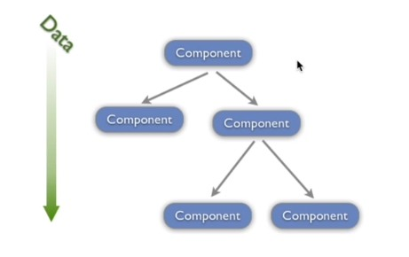

## React 基础
### 一、React 介绍
1. React 是一个用于构建用户界面的 Javascript 库，它只负责应用的视图层，帮助开发人员构建快速且交互式的 web 应用程序

2. React 使用组件的方式构建用户界面

### 二、JSX语法
1. 在 React 中使用 JSX 语法描述用户界面，它是一种 Javascript 语法扩展

2. 在 React 代码执行之前，Babel 会将 JSX 语法转换为标准的 Javascript API

3. JSX 语法是一种语法糖，让开发人员使用更加舒服的代码构建用户界面

4. 在 JSX 中使用表达式
    ```react
    const user = {
        firstName: 'Harper',
        lastName: 'Perez'
    }
    
    function formatName(user) {
        return user.firstName + ' ' + user.lastName
    }
    
    const element = <h1>Hello, {formatName(user)}!</h1>;
    ```
   JSX 本身其实也是一种表达式，将它赋值给变量，当作参数传入，作为返回值都可以

5. 属性

    如果属性值为字符串类型，需要加引号，属性名称推荐采用驼峰式命名法
    ```react
    const element = <div greeting="hello"></div>
    ```
    
    如果属性值为javascript表达式，属性值外面加大括号
    ```react
    const element = 
    // 注意大括号外面不能加引号，JSX 会将引号当中的内容识别为字符串而不是表达式
    ```
6. JSX 单标记必须闭合
    
    如果 JSX 是单标记，必须闭合，否则报错
    ```react
    const element = 
    const element = <input type="text" />
    ```

7. className

    为 JSX 标记添加类名需要使用className，而不是class
    ```react
    const element = 
    ```

8. JSX 自动展开数组

    ```react
    const arr = [<p>哈哈</p>,<p>哈哈</p>,<p>哈哈</p>]
    const element = (
        <div> {arr} </div>
    )
   // 解析后
   <div>
    <p>哈哈</p>
    <p>哈哈</p>
    <p>哈哈</p>
   </div>
    ```

9. 三元运算
    ```react
    { boolean ? <div>Hello React</div> : null }
    { boolean && <div>Hello React</div> }
    ```

10. 循环
    ```react
    const persons = [{
        id: 1,
        name: '张三',
        age: 20
    },{
        id: 2,
        name: '李四',
        age: 15
    }]
    
    <ul>
    { persons.map(person => <li key={person.id}> { person.name } { person.age } </li>) }
    </ul>
    ```

11. 事件
    ```react
    {/* 第一个参数即是事件对象 不需要传递 */}
    <button onClick={this.eventHandler}>按钮</button>
    {/* 需要传递事件对象 */}
    <button onClick={e => this.eventHandler('arg', e)}>按钮</button>
    {/* 最后一个参数即是事件对象 不需要传递 */}
    <button onClick={this.eventHandler.bind(null, 'arg')}按钮</button>
    ```
    第一种无法传参；第二种可以传参，先调用箭头函数再在箭头函数里面调用方法就可以传递参数；第三种可以传参，通过bind给方法传参
    
    ```react
    constructor() {
        this.eventHandler = this.eventHandler.bind(this)
        // 这里给eventHandler重新赋值，改变this指向，指向实例
    }
    eventHandler() {} // 这里this是undefined
    <button onClick={this.eventHandler}>按钮</button>
    ```

12. 样式
    * 行内样式
    ```react
    class App extends Component {
        render() {
            const style = { width: 200, height: 200, backgroundColor: 'red' }
            return <div style={ style }></div>
        }
    }
    ```
    * 外链样式
    ```react
    import styles from './Button.css'
    class Button extends Component {
        render() {
            return <button className={ styles.error}>Error Button</button>
        }
    }
    ```
    * 全局样式
    ```react
    import './styles.css'
    ```

13. ref 属性
    通过 ref 可以获取元素对象、组件实例对象
    * createRef
    ```react
    class Input extends Component {
        constructor() {
            super()
            this.inputRef = React.createRef()
        }
        render() {
            return (
                <div>
                    <input type="text" ref={this.inputRef} />
                    <button onClick={() => console.log(this.inputRef.current)}>button</button>
                </div>
            )
        }
    }
    ```
    * 函数参数
    ```react
    class Input extends Component {
        render() {
            return (
                <div>
                    // 函数参数表示当前元素所对应的dom对象
                    <input type="text" ref={input => (this.input = input)} />
                    <button onClick={() => console.log(this.input)}>button</button>
            )
        }
    }
    ```
    * ref 字符串
    不推荐使用，在严格模式下报错
    ```react
    class Input extends Component {
        render() {
            <div>
                <input type="text" ref="userName" />
                <button onClick={() => console.log(this.refs.userName)}>button</button>
            </div>
        }
    }
    ```
    * 获取组件实例
    
        点击按钮让input文本框获取焦点。
        
        input文本框以及让文本框获取焦点的方法定义在Input组件中，在App组件中引入Input组件，按钮定义在App组件中。
        
    ```react
    // Input.js
    class Input extends Components{
        constructor() {
            super()
            this.inputRef = React.createRef()
            this.focusInput = this.focusInput.bind(this)
        }
        focusInput() {
            this.inputRef.current.focus()
        }
        render(){
            return(
                <div>
                    <input type="text" ref={this.inputRef} />
                </div>
            )
        }
    }
    ```
    ```react
    // App.js
    class App extends Component{
        constructor() {
            super()
            this.InputComponentRef = React.creactRef()
        }
        render() {
            return(
                <div>
                    <Input ref={this.InputComponentRef} />
                    <button onClick={() => this.InputComponentRef.current.focusInput()}>button</button>
                </div>
            )
        }
    }
    ```
        
14. 组件

    React 是基于组件的方式进行用户界面开发的，组件可理解为对页面中某一块区域的封装
    * 创建类组件
        ```react
        import React, { Component } from 'react'
        class App extends Component{
            render(){
                return(
                    return <div>Hello,我是类组件</div>
                )
            }
        }
        ```
    * 创建函数组件
        ```react
        const Person = () => {
            return <div>Hello,我是函数组件</div>
        }
        ```
        注意事项：
            1. 组件名称首字母必须大写，用以区分组件和普通标签
            2. jsx 语法外层必须有一个根元素
    * 组件props传递数据
    
        在调用组件时可以向组件内部传递数据，在组件中可以通过props对象获取外部传递进来的数据
       ```react
       <Person name="乔治" age="20" />
       Person name="玛丽" age="10" />
       ```
       ```react
        // 类组件
        class Person extends Component{
            render(
                return(
                    <div>
                        <h3>姓名：{this.props.name}</h3>
                        <h4>年龄：{this.props.age}</h4>
                    </div>
                )
            )
        }
       ```
      ```react
      // 函数组件
      const Person = props => {
        return (
            <div>
                <h3>姓名：{props.name}</h3>
                <h4>年龄：{props.age}</h4>
            </div>
        )
      }
      ```
      注意：
        1. props对象中存储的数据是只读的，不能在组件内部被修改
        2. 当 props 数据源中的数据被修改后，组件中接收到的 props 数据会被同步更新。（数据驱动DOM）

    * 设置props默认值
    ```react
    class App extends Component {
        static defaultProps = {}
    }
    ```
    ```react
    function ThemedButton(props) {}
    ThemedButton.defaultProps = {
        theme: 'secondary',
        label: 'Button Text'
    }
    ```
    
    * 组件children
    
        通过props.children属性可以获取到在调用组件时填充到组件标签内部的内容
    ```react
    <Preson>组件内容部的内容</Preson>
    ```
    ```react
    const Preson = (props) => {
        return (
            <div>{ props.children }</div>
        )
    }
    ```
    
    * 单向数据流
    
        1. 在React中，关于数据流动有一条原则，就是单向数据流动，自顶向下，从父组件到子组件
        2. 单向数据流特性要求我们共享数据要放置在上层组件中
        3. 子组件通过调用父组件传递过来的方法更改数据
        4. 当数据发生更改时，React会重新渲染组件树
        5. 单向数据流使组件之间的数据流动变得可预测，使得定位重新错误变得简单
        
        

15. 类组件状态 state
    * 定义组件状态：类组件除了外部(props)接收状态数据以外还可以拥有自己的状态(state),此状态在组件内部可以被更新，状态更新 DOM 更新。组件内部的状态数据被存储在组件类中state属性中，state属性值为对象类型，属性名称固定不可更改
    ```react
    class App extends Component {
        constructor() {
            super()
            this.state = {
                person: { name: '张三', age: 20 }
            }
        }
        render() {
            return(
                <div>
                    { this.state.person.name }
                    { this.state.person.age }
                </div>
            )
        }
    }
    ```
    
    * 更改组件状态：state 状态对象中的数据不可直接更改，如果直接更改 DOM 不会被更新，要更改 state 状态数据需要使用 setState 方法。
    ```react
    class App extends Component{
        constructor(){
            this.state = {
                person: { name: '张三', age: 20 }
            }
            this.changePerson = this.changePerson.bind(this)
        }
        changePerson(){
            this.setState({
                person: { name: '李四', age: 15 }
            })
        }
        render(){
            return (
                <div>
                    { this.state.person.name }
                    { this.state.person.age }
                    <button onClick={this.changePerson}>按钮</button>
                </div>
            )
        }
    }
    ```
    
    * 双向数据绑定：双向数据绑定是指，组件类中更新了状态，DOM 状态同步更新，DOM 更改了状态，组件类中同步更新。组件<=>视图。要实现双向数据绑定需要用到表单元素和state状态对象。
    ```react
    class App extends Component{
        constructor(){
            this.state = {
                name: '张三'
            }
            this.nameChange = this.nameChange.bind(this)
        }
        nameChange(event){
            this.setState({ name: event.target.value })
        }
        render() {
            
            return (
                <div>
                    <div> {this.state.name }</div>
                    <Person name={this.state.name} changed={this.nameChange} />
                </div>
            )
        }
    }
    ```
    ```react
    const Person = props =>{ return <input type="text" value={props.name} onChange={props.changed} />}
    ```
    
16. 类组件生命周期函数
    
