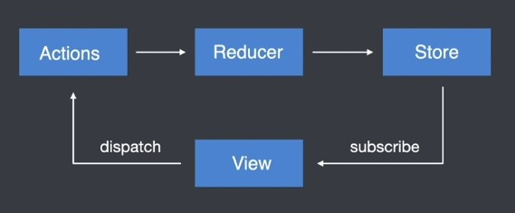
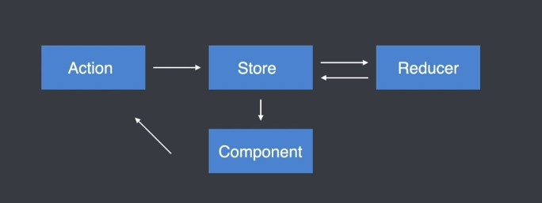
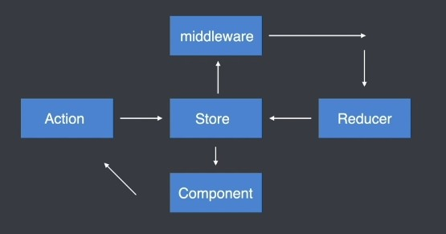

## React 状态管理工具
### Redux
#### 1.Redux 核心
##### 1.1 Redux 介绍
javascript状态容器，提供可预测化的状态管理
```js
const state = {
  modelOpen: 'yes',
  btnClicked: 'no',
  btnActiveClass: 'active',
  page: 5,
  size: 10
}
```
##### 1.2 Redux 核心概念及工作流程
* Store：存储状态的容器，javascript对象
* View：视图，HTML页面
* Actions：对象，描述对状态进行怎样的操作
* Reducers：函数，操作状态并返回新的状态



#### 1.3 Redux使用：计数器案例
```html
<!DOCTYPE html>
<html lang="en">
<head>
  <meta charset="UTF-8">
  <meta http-equiv="X-UA-Compatible" content="IE=edge">
  <meta name="viewport" content="width=device-width, initial-scale=1.0">
  <title>Document</title>
</head>
<body>
<button id="plus">+</button>
<span id="count">0</span>
<button id="minus">-</button>

  <script src="./redux.min.js"></script>
  <script>
    // 3. 存储默认状态
    var initialState = {
      count: 0
    }
    
    /**
     * 2. 创建reducer函数
     * 第一次进入页面时会触发一次action，就是存储默认的state
     * @param state  是createStore传的第二个参数，有传递就用，没传递就用初始化的值,一般不会createStore这么传递
     * @param action 是dispatch时的参数
     */
    function reducer(state = initialState, action) {
      switch(action.type) {
        case 'increment':
          return { count: state.count + 1 }
        case 'decrement':
          return { count: state.count - 1 }
        default:
          return state
      }
    }

    // 1.创建store对象，返回是store存储状态
    var store = Redux.createStore(reducer)

    // 4. 定义action
    var increment = { type: 'increment' }
    var decrement = { type: 'decrement' }

    // 5. 获取按钮给按钮添加点击事件
    document.getElementById('plus').onclick = function() {
      // 6. 触发action
      store.dispatch(increment)
    }

    document.getElementById('minus').onclick = function() {
      // 6. 触发action
      store.dispatch(decrement)
    }

    // 7.同步视图 订阅store，store的状态发生变化时就执行
    store.subscribe(() => {
      // 获取store对象中存储的状态
      //console.log(store.getState())
      document.getElementById('count').innerHTML = store.getState().count
    })


    
  </script>
</body>
</html>
```

##### 1.4 Redux 核心
```js
// 创建 Store 状态容器
const store = Redux.createStore(reducer)

// 创建用于处理状态的 reducer 函数
function reducer(state = initialState, action) {}

// 获取状态
store.getState()

// 订阅状态
store.subscribe(function() {})

// 触发 Action
store.dispatch({ type: 'description...'})
```

#### 2. React + Redux
##### 2.1 在React中不使用Redux时遇到的问题
在React中组件通信的数据流是单向的，顶层组件可以通过props属性向下层组件传递数据，而下层组件不能向上层组件传递数据，要实现下层组件修改数据，需要上层组件传递修改数据的方法到下层组件，当项目越来越大的时候，组件之间传递数据变得越来越困难。

##### 2.2 在React项目中加入Redux的好处
使用Redux管理数据，由于Store独立于组件，使得数据管理独立于组件，解决了组件之间传递数据困难的问题。

##### 2.3 下载 Redux
```base
npm install redux react-redux
```

##### 2.4 Redux工作流程
1. 组件通过 dispatch 方法触发 Action
2. Store 接收 Action 并将 Action 分发给 Redux
3. Reducer 根据 Action 类型对状态进行更改并将更改后的状态返回给Store
4. 组件订阅了Store中的状态，Store中的状态更新会同步到组件



##### 2.5 使用Redux步骤

###### 2.5.1 创建store

```js
// src/store/index.js
import { createStore } from 'redux'
import reducer from './reducers/counter.reducer'
export const store = createStore(reducer)
```

在根组件中使用store：

```js
import React from 'react';
import ReactDOM from 'react-dom';
import Counter from './components/Counter'
import { Provider } from 'react-redux'
import {store} from './store'
/**
 * react-redux
 *  Provider  作用就是将我们创建出来的store放在一个全局组件够的着的地方，Provider要放在最外层
 *  connect
 */

ReactDOM.render(
  // 通过 provider 组件，将store 放在了全局的组件可以够得着的地方
  <Provider store={store}>
    <Counter />
  </Provider>,
  document.getElementById('root')
);
```

###### 2.5.2 创建 reducer

```js
// src/store/reducers/counter.reducer.js
import { DECREMENT, INCREMENT } from "../count/counter.const";

const initialState = {
  count: 0
}

export default function reducer (state = initialState, action) {
  switch (action.type) {
    case INCREMENT:
      return { count: state.count + 1 };
    case DECREMENT:
      return { count: state.count - 1 };
    default:
      return state;
  }
}
```

```js
// src/store/count/counter.const.js
export const INCREMENT = 'increment'
export const DECREMENT = 'decrement'
```

###### 2.5.3 在组件中使用 connect 接受 store 里面的 state 和 dispatch

connect方法接受两个参数，返回一个高阶组件。 connect方法的第一个参数是mapStateToProps方法，将store中的state传递到组件的props中，mapStateToProps方法的参数是state，返回值是一个对象，会传递到组件中，写法如下：

```js
const mapStateToProps = (state) => ({
  count: state.count,
  a: 'a', // 这里怎么定义，组件中就可以获得到一个属性
})
```

connect方法的第二个参数是mapDispatchToProps方法，将store中的dispatch传递到组件的props中，mapDispatchToProps方法的参数是dispatch，返回值是一个对象，对象中的方法可以使用dispatch,这个对象中的方法会传递到组件中，写法如下：

```js
const mapDispatchToProps = (dispatch) => ({
  increment () {
    dispatch({ type: 'increment'})
  },
  decrement () {
    dispatch({ type: 'decrement' })
  }
})
```

此外，还可以使用redux中的bindActionCreators来帮助我们创建action函数

```js
import { bindActionCreators } from 'redux'

const mapDispatchToPros = dispatch => ({
  // bindActionCreators返回一个对象
  ...bindActionCreators({
    increment() {
      return { type: 'increment '}
    },
    decrement() {
      return { type: 'decrement' }
    }
  }, dispatch)
})
```

或者写为
```js
const mapDispatchToProps = dispatch => bindActionCreators({
    increment () {
      return { type: 'increment'}
    },
    decrement () {
      return { type: 'decrement'}
    }
  }, dispatch)
```

也可以将bindActionCreators的第一个参数进行抽离
```js
// src/store/actions/counter.actions.js
export const increment = () => ({ type: 'increment' })

export const decrement = () => ({ type: 'decrement' })
```

```js
import * as counterActions from '../store/actions/counter.actions'

const mapDispatchToProps = dispatch => bindActionCreators(conterActions, dispatch)
```
connect方法接受mapStateToProps和mapDispatchToProps，返回一个高阶组件，然后传入Counter组件进行导出

```js
export default connect(mapStateToProps, mapDispatchToProps)(Counter)
```

最终代码

```js
// src/components/Counter.js

import React from 'react'
import { connect } from "react-redux";
import { bindActionCreators } from 'redux'
import * as counterActions from '../store/actions/counter.actions'

function Counter({ count, increment, decrement }) {
    return <div>
        <button onClick={increment}>+</button>
        <span>{count}</span>
        <button onClick={decrement}>-</button>
    </div>
}

/**
 * 1. connent 方法会帮助我们订阅store 当store中的状态发生更改的时候，会帮助我们重新渲染组件
 * 2. connent 方法可以让我们获取store中的状态 将状态通过组件的props属性映射给组件
 * 3. connent 方法可以让我们获取dispatch方法
 */

const mapStateToProps = state => ({
    count: state.count,
    a: 'a'
})

const mapDispatchToProps = dispatch => bindActionCreators(counterActions, dispatch)

/**
 * 1. connect 方法返回的是另外一个方法(高阶组件)，返回的方法要求我们传递一个组件，因为当store发生改变时要知道改变哪个组件；状态映射给哪个组件的props属性
 * 2. connect 方法第一个参数是一个函数，这个函数有一个形参，把它命名为state，这个state就是组件当中的状态，这个函数返回一个对象，会传递到组件中
 * 3. connect 方法的第二个参数也是一个函数，他可以拿到dispatch方法
 */

export default connect(mapStateToProps, mapDispatchToProps)(Counter)
```

```js
// src/store/const
export const INCREMENT = 'increment'

export const DECREMENT = 'decrement'
```

```js
// src/store/actions/counter.actions.js
import { DECREMENT, INCREMENT } from "../const/counter.count"

export const increment = () => ({ type: INCREMENT })

export const decrement = () => ({ type: DECREMENT })
```

```js
// src/store/reducer/counter.reducer.js
import { DECREMENT, INCREMENT } from "../const/counter.count"

const initialState = {
    count: 0
}

export default (state = initialState, action) => {
    switch (action.type) {
        case INCREMENT:
            return { count: state.count + 1 }
        case DECREMENT:
            return { count: state.count - 1 }
        default:
            return state
    }
}
```

```js
// src/stoer/index.js
import { createStore } from 'redux'
import reducer from "./reducer/counter.reducer";

export const store = createStore(reducer)

```

```js
// src/index.js
import React from 'react';
import ReactDOM from 'react-dom';
import Counter from "./components/Counter";
import { Provider } from "react-redux";
import { store } from "./store";

/**
 * react-redux
 *  Provider  作用就是将我们创建出来的store放在一个全局组件够的着的地方，
 *            Provider要放在最外层
 *  conect    会帮助我们订阅store，store的状态更改后，会帮我们重新渲染组件
 *            可以拿到store的状态、可以把store状态映射到props中、可以拿到dispatch方法
 */

ReactDOM.render(
  // 通过Provider组件 将store放在了全局的组件可以够的到的地方
  <Provider store={store}>
    <Counter />
  </Provider>,
  document.getElementById('root')
);
```

###### 2.5.4 Action 传递参数

1. 传递参数
```js
<button onClick={() => increment(5)}>
```

2. 接收参数，传递reducer
```js
export const increment = payload => ({ type: INCREMENT, payload })
export const decrement = payload => ({ type: DECREMENT, payload })
```

3. reducer根据接受收到的数据进行处理
```js
export default function reducer(state = initialState, action) {
    switch (action.type) {
        case INCREMENT:
            return { count: state.count + action.payload }
        case DECREMENT:
            return { count: state.count - action.payload }
        default:
            return state
    }
}
```

##### 2.6 redux 实现弹出框案例
store中的状态越多，reducer中的switch分支就会越多，不利于维护，需要拆分reducer

```js
// src/index.js
import React from 'react';
import ReactDOM from 'react-dom';
import App from "./App";
import { Provider } from "react-redux";
import { store } from "./store";

/**
 * react-redux
 *  Provider  作用就是将我们创建出来的store放在一个全局组件够的着的地方，
 *            Provider要放在最外层
 *  conect    会帮助我们订阅store，store的状态更改后，会帮我们重新渲染组件
 *            可以拿到store的状态、可以把store状态映射到props中、可以拿到dispatch方法
 */
ReactDOM.render(
  // 通过Provider组件 将store放在了全局的组件可以够的到的地方
  <Provider store={store}>
    <App />
  </Provider>,
  document.getElementById('root')
);

```

```js
// src/App.js
import Counter from "./components/Counter";
import Modal from "./components/modal";

function App() {
  return (
    <div>
      <Counter />
      <Modal />
    </div>
  );
}

export default App;
```

```js
// src/store/index.js
import { createStore } from 'redux'
import reducer from "./reducer/counter.reducer";

export const store = createStore(reducer)
```

```js
// src/store/actions/modal.actions.js
import { HIDEMODAL, SHOWMODAL } from "../const/modal.count"

export const show = () => ({ type: SHOWMODAL })

export const hide = () => ({ type: HIDEMODAL })
```

```js
// src/store/const/modal.count.js
export const SHOWMODAL = 'showModal'
export const HIDEMODAL = 'hideModal'
```

```js
// src/store/reducer/counter.reducer.js
import { DECREMENT, INCREMENT } from "../const/counter.count"
import { HIDEMODAL, SHOWMODAL } from "../const/modal.count"

const initialState = {
    count: 0,
    show: false
}

export default function reducer(state = initialState, action) {
    switch (action.type) {
        case INCREMENT:
            return {...state, count: state.count + action.payload }
        case DECREMENT:
            return {...state, count: state.count - action.payload }
        case SHOWMODAL:
            return {...state, show: true }
        case HIDEMODAL:
            return {...state, show: false }
        default:
            return state
    }
}

```

```js
// src/components/Modal.js
import React from 'react'
import { connect } from "react-redux";
import { bindActionCreators } from "redux";
import * as modalActions from "../store/actions/modal.actions";

function Modal({showStatus, show, hide }) {
    const styles = {
        width: 200,
        height: 200,
        position: 'absolute',
        left: '50%',
        top: '50%',
        marginLeft: -100,
        marginTop: -100,
        backgroundColor: 'skyblue',
        display: showStatus ? 'block': 'none'
    }
    return <div>
        <button onClick={show}>显示</button>
        <button onClick={hide}>隐藏</button>
        <div style={styles}></div> 
    </div>
}

const mapStateToProps = state => ({
    showStatus: state.show
})

const mapDispatchToProps = dispatch => bindActionCreators(modalActions, dispatch)

export default connect(mapStateToProps, mapDispatchToProps)(Modal)
```

##### 2.7 拆分reducer
使用redux提供的combineReducers方法合并其它的reducer

```js
// src/store/reducer/root.reducer.js

import { combineReducers } from 'redux'
import CounterReducer from "./counter.reducer";
import ModalReducer from "./modal.recucer";

// store容器的结构 {counter: { count: 0 }, modal: { show: false }}
export default combineReducers({
    counter: CounterReducer,
    modal: ModalReducer
})
```


```js
// src/store/reducer/counter.reducer.js
import { DECREMENT, INCREMENT } from "../const/counter.count"

const initialState = {
    count: 0,
}

export default function reducer(state = initialState, action) {
    switch (action.type) {
        case INCREMENT:
            return {...state, count: state.count + action.payload }
        case DECREMENT:
            return {...state, count: state.count - action.payload }
        default:
            return state
    }
}

```

```js
// src/store/reducer/modal.reducer.js
import { HIDEMODAL, SHOWMODAL } from "../const/modal.count"

const initialState = {
    show: false
}

export default function reducer(state = initialState, action) {
    switch (action.type) {
        case SHOWMODAL:
            return {...state, show: true }
        case HIDEMODAL:
            return {...state, show: false }
        default:
            return state
    }
}

```

创建store时传入的reducer则来自于我们刚才定义的root.reducer.js

```js
// src/store/index.js
import { createStore } from 'redux'
import RootReducer from "./reducer/root.reducer";

export const store = createStore(RootReducer)
```
在每个组件中的mapStateToProps中也要发生相应的改变

```js
const mapStateToProps = state => ({
    count: state.counter.count
})
```

```js
const mapStateToProps = state => ({
    showStatus: state.modal.show
})
```

#### 3.Redux 中间件
##### 3.1 什么是中间件
中间件本质上就是一个函数，中间件允许我们扩展redux应用程序

##### 3.2 加入了中间件 Redux 工作流程



##### 3.3 开发 Redux 中间件

开发中间件的模板代码
```js
export default store => next => action => { }
```

##### 3.4 注册中间件

中间件在开发完成以后只有被注册才能在Redux的工作流程中生效
```js
// src/store/index.js
import { createStore, applyMiddleware } from 'redux'
import logger from './middleware/logger'

createStore(reducer, applyMiddleware(logger))
```

```js
// src/store/middleware/logger.js

const logger = store => next => action => {
    console.log(store)
    console.log(action)
    next(action) // 一定要调用next方法，action才能把结果传递给下一个中间件(reducer)，否则卡在这了
}

export default logger
```

中间件的执行顺序就是中间件的注册顺序，先注册的先执行
```js
export const store = createStore(RootReducer, applyMiddleware(logger, test))
```
**如果中间件中的结尾不调用next(action)，则整个流程就会卡在此处不会再往后执行**

##### 3.5 中间件开发实例 thunk(异步中间件)
1. 当前这个中间件函数不关心你想执行什么样的异步操作，只关心你执行的是不是异步操作
2. 如果你执行的是异步操作，你在触发action的时候 给我传递一个函数，如果执行的是同步操作就传递action对象
3. 异步操作代码要写在你传递进来的函数中
4. 当前这个中间件函数在调用你传递进来的函数时，要将dispatch方法传递过去

```js
// src/store/middleware/thunk.js
const thunk = ({ dispatch }) => next => action => {
  // action是你传递的

  if (typeof action === 'function') {
    return action(dispatch) // action 方法内部会发起新的 dispatch 
  }
  next(action)
}

export default thunk
```
在action文件中定义异步函数action

```js
// src/store/action/counter.count.js

import { DECREMENT, INCREMENT } from "../const/counter.count"

export const increment = payload => ({ type: INCREMENT, payload })

export const decrement = payload => ({ type: DECREMENT, payload })

// action
export const increment_async = paylog => dispatch => {
    setTimeout(() => {
        dispatch(increment(paylog))
    }, 2000)
}
```
原本使用increment的地方，现在改用increment_async,实现了异步的功能

#### 4. Redux 常用中间件

##### 4.1 redux-thunk

###### 4.1.1 redux-thunk 下载

```base
npm install redux-thunk
```
 
###### 4.1.2 引入 redux-thunk

```js
import thunk from 'redux-thunk'
```

###### 4.1.3 注册 redux-thunk

```js
import { applyMiddleware } from 'redux'
createStore(rootReducer, applyMiddleware(thunk))
```

###### 4.1.4 使用redux-thunk

```js
const loadPosts = () => async dispatch => {
  const posts = await axios.get('/api/posts/').then(response => response.data)
  dispatch({ type: LOADPOSTSSUCCESS, payload: posts })
}
```

##### 4.2 Redux-saga

###### 4.2.1 redux-saga 解决的问题
redux-saga可以将异步操作从 Action Creator 文件中抽离出来，放在一个单独的文件中

###### 4.2.2 redux-sage下载

```js
npm install redux-saga
```

###### 4.2.3创建redux-saga 中间件

```js
// src/store/index.js
import createSagaMiddleware from 'redux-saga'
const sagaMiddleware = createSagaMiddleware()
```

###### 4.2.4 注册sagaMiddleware
```js
// src/store/index.js
createStore(reducer, applyMiddleware(sagaMiddleware))
```

###### 4.2.5 使用saga接收action执行异步操作
```js
// src/store/sagas/counter.saga.js
import { takeEvery, put, delay } from "redux-saga/effects";
import { increment } from "../actions/counter.actions";
import { INCREMENT_ASYNC } from "../const/counter.count";
// takeEvery接收action
// put触发 action
// delay 延迟

// 不可以用定时器做延迟，要使用saga提供的delay方法做延迟
function* increment_async_fn(action) {
    yield delay(2000)
    yield put(increment(action.payload))
}

export default function* counterSaga() {
    // 接收action
    yield takeEvery(INCREMENT_ASYNC, increment_async_fn)// // 第二个函数形参会接受一个 action 函数
}
```

```js
// src/store/actions/counter.action.js
export const increment_async = payload => ({ type: INCREMENT_ASYNC, payload })

```

```js
// src/store/const/counter.count.js
export const INCREMENT_ASYNC = 'increment_async'
```

```js
// src/components/Counter.js
<button onClick={() => increment_async(20)}>+</button>
```

###### 4.2.6 启动saga

```js
// src/store/index.js
import postSaga from './store/sagas/post.saga'
sagaMiddleware.run(postSaga)
```

###### 4.2.7 合并saga

```js
// src/sagas/root.saga.js

import { all } from "redux-saga/effects";
import counterSaga from "./counter.saga";
import modalSaga from "./modal.saga";

export default function* rootSaga() {
    yield all([counterSaga(), modalSaga()])
}
```

```js
// src/sagas/modal.saga.js
import { takeEvery, put, delay } from "redux-saga/effects";
import { SHOWMODAL_ASYNC } from "../const/modal.count";
import { show } from "../actions/modal.actions";

// takeEvery 接收 action 
// put 触发 action 

function* showModal_async_fn() {
    yield delay(2000)
    yield put(show())
}

export default function* modalSaga() {
    // 接收 action
    yield takeEvery(SHOWMODAL_ASYNC, showModal_async_fn)
}

```
counter.saga.js 文件没有改变

store 入口文件中的 saga 中间件启动 root.saga

```js
// src/store/index.js
import rootSaga from './sagas/root.saga'

sagaMiddleware.run(rootSaga)
```

##### 4.3 redux-actions

###### 4.3.1 redux-actions 解决的问题

redux流程中大量的样板代码读写很痛苦，使用redux-actions可以简化Action和Reducer的处理

###### 4.3.2 redux-actions 下载

```base
npm install redux-actions
```

###### 4.3.3 创建Action

```js
// src/store/actions/counter.action.js
import { createAction } from 'redux-actions'

const increment_action = createAction('increment')
const decrement_action = createAction('decrement')
```

###### 4.3.4 创建Reducer

```js
// src/store/reducer/counter.reducer.js
import { handleActions as createReducer } from 'redux-actions'
import { increment_action, decrement_action } from '../actions/counter.action'

const initialState = { count: 0 }

const handleIncrement = (state, action) => {
  return { count: state + action.payload } // payload是中间件自动添加的
}

const handleDecrement = (state, actoin) => {
  return { count: state - action.payload }
}

const counterReducer = createReducer({
  [increment_action]:(state, action) => ({ count: state.count + 1 }),
  [decrement_action]:(state, action) => ({ count: state.count - 1 })
}, initialState)

export default counterReducer
```

```js
// src/component/Counter.js

<button onClick={() => increment(5)}>+</button>
<button onClick={() => decrement(5)}>-</button>
```

redux-actions 也可以结合在 redux-saga 中使用

#### 5. Redux源码实现

##### 5.1 核心逻辑

1. redux有一个核心的API createStore 用来创建store对象，在调用createStore是可以传递三个参数：reducer（根据类型对store状态进行更改）、preloadedState（预存储store状态）、enhancer（对store功能进行增加）

2. createStore方法返回一个对象，返回的对象有三个方法：getState（用于获取状态）、dispatch（触发action）、subscribe（订阅状态）

3. dispatch拿到action后，内部要调用传递进来的reducer函数，reducer函数要返回最新的状态，我们要把reducer返回的最新状态去替换原有的currentState状态，达到更新状态的目的。reducer函数有两个参数，第一个参数是当前状态，第二个参数是action，在reducer函数中要判断action对象的type属性值，根据type属性值的不同，对状态进行不同的处理，最后返回一个新的状态替换原有的状态。循环调用订阅者（调用订阅者更新视图）

4. subscribe可以被多个地方订阅，当状态改变所有的订阅者都要被执行，可以使用数组把订阅者存储，当状态改变时再调用订阅者


```js
/**
 * createStore(reducer, preloadedState, enhancer)
 * { getState, dispatch, subscribe }
 */

function createStore(reducer, preloadedState) {
  // store 对象中存储的状态
  var currentState = preloadedState
  // 存放订阅者函数
  var currenListeners = []

  /**
   * currentState是createStore函数的局部变量，当createStore函数运行后，变量currentState会被释放，
   * 但是在我们实际功能中状态要一直存在的，所以用闭包让currentState长久驻存在内存中
   */

  // 获取状态
  function getState() {
    return currentState
  }

  // 触发action
  function dispatch(action) {
    /**
     * 1. dispatch拿到action后，内部要调用传递进来的reducer函数，
     * reducer函数要返回最新的状态，我们要把reducer返回的最新状态去替换原有的currentState状态，达到更新状态的目的
     *
     * 2. reducer函数有两个参数，第一个参数是当前状态，第二个参数是action，在reducer函数中要判断action对象的type属性值
     * 根据type属性值的不同，对状态进行不同的处理，最后返回一个新的状态替换原有的状态
     */
    currentState = reducer(currentState, action)

    // 循环数组 调用订阅者（调用订阅者更新视图）
    for (var i = 0; i < currenListeners.length; i++) {
      // 获取订阅者
      var listener = currenListeners[i]
      // 调用订阅者
      listener()
    }
  }

  /**
   * subscribe可以被多个地方订阅，当状态改变所有的订阅者都要被执行，可以使用数组把订阅者存储，当状态改变时再调用订阅者
   */
  // 订阅状态
  function subscribe(listener) {
    currenListeners.push(listener)
  }

  return {
    getState,
    dispatch,
    subscribe
  }
}
```

```html
<!DOCTYPE html>
<html lang="en">
  <head>
    <meta charset="UTF-8" />
    <meta http-equiv="X-UA-Compatible" content="IE=edge" />
    <meta name="viewport" content="width=device-width, initial-scale=1.0" />
    <title>Document</title>
  </head>
  <body>
    <button id="increment">+</button>

    <span id="box">0</span>

    <button id="decrement">-</button>

    <script src="./myRedux.js"></script>

    <script>
      function reducer(state, action) {
        switch (action.type) {
          case 'increment':
            return state + 1
          case 'decrement':
            return state - 1
          default:
            return state
        }
      }

      // 创建store
      var store = createStore(reducer, 0)

      store.subscribe(() => {
        // 获取最新的状态
        document.getElementById('box').innerHTML = store.getState()
      })

      // 获取加按钮
      document.getElementById('increment').onclick = function () {
        // 触发action 让数值加1
        store.dispatch({ type: 'increment' })
      }

      // 获取减按钮
      document.getElementById('decrement').onclick = function () {
        // 触发action 让数值减1
        store.dispatch({ type: 'decrement' })
      }
    </script>
  </body>
</html>

```


##### 5.2 参数类型约束

1. createStore函数的reducer参数必须为函数，否则就以报错的形式告诉调用者，在createStore函数顶部添加：
```js
// 约束reducer参数类型
if (typeof reducer !== 'function') throw new Error('reducer必须为函数')
```

2. dispatch参数action必须为对象，对象当中一定要有type属性，在dispatch函数添加：
```js
// 判断action是否是对象
if (!isPlainObject(action)) throw new Error('action必须是对象')

// 判断对象中是否具有type属性
if (typeof action.type === 'undefined') throw new Error('action对象中必须要有type属性')
```

添加全局函数，判断参数是否是对象
```js
// 判断obj是否是对象
function isPlainObject(obj) {
  // 排除基本数据类型和null
  if (typeof obj !== 'object' || obj === null) return false
  // 区分数组和对象 原型对象对比的方式
  var proto = obj
  while (Object.getPrototypeOf(proto) != null) {
    proto = Object.getPrototypeOf(proto)
  }

  return Object.getPrototypeOf(obj) === proto
}

```


